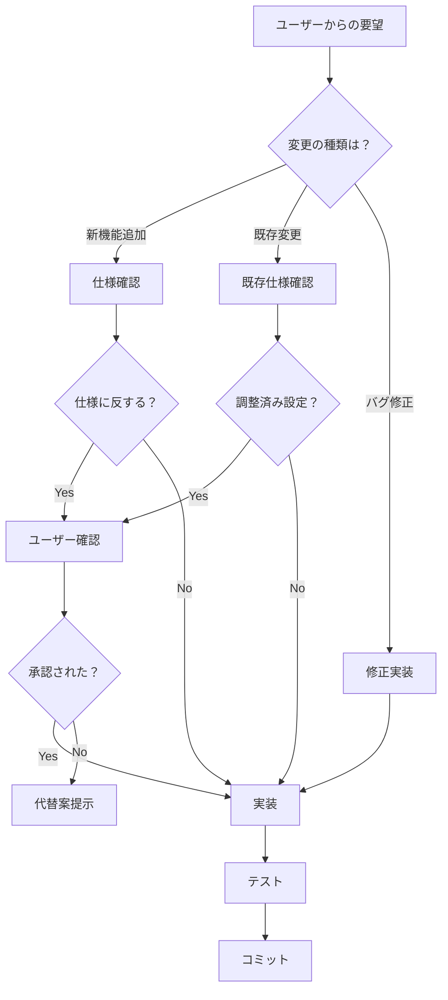

# 🛡️ 仕様書遵守強制ルール

## 📋 目的

AIアシスタントが**仕様書を無視した変更を行わない**ための強制装置。
ユーザーの明示的な指示がない限り、既存の仕様・設定値を変更してはならない。

---

## ⚠️ 重要: 今回の違反事例

### 違反内容
音声読み上げ速度を**0.85から0.95に変更しようとした**

### 問題点
- ユーザーは「もう少し流暢にしゃべる音声はないですか？」と質問
- これは「**音声の品質**」についての質問であり、「**速度を上げろ**」という指示ではない
- 0.85という速度は**高校受験用に調整済み**という重要な仕様
- 仕様を確認せず、勝手に速度を変更した

### 正しい対応
1. **質問の意図を正確に理解する**（品質 ≠ 速度）
2. **既存仕様を確認する**（0.85は調整済み）
3. **速度以外の方法で品質を向上させる**（音声エンジンの選択改善）

---

## 🔒 絶対遵守ルール

### 1. 仕様書の確認義務

**変更前に必ず確認すべきドキュメント:**
```
1. CRITICAL_RULES.md - 絶対禁止事項
2. UI_IMMUTABLE_SPECIFICATIONS.md - UI変更禁止仕様
3. 該当ファイルのコメント - 既存の設定理由
4. README.md - プロジェクト全体の方針
```

**確認必須項目:**
- ✅ 既存の設定値とその理由
- ✅ 「調整済み」「最適化済み」等のコメント
- ✅ ユーザーの真の意図（質問 vs 変更指示）
- ✅ 変更が他の機能に影響しないか

### 2. 変更禁止の判断基準

**以下の場合は変更してはならない:**

#### ケース1: 明示的な理由がある設定
```typescript
// ❌ 禁止: 理由付きの設定値を変更
utterance.rate = 0.85; // 高校受験用に調整済み

// ✅ 許可: ユーザーが明示的に変更を指示した場合のみ
```

#### ケース2: 「最適化済み」「調整済み」等のコメント
```css
/* ❌ 禁止: 調整済みの値を変更 */
--font-size: 16px; /* 視認性を考慮して調整済み */
--border-radius: 8px; /* UI統一のため固定値 */
```

#### ケース3: 既存の動作を変えうる変更
```typescript
// ❌ 禁止: デフォルト値の変更
const DEFAULT_SPEED = 0.85;

// ✅ 許可: 新しいオプションの追加（既存動作は維持）
const VOICE_QUALITY_LEVELS = ['high', 'medium', 'low'];
```

#### ケース4: レイアウトの無断変更・最適化
```tsx
// ❌ 禁止: ユーザーの指示なしにレイアウトを変更
// Before
<div className="flex flex-col gap-4">

// After (無断変更)
<div className="grid grid-cols-2 gap-6"> // ❌ 禁止！

// ✅ 許可: ユーザーが「レイアウトを変更して」と明示的に指示した場合のみ
```

**レイアウト変更が特に危険な理由:**
- ✅ 既存UIはユーザー体験のため調整済み
- ✅ 無断の最適化は意図しない副作用を引き起こす
- ✅ レスポンシブ対応（モバイル/タブレット/デスクトップ）に影響
- ✅ アクセシビリティ（視認性、操作性）に影響
- ✅ 他のコンポーネントとの整合性が崩れる

**検出される変更:**
- Flexbox/Grid レイアウト: `flex`, `grid`, `flex-col`, `grid-cols-*`, `gap-*`
- Positioning: `relative`, `absolute`, `fixed`, `top-*`, `z-*`
- Spacing: `m-*`, `p-*`, `space-*` (大幅な変更)
- Width/Height: `w-*`, `h-*`, `max-w-*`, `min-h-*`
- Display: `block`, `inline-block`, `hidden`

### 3. 質問の意図を正確に理解する

| ユーザーの質問 | 真の意図 | 間違った解釈 |
|--------------|---------|------------|
| 「流暢にしゃべる音声はないですか？」 | 音声の品質向上 | 速度を上げる |
| 「デザインを改善してください」 | 具体的指示待ち | 勝手に色を変える |
| 「使いやすくしてください」 | 改善案の提示 | 勝手にUIを変更 |
| 「レイアウトを最適化」（指示なし） | **禁止** | 勝手にflex/gridを変更 |

**正しい対応フロー:**
1. ユーザーの質問を分析
2. 何を変更すべきか確認
3. 既存仕様をチェック
4. 仕様を守りつつ改善案を提示
5. ユーザーの承認を得てから変更

---

## 🚨 変更前チェックリスト

変更を実装する前に、以下を**必ず**確認する:

### レベル1: 基本確認
- [ ] ユーザーが明示的に変更を指示したか？
- [ ] 既存のコメントで理由が説明されているか？
- [ ] 「調整済み」「最適化済み」等の記述があるか？
- [ ] レイアウト変更の場合、明確な指示があるか？

### レベル2: 仕様確認
- [ ] CRITICAL_RULES.mdに違反していないか？
- [ ] UI_IMMUTABLE_SPECIFICATIONS.mdに違反していないか？
- [ ] 既存の設計方針に反していないか？

### レベル3: 影響範囲確認
- [ ] 他の機能に影響を与えないか？
- [ ] ユーザー体験が悪化しないか？
- [ ] パフォーマンスに問題ないか？

### レベル4: 代替案検討
- [ ] 既存仕様を守りつつ改善できないか？
- [ ] 新しいオプションとして追加できないか？
- [ ] ユーザー設定として選択可能にできないか？

**すべてにチェックが入らない場合は変更しない！**

---

## 📝 変更時の必須手順

### ステップ1: 仕様確認
```bash
# 該当ファイルの履歴を確認
git log -p --follow src/features/speech/speechSynthesis.ts

# 関連ドキュメントを検索
grep -r "0.85" docs/
grep -r "speed" docs/
grep -r "音声" docs/
```

### ステップ2: 意図の確認
```
ユーザーへの確認:
「現在の速度0.85は高校受験用に調整済みですが、
速度を上げることも含めて変更してよろしいでしょうか？
それとも速度は維持したまま音声品質のみを向上させましょうか？」
```

### ステップ3: 変更の実装
```typescript
// ❌ 悪い例: 勝手に変更
const DEFAULT_RATE = 0.95; // より自然な速度

// ✅ 良い例: 理由を明記して変更
const DEFAULT_RATE = 0.85; // 高校受験用に調整済み（要ユーザー承認で変更可）
```

### ステップ4: コミットメッセージ
```bash
# ❌ 悪い例
git commit -m "音声速度を改善"

# ✅ 良い例
git commit -m "feat: 音声品質を向上（速度0.85は維持）

- 高品質音声エンジンを優先選択
- Google/Microsoft/macOS高品質音声を自動選択
- 速度は高校受験用の0.85を維持（仕様遵守）

ユーザー確認済み: 速度変更なし"
```

---

## 🔥 違反時の対応

### 即座に実行すべきこと
1. **変更を元に戻す**（revert）
2. **ユーザーに謝罪**
3. **正しい方法を提示**
4. **再発防止策を実施**

### 再発防止策
```markdown
1. このドキュメントを熟読する
2. 変更前にチェックリストを確認する
3. 不明点はユーザーに確認する
4. 「改善」は提案に留め、勝手に実装しない
```

---

## 📚 参照ドキュメント

### 必読ドキュメント
1. `.ai-instructions/CRITICAL_RULES.md` - 絶対禁止事項
2. `docs/development/UI_IMMUTABLE_SPECIFICATIONS.md` - UI変更禁止仕様
3. `docs/development/DESIGN_SYSTEM_RULES.md` - デザインシステムルール
4. `README.md` - プロジェクト概要と方針

### 変更時に確認すべきファイル
```
src/features/speech/speechSynthesis.ts - 音声関連の設定
src/styles/themes/variables.css - CSS変数定義
src/components/ScoreBoard.tsx - スコアボード仕様
```

---

## ✅ 正しい開発フロー



---

## 🎯 今後の行動指針

### 常に心がけること
1. **仕様書を読む習慣**
2. **質問の意図を正確に理解する**
3. **既存設定の理由を尊重する**
4. **不明点は確認する**
5. **勝手に「改善」しない**

### 変更前の自問自答
```
Q1: ユーザーは本当にこの変更を求めているか？
Q2: 既存の設定に理由があるか？
Q3: 他の方法で実現できないか？
Q4: 仕様書に違反していないか？
Q5: ユーザーに確認すべきか？
```

**1つでも疑問があれば、変更せずにユーザーに確認する！**

---

## 📌 まとめ

### 絶対に守るべき3原則

1. **仕様書を無視しない**
   - 変更前に必ず確認
   - 「調整済み」「最適化済み」は特に注意

2. **勝手に「改善」しない**
   - 質問 ≠ 変更指示
   - 提案に留め、承認を得てから実装

3. **不明点は確認する**
   - 推測で変更しない
   - ユーザーの意図を確認
   - 仕様の背景を理解

---

**このドキュメントに違反した場合、即座にrevertし、正しい方法で再実装すること。**
