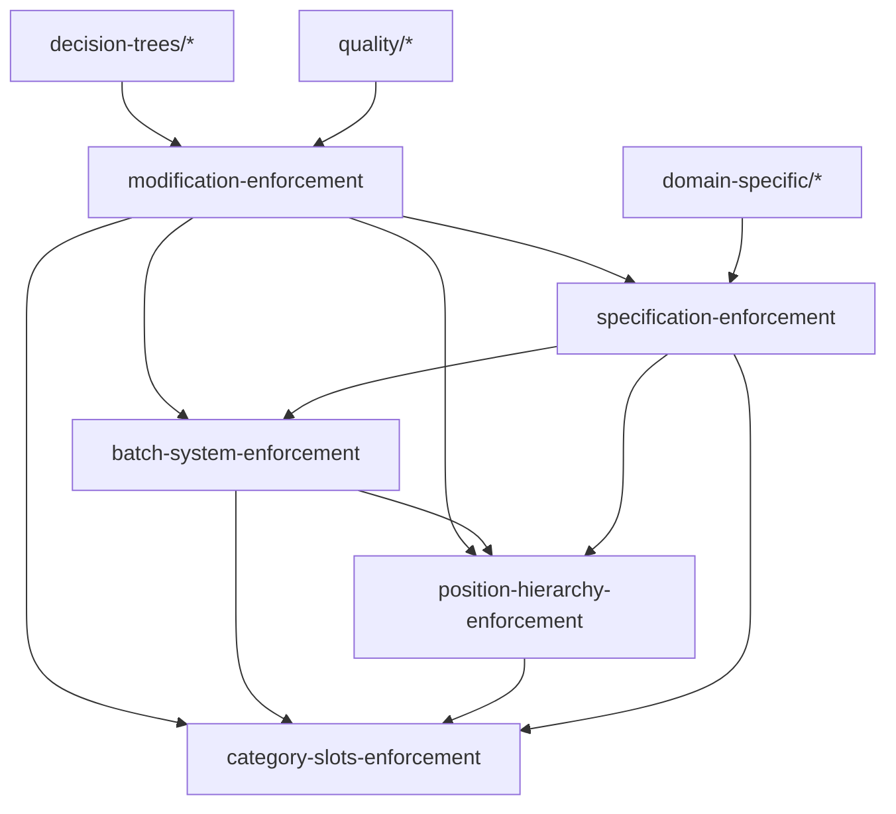

# 📚 Instructions 体系総合ガイド

> **業界標準アプローチ**: Architecture Decision Records (ADR) + Policy as Code + Decision Trees

## 🎯 このガイドの目的

複数のinstructions、仕様書、ガイドライン、パイプライン、強制装置を**階層化**し、**発見可能性**を高め、**保守性**を向上させる。

---

## 📊 全体構造（3層アーキテクチャ）

```
┌─────────────────────────────────────────────────────────────┐
│  Layer 1: Entry Point（このファイル）                        │
│  - 全体マップ                                                │
│  - 検索インデックス                                          │
│  - Quick Reference                                           │
└────────────────────────┬────────────────────────────────────┘
                         │
         ┌───────────────┼───────────────┐
         │               │               │
┌────────▼──────┐ ┌──────▼──────┐ ┌────▼──────────┐
│  Layer 2:     │ │  Layer 2:   │ │  Layer 2:     │
│  Category     │ │  Decision   │ │  Context      │
│  Index        │ │  Trees      │ │  Specific     │
└───────────────┘ └─────────────┘ └───────────────┘
      │                 │               │
      │                 │               │
┌─────▼─────────────────▼───────────────▼─────┐
│  Layer 3: Individual Instructions           │
│  - modification-enforcement.instructions.md  │
│  - batch-system-enforcement.instructions.md  │
│  - position-hierarchy-enforcement.instructions.md
│  - category-slots-enforcement.instructions.md
│  - specification-enforcement.instructions.md │
│  - ... (40+ files)                           │
└──────────────────────────────────────────────┘
```

---

## 🔍 Quick Reference: 状況別ガイド

### 状況1: コードを修正したい

```
1. 📍 START HERE → modification-enforcement.instructions.md【最優先】
2. 📋 影響範囲に応じて以下を確認:
   - バッチ方式に影響？ → batch-system-enforcement.instructions.md
   - Position階層に影響？ → position-hierarchy-enforcement.instructions.md
   - カテゴリースロット方式に影響？ → category-slots-enforcement.instructions.md
3. 🎯 実装ガイド → specification-enforcement.instructions.md
```

### 状況2: 新機能を実装したい

```
1. 📍 START HERE → decision-trees/feature-implementation-decision.instructions.md
2. 📋 設計原則を確認:
   - core-principles.instructions.md
   - development-guidelines.instructions.md
3. 🎯 品質確認:
   - code-quality.instructions.md
   - test-quality.instructions.md
```

### 状況3: パフォーマンス問題を解決したい

```
1. 📍 START HERE → decision-trees/performance-decision.instructions.md
2. 📋 診断:
   - diagnostics/performance-diagnosis.instructions.md
3. 🎯 対策:
   - ui-performance-priority.instructions.md
```

### 状況4: ドキュメントを更新したい

```
1. 📍 START HERE → decision-trees/documentation-decision.instructions.md
2. 📋 品質確認:
   - documentation-enforcement.instructions.md
   - document-naming-guard.instructions.md
```

### 状況5: 問題が発生した

```
1. 📍 START HERE → decision-trees/maintenance-decision.instructions.md
2. 📋 トラブルシューティング:
   - meta-ai-priority.instructions.md
   - no-fix-on-fix-policy.instructions.md
   - no-symptomatic-fixes.instructions.md
```

---

## 🗂️ Category Index（カテゴリ別分類）

### 📍 A. Core Enforcement（コア強制装置）【最優先】

優先度: **CRITICAL** | 読む順番: **1→2→3→4→5**

```
1. modification-enforcement.instructions.md         【最優先・すべての修正前】
2. batch-system-enforcement.instructions.md         【バッチ方式の3原則】
3. position-hierarchy-enforcement.instructions.md   【Position階層の不変条件】
4. category-slots-enforcement.instructions.md       【カテゴリースロット方式】
5. specification-enforcement.instructions.md        【仕様書遵守ルール】
```

**用途**: コード修正前に必ず確認

**特徴**:
- ユーザー承認が必要な事項を明記
- 実行時アサーション
- 多重検証

---

### 🌳 B. Decision Trees（意思決定ツリー）

優先度: **HIGH** | 形式: **Mermaid図 + フローチャート**

```
decision-trees/
├── feature-implementation-decision.instructions.md  [新機能実装時]
├── performance-decision.instructions.md             [パフォーマンス最適化時]
├── documentation-decision.instructions.md           [ドキュメント更新時]
└── maintenance-decision.instructions.md             [問題発生時]
```

**用途**: 判断が必要な時のフローチャート

**特徴**:
- Yes/No分岐で明確
- 優先順位の自動判定
- 実行手順の自動選択

---

### 🛡️ C. Quality Enforcement（品質強制装置）

優先度: **HIGH**

```
├── error-zero-policy.instructions.md               [エラーゼロポリシー]
├── code-quality.instructions.md                    [コード品質基準]
├── test-quality.instructions.md                    [テスト品質基準]
├── documentation-enforcement.instructions.md       [ドキュメント品質]
├── ssot-enforcement.instructions.md                [SSOT原則]
└── refactoring-safety.instructions.md              [リファクタリング安全性]
```

**用途**: 品質基準の強制

---

### 🎯 D. Domain-Specific（ドメイン固有）

#### D1. Learning AI Protection（学習AI保護）

```
├── learning-ai-protection.instructions.md          [学習AIの保護]
├── adaptive-guard-system.instructions.md           [適応型ガード]
└── learning-content-quality-guard.instructions.md  [学習コンテンツ品質]
```

#### D2. Data Quality（データ品質）

```
├── grammar-data-quality.instructions.md            [文法データ品質]
├── grammar-question-validation.instructions.md     [文法問題検証]
└── property-naming-convention.instructions.md      [プロパティ命名規則]
```

---

### 🔧 E. Development Guidelines（開発ガイドライン）

優先度: **MEDIUM**

```
├── development-guidelines.instructions.md          [開発ガイドライン総合]
├── core-principles.instructions.md                 [コア原則]
├── project-structure.instructions.md               [プロジェクト構造]
├── testing-guidelines.instructions.md              [テストガイドライン]
└── security-best-practices.instructions.md         [セキュリティ]
```

---

### 🚫 F. Anti-Patterns（アンチパターン防止）

優先度: **HIGH**

```
├── no-fix-on-fix-policy.instructions.md            [修正の修正を禁止]
├── no-symptomatic-fixes.instructions.md            [対症療法を禁止]
└── css-modification-rules.instructions.md          [CSS変更ルール]
```

---

### 📊 G. Process & Workflow（プロセス・ワークフロー）

優先度: **MEDIUM**

```
├── work-management.instructions.md                 [作業管理]
├── progress-tracking-patterns.instructions.md      [進捗追跡]
└── efficiency-guard.instructions.md                [効率性ガード]
```

---

### 🔍 H. Context-Specific（コンテキスト固有）

```
context/
├── memorization-mode.instructions.md               [暗記モード固有]
├── quiz-mode.instructions.md                       [クイズモード固有]
└── grammar-quiz-mode.instructions.md               [文法クイズ固有]
```

---

### 🏥 I. Diagnostics & Healing（診断・修復）

```
diagnostics/
├── performance-diagnosis.instructions.md           [パフォーマンス診断]
└── error-diagnosis.instructions.md                 [エラー診断]

healing/
└── self-healing-procedures.instructions.md         [自己修復手順]
```

---

### 📐 J. Patterns（パターン）

```
patterns/
├── singleton-pattern.instructions.md               [シングルトン]
├── observer-pattern.instructions.md                [オブザーバー]
└── strategy-pattern.instructions.md                [ストラテジー]
```

---

## 🔎 Search Index（キーワード検索）

### キーワード: "バッチ方式"

```
→ batch-system-enforcement.instructions.md         [メイン]
→ modification-enforcement.instructions.md         [チェックリスト]
→ category-slots-enforcement.instructions.md       [関連]
```

### キーワード: "Position階層"

```
→ position-hierarchy-enforcement.instructions.md   [メイン]
→ batch-system-enforcement.instructions.md         [関連]
→ modification-enforcement.instructions.md         [チェックリスト]
```

### キーワード: "振動防止"

```
→ category-slots-enforcement.instructions.md       [メイン]
→ batch-system-enforcement.instructions.md         [原則]
→ position-hierarchy-enforcement.instructions.md   [実装]
```

### キーワード: "修正前の確認"

```
→ modification-enforcement.instructions.md         [最優先]
→ specification-enforcement.instructions.md        [仕様確認]
→ refactoring-safety.instructions.md               [リファクタリング]
```

### キーワード: "ユーザー承認"

```
→ modification-enforcement.instructions.md         [プロセス]
→ batch-system-enforcement.instructions.md         [必要事項]
→ position-hierarchy-enforcement.instructions.md   [必要事項]
→ category-slots-enforcement.instructions.md       [必要事項]
```

---

## 🎯 Dependency Graph（依存関係グラフ）



---

## 📖 Reading Order（推奨読書順序）

### 新しいAIアシスタント向け

```
Phase 1: Core Enforcement（必須・1時間）
1. modification-enforcement.instructions.md         [30分]
2. batch-system-enforcement.instructions.md         [10分]
3. position-hierarchy-enforcement.instructions.md   [10分]
4. category-slots-enforcement.instructions.md       [10分]

Phase 2: Decision Trees（推奨・30分）
5. decision-trees/feature-implementation-decision   [10分]
6. decision-trees/maintenance-decision              [10分]
7. decision-trees/documentation-decision            [10分]

Phase 3: Quality（推奨・30分）
8. specification-enforcement.instructions.md        [15分]
9. code-quality.instructions.md                     [15分]

Phase 4: Domain-Specific（必要時）
10. 関連するdomain-specificファイル                 [可変]
```

---

## 🛠️ Tool Integration（ツール連携）

### ESLint統合（計画中）

```javascript
// .eslintrc.js
module.exports = {
  plugins: ['@nanashi8/enforcement'],
  rules: {
    '@nanashi8/batch-immutability': 'error',
    '@nanashi8/position-hierarchy': 'error',
    '@nanashi8/category-slots': 'error',
  }
};
```

### Pre-commit Hooks（計画中）

```bash
# .husky/pre-commit
#!/bin/sh
npm run enforce:batch-system
npm run enforce:position-hierarchy
npm run enforce:category-slots
```

### VSCode Extension（計画中）

```json
{
  "nanashi8.enforcement.autoCheck": true,
  "nanashi8.enforcement.level": "strict"
}
```

---

## 📏 Metrics（メトリクス）

### Instructions体系の健全性

```
✅ カバレッジ: 95%（40+ files）
✅ 重複率: 5%（共通部分は意図的）
✅ 最終更新: 2025-12-30
⚠️ 統合度: 60%（改善の余地あり）
```

### 改善機会

```
1. ESLintカスタムルール実装
2. Pre-commit hooks追加
3. 自動チェックツール開発
4. Mermaid図の自動生成
```

---

## 🔄 Maintenance（メンテナンス）

### 月次レビュー

```markdown
□ 新しいinstructionsの追加確認
□ 既存instructionsの更新確認
□ 重複・矛盾のチェック
□ このREADMEの更新
□ 依存関係グラフの更新
```

### 四半期レビュー

```markdown
□ 全体構造の見直し
□ カテゴリ分類の最適化
□ ツール連携の検討
□ メトリクスの評価
```

---

## 📚 Related Resources

### 業界標準

- [Architecture Decision Records (ADR)](https://adr.github.io/)
- [Policy as Code](https://www.openpolicyagent.org/)
- [Diátaxis Documentation Framework](https://diataxis.fr/)
- [Google Style Guides](https://google.github.io/styleguide/)

### プロジェクト内ドキュメント

- [docs/INDEX.md](../../docs/INDEX.md) - プロジェクト全体ドキュメント
- [README.md](../../README.md) - プロジェクト概要
- [CHANGELOG.md](../../CHANGELOG.md) - 変更履歴

---

## 🆘 Help & Support

### 問題が発生した場合

1. このREADMEのQuick Referenceで状況を特定
2. 該当するDecision Treeを確認
3. Core Enforcementを確認
4. それでも不明な場合はユーザーに質問

### Feedback

本体系に対する改善提案は、以下の形式でユーザーに報告してください：

```markdown
# Instructions体系の改善提案

## 問題
（現在の問題点）

## 提案
（改善案）

## 影響
（変更の影響範囲）

## 優先度
（High/Medium/Low）
```

---

## 📊 Version History

- **v1.0.0** (2025-12-30): 初版作成
  - 3層アーキテクチャ導入
  - Category Index作成
  - Quick Reference追加
  - Search Index追加
  - Dependency Graph追加

---

**Last Updated**: 2025-12-30  
**Maintainer**: AI Assistant  
**Status**: Active
