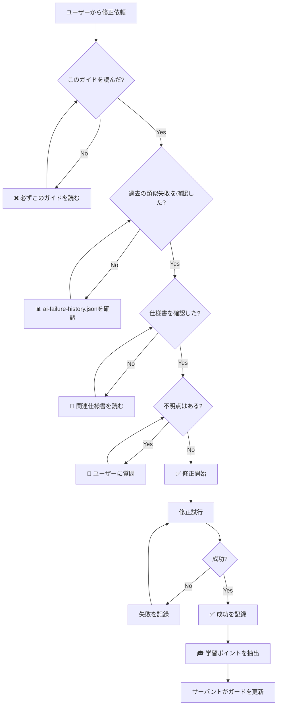

# 🛡️ AI修正失敗防止ガイド（サーバント水先案内人）

## 📋 概要

このガイドは、過去のAI修正失敗から学習した「水先案内人」として機能します。
AIエージェントは修正を開始する前に、必ずこのガイドを参照して同じ失敗を繰り返さないようにしてください。

**更新日**: 2025-12-30
**総失敗記録数**: 1件
**総回復数**: 1件
**平均試行回数**: 2.0回

---

## 🚨 Critical: 修正前の必須チェックリスト

```
□ 1. このinstructionsファイルを読んだ
□ 2. 過去の類似失敗パターンを確認した
□ 3. 関連する仕様書を確認した (mandatory-spec-check.instructions.md)
□ 4. バッチ方式の原則を理解した (batch-system-enforcement.instructions.md)
□ 5. Position階層を理解した (position-hierarchy-enforcement.instructions.md)
□ 6. ユーザーに不明点を質問した
```

**❌ このチェックリストを完了せずに修正を開始してはいけません**

---

## 📊 過去の失敗パターンDB

### 失敗パターン一覧

### 総記録数: 1件

#### 1. バッチ完全消化後の次バッチ生成を実装

**試行回数**: 2回
**解決方法**: （検証用）ガード→セッション→学習の導線を通した
**日時**: 2025/12/30 22:41:52

**学習ポイント**:
- 頻出失敗: バッチ方式の原則違反
- バッチ方式の原則理解不足 - batch-system-enforcement.instructions.mdを確認

**失敗の経緯**:
1. （検証用）まだ直していないが、バッチ確定後に配列を変更しないことを再確認
   - 理由: バッチ方式の原則違反

---


## 🎯 頻出失敗カテゴリー（統計）

1. **バッチ方式の原則違反** - 1回発生

## 🎯 頻出失敗カテゴリー

### カテゴリー1: 仕様理解不足

**症状**: 
- 「まだ直っていない」と言われる
- 意図しない副作用が発生

**原因**:
- 仕様書を読まずに推測で実装
- 既存の設計原則を無視

**予防策**:
1. **必ず** 関連仕様書を読む
2. **必ず** mandatory-spec-check.instructions.md に従う
3. 不明点はユーザーに質問

**参照**: `.aitk/instructions/mandatory-spec-check.instructions.md`

---

### カテゴリー2: バッチ方式の原則違反

**症状**:
- バッチ途中で語句の順序が変わる
- 2語連続出題（振動）が発生
- 「振動が続いている」と報告される

**原因**:
- バッチ確定後に配列を変更
- clearExpiredFlagsの不適切な実行
- 再スケジューリングの誤実行

**予防策**:
1. バッチ確定後は配列を**絶対に**変更しない
2. バッチ完全消化まで再計算しない
3. useCategorySlots=true時は特別ルールを適用

**参照**: `.aitk/instructions/batch-system-enforcement.instructions.md`

---

### カテゴリー3: useEffect依存配列の誤設定

**症状**:
- 無限ループ発生
- コンソールに大量のログ
- ブラウザが固まる

**原因**:
- state更新がuseEffectをトリガーし、そのuseEffectがstateを更新（ループ）
- 依存配列に必要なフラグが含まれていない

**予防策**:
1. 新しいstateフラグを導入した場合、useEffectの依存配列を確認
2. state更新とuseEffect実行の因果関係を図示
3. 無限ループ防止フラグを使用

**例**:
```typescript
// ❌ 悪い例
useEffect(() => {
  setNeedsBatchRegeneration(true); // 無限ループ
}, [needsBatchRegeneration]);

// ✅ 良い例
useEffect(() => {
  if (needsBatchRegeneration) {
    // バッチ再生成処理
    setNeedsBatchRegeneration(false); // フラグをリセット
  }
}, [needsBatchRegeneration]);
```

---

### カテゴリー4: 型定義の不一致

**症状**:
- TypeScriptエラー
- "Property does not exist on type"

**原因**:
- 古いプロパティ名を推測で使用
- 型定義を確認していない

**予防策**:
1. 型定義ファイルを確認
2. IDE の型推論を信頼
3. プロパティ名を推測しない

---

## ✅ 成功パターン分析

**総成功数**: 1件

## 🔄 修正プロセスフロー



---

## 🤖 サーバント水先案内人の役割

サーバントは以下の役割を担います：

1. **失敗記録の自動収集**
   - `record-ai-failure.mjs` による手動記録
   - Git履歴からの自動抽出
   - CI/CD失敗の自動記録

2. **パターン分析**
   - 頻出失敗カテゴリーの特定
   - 成功パターンの抽出
   - 平均試行回数の計算

3. **ガード自動生成**
   - このinstructionsファイルの自動更新
   - 新しい予防策の提案
   - チェックリストの拡張

4. **水先案内**
   - AI修正開始時に関連する過去の失敗を提示
   - 類似ケースの解決方法を提案
   - 確認すべき仕様書を指摘

---

## 📚 関連ドキュメント

### 必須確認
- `.aitk/instructions/mandatory-spec-check.instructions.md` - 仕様確認強制
- `.aitk/instructions/batch-system-enforcement.instructions.md` - バッチ方式
- `.aitk/instructions/modification-enforcement.instructions.md` - 修正前チェック

### 設計原則
- `.aitk/instructions/position-hierarchy-enforcement.instructions.md` - Position階層
- `.aitk/instructions/category-slots-enforcement.instructions.md` - カテゴリースロット

### データベース
- `.aitk/ai-failure-history.json` - AI失敗履歴DB
- `.aitk/failure-patterns.json` - 一般的な失敗パターンDB

---

## 🔧 使用方法

### 修正開始前（AI側）

```bash
# 1. このファイルを読む
cat .aitk/instructions/ai-failure-prevention.instructions.md

# 2. 類似失敗を検索
node scripts/search-ai-failures.mjs "バッチ"

# 3. セッション開始を記録
node scripts/record-ai-failure.mjs start "ユーザー依頼内容"
```

### 修正中（AI側）

```bash
# 修正試行ごとに記録
node scripts/record-ai-failure.mjs attempt "MemorizationView.tsx" "無限ループが発生"
```

### 修正完了後（AI側）

```bash
# 成功を記録
node scripts/record-ai-failure.mjs success "needsBatchRegenerationフラグで解決"

# サーバントにガード更新を依頼
node scripts/learn-from-ai-failures.mjs
```

---

## 📈 継続的改善

このガイドは以下のタイミングで自動更新されます：

1. **即時更新**: 修正成功時
2. **日次更新**: サーバント自動学習（毎日深夜2時）
3. **15コミット更新**: GitHub Actions トリガー

---

## ⚠️ 重要な原則

### 絶対的なルール

1. **推測で実装しない** - 必ず仕様書を確認
2. **不明点は質問する** - ユーザーとの調整が必要
3. **失敗を記録する** - 次回のAIが同じ失敗を防ぐため
4. **バッチ方式の原則を守る** - 振動問題の根本原因

### 推奨事項

1. **段階的修正** - 一度に複数の変更をしない
2. **テスト確認** - 修正後は必ずテストを実行
3. **ログ出力** - デバッグ用のログを残す
4. **フラグ導入** - 状態管理には明示的なフラグを使用

---

## 🎓 学習サイクル

```
失敗 → 記録 → 分析 → ガード生成 → 次回防止
  ↑                                    ↓
  └────────────── 継続的改善 ──────────┘
```

サーバントは過去の失敗から学び、次回のAIを導く水先案内人として機能します。
AIエージェントは必ずこのガイドを活用し、同じ失敗を繰り返さないようにしてください。

---

**最終更新**: 2025-12-30
**次回更新**: サーバント自動学習時（毎日深夜2時）
