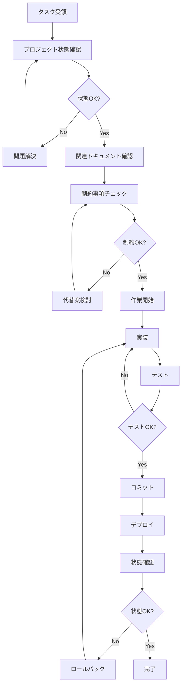

# プロジェクト状態認識システム

**目的**: AIエージェントがプロジェクトの現在状態を完全に理解し、適切な判断を下せるようにする

---

## 🎯 基本原則

作業開始前に**必ず**以下を確認：

1. **現在のブランチ**: `main`で作業中か？
2. **未コミット変更**: 変更が残っていないか？
3. **エラー状態**: VS Code問題パネルに0エラーか？
4. **テスト状態**: すべてのテストがパスしているか？
5. **ビルド状態**: TypeScriptコンパイルが成功しているか？

---

## 📊 プロジェクト全体の状態マップ

### アプリケーション構成

```
English Learning App (英語学習アプリ)
├── 8-AI System（7専門AI + 1メタAI）
│   ├── QuestionScheduler（メタAI: 問題出題制御）
│   ├── MemoryAI（記憶定着最適化）
│   ├── CognitiveLoadAI（認知負荷管理）
│   ├── ErrorPredictionAI（エラー予測）
│   ├── GamificationAI（ゲーミフィケーション）
│   ├── LinguisticAI（言語学的分析）
│   ├── ContextualAI（文脈学習最適化）
│   └── LearningStyleAI（学習スタイル適応）
├── 4つの学習モード
│   ├── Memorization（暗記）
│   ├── Grammar（文法）
│   ├── Spelling（スペリング）
│   └── Translation（翻訳）
├── データセット（5,000+問題）
│   ├── 語彙: 3,000+単語
│   ├── 文法: 500+問題
│   ├── 発音: 800+単語
│   └── 長文: 100+パッセージ
└── 品質システム
    ├── TypeScript strict mode
    ├── ESLint + Prettier
    ├── Vitest (95%+ coverage)
    ├── Playwright E2E
    └── CI/CD (GitHub Actions)
```

---

## 🏗️ 技術スタック

### フロントエンド

| 技術 | バージョン | 用途 |
|------|----------|------|
| React | 18.x | UIフレームワーク |
| TypeScript | 5.x | 型安全性 |
| Vite | 5.x | ビルドツール |
| Tailwind CSS | 3.x | スタイリング |

### 品質管理

| ツール | 目的 | 基準 |
|--------|------|------|
| TypeScript | 型チェック | 0エラー必須 |
| ESLint | コード品質 | 0警告必須 |
| Prettier | コード整形 | 自動適用 |
| Vitest | ユニットテスト | 95%+カバレッジ |
| Playwright | E2Eテスト | 主要フロー100% |
| Markdownlint | ドキュメント品質 | 0エラー必須 |

### データ管理

- **IndexedDB**: 学習進捗、統計データ
- **localStorage**: 設定、キャッシュ
- **CSV**: 学習データセット（`public/data/`）

---

## 📂 重要なファイルとその役割

### コア実装ファイル

```typescript
// 最重要ファイル（変更時は特に注意）
src/ai/scheduler/QuestionScheduler.ts       // メタAI: 問題出題制御
src/ai/AICoordinator.ts                     // AI統合コーディネーター
src/ai/specialists/*.ts                     // 7つの専門AI

// 学習モード実装
src/components/MemorizationView.tsx         // 暗記モード
src/components/GrammarQuizView.tsx          // 文法モード
src/components/SpellingView.tsx             // スペリングモード
src/components/TranslationView.tsx          // 翻訳モード

// アルゴリズム
src/strategies/memoryAcquisitionAlgorithm.ts  // 記憶獲得アルゴリズム
src/strategies/hybridQuestionSelector.ts      // ハイブリッド問題選択
src/strategies/learningPhaseDetector.ts       // 学習フェーズ検出

// データストレージ
src/storage/progress/progressStorage.ts     // 進捗管理
src/storage/progress/statistics.ts          // 統計データ
```

### 設定ファイル

```json
// TypeScript設定
tsconfig.json                    // strict: true, noEmit推奨
tsconfig.node.json               // Node.js用設定

// Linter/Formatter
eslint.config.js                 // ESLint設定
.prettierrc                      // Prettier設定
.markdownlint.json               // Markdown linting

// ビルド/テスト
vite.config.ts                   // Vite設定
vitest.config.ts                 // Vitest設定
playwright.config.ts             // Playwright設定
```

### ドキュメント構造

```
docs/
├── maintenance/              # メンテナンスガイド
│   └── AI_MAINTENANCE_GUIDE.md
├── plans/                    # プロジェクト計画
│   └── SERVANT_EVOLUTION_MASTER_PLAN.md
├── quality/                  # 品質管理
│   ├── QUALITY_SYSTEM.md
│   └── INTEGRATED_QUALITY_PIPELINE.md
├── specifications/           # 仕様書
├── guidelines/              # ガイドライン
└── references/              # リファレンス
```

---

## 🔍 状態確認コマンド

### Git状態の確認

```bash
# 現在のブランチ確認
git branch --show-current
# 期待値: main

# 未コミット変更の確認
git status
# 期待値: nothing to commit, working tree clean

# 最新のコミット確認
git log -1 --oneline
```

### ビルド/テスト状態の確認

```bash
# TypeScript型チェック
npx tsc --noEmit
# 期待値: 出力なし（0エラー）

# ESLint チェック
npm run lint
# 期待値: 0 errors, 0 warnings

# 全テスト実行
npm test
# 期待値: All tests passed

# ビルド成功確認
npm run build
# 期待値: Build completed successfully
```

### プロジェクト健全性チェック

```bash
# VS Code問題パネルのエラー確認
# コマンドパレット → "View: Show Problems"
# 期待値: 0 errors, 0 warnings

# GitHub Actions の状態確認
gh run list --limit 3
# 期待値: すべて✓（成功）

# パッケージの脆弱性確認
npm audit
# 期待値: 0 vulnerabilities
```

---

## 📋 機能実装状況

### Phase 1: 基礎システム ✅ 完了

- [x] 4つの学習モード実装
- [x] 基本的な問題選択アルゴリズム
- [x] 進捗追跡システム
- [x] スコアボード

### Phase 2: AI統合 ✅ 完了

- [x] 7つの専門AI実装
- [x] QuestionScheduler（メタAI）
- [x] AI統合オプトイン機能
- [x] AIシミュレーター

### Phase 3: 品質強化 ✅ 完了

- [x] 包括的テストスイート
- [x] CI/CD パイプライン
- [x] コード品質チェック
- [x] ドキュメント体系化

### Phase 4: サーバント進化 🚧 進行中

- [x] マスタープラン策定
- [x] メンテナンスガイド作成
- [ ] 意思決定ツリーシステム（Phase 1-1）
- [ ] 自動修復システム（Phase 1-2）
- [ ] 学習システム（Phase 2-1）
- [ ] プロアクティブ提案（Phase 2-2）
- [ ] マルチエージェント協調（Phase 3-1）
- [ ] 自己改善システム（Phase 3-2）

---

## 🚨 重要な制約事項

### 絶対に変更してはいけないもの

1. **調整済みのレイアウト値**
   - `h-[600px]`, `sm:h-[650px]` などのTailwindクラス
   - パディング、マージン、フォントサイズ
   - **理由**: ユーザー体験のため精密に調整済み
   - **変更方法**: ユーザーの明示的な許可が必要

2. **データ構造**
   - CSV データフォーマット
   - IndexedDB スキーマ
   - localStorage キー名
   - **理由**: 既存データとの互換性維持

3. **AI アルゴリズムのコアロジック**
   - 忘却曲線の計算式
   - 記憶強度の更新ロジック
   - **理由**: 学習効果が検証済み
   - **変更方法**: シミュレーションで効果検証後

4. **品質基準**
   - TypeScript strict mode
   - テストカバレッジ 95%+
   - 0 エラー、0 警告
   - **理由**: プロジェクトの品質保証

### 変更前に確認が必要なもの

1. **パフォーマンス影響のある変更**
   - 大量データの処理ロジック
   - レンダリング最適化
   - IndexedDB アクセスパターン

2. **ユーザー体験に影響する変更**
   - UIの配置変更
   - 操作フロー変更
   - デフォルト設定変更

3. **後方互換性に影響する変更**
   - API変更
   - データ構造変更
   - 設定キー名変更

---

## 🎯 作業前チェックリスト

新しいタスクを開始する前に、以下をすべて確認：

```markdown
作業開始チェックリスト:

[ ] Git ブランチは main か？
[ ] 未コミット変更は0件か？
[ ] TypeScript コンパイルエラー0か？
[ ] ESLint エラー/警告 0か？
[ ] VS Code 問題パネル 0エラーか？
[ ] 最新のコミットは正常にデプロイされたか？
[ ] 関連ドキュメントを読んだか？
[ ] 変更が制約事項に違反しないか確認したか？
[ ] テスト戦略を考えたか？
[ ] ロールバック方法を理解したか？
```

**すべてチェックが完了してから作業を開始してください。**

---

## 📊 現在の品質メトリクス（目標値）

| 指標 | 目標 | 現在 | 状態 |
|------|------|------|------|
| TypeScript エラー | 0 | 0 | ✅ |
| ESLint 警告 | 0 | 0 | ✅ |
| Markdown エラー | 0 | 0 | ✅ |
| テストカバレッジ | 95%+ | 90%+ | 🟡 |
| E2E テストパス率 | 100% | 100% | ✅ |
| ビルド時間 | <30秒 | ~20秒 | ✅ |
| バンドルサイズ | <500KB | ~350KB | ✅ |

---

## 🔄 継続的モニタリング

### 毎回のコミット前

1. **ローカルチェック**
   ```bash
   npm run typecheck    # TypeScript
   npm run lint         # ESLint
   npm test            # Vitest
   ```

2. **Pre-commit フック** (自動実行)
   - ダークモード禁止チェック
   - 仕様書遵守チェック
   - Prettier フォーマット
   - TypeScript 型チェック
   - プロジェクト構造検証

3. **GitHub Actions** (自動実行)
   - ビルド成功確認
   - 全テスト実行
   - E2E テスト
   - デプロイ

### 定期的なレビュー

- **週次**: 技術的負債の確認
- **月次**: パフォーマンス分析
- **四半期**: アーキテクチャレビュー

---

## 🎓 関連ドキュメント

作業内容に応じて参照：

### メンテナンス作業

- [AI_MAINTENANCE_GUIDE.md](../../../docs/maintenance/AI_MAINTENANCE_GUIDE.md) - AI システムのメンテナンス
- [meta-ai-priority.instructions.md](../meta-ai-priority.instructions.md) - 優先度判断

### 品質保証

- [QUALITY_SYSTEM.md](../../../docs/quality/QUALITY_SYSTEM.md) - 品質システム全体
- [INTEGRATED_QUALITY_PIPELINE.md](../../../docs/quality/INTEGRATED_QUALITY_PIPELINE.md) - 品質パイプライン

### 開発ガイドライン

- [core-principles.instructions.md](../core-principles.instructions.md) - コア原則
- [development-guidelines.instructions.md](../development-guidelines.instructions.md) - 開発ガイドライン

### プロジェクト計画

- [SERVANT_EVOLUTION_MASTER_PLAN.md](../../../docs/plans/SERVANT_EVOLUTION_MASTER_PLAN.md) - サーバント進化計画

---

## 📝 状態記録のベストプラクティス

### コミットメッセージ

```
feat(scope): 簡潔な説明

- 変更内容1
- 変更内容2

関連: #issue-number
```

### ドキュメント更新

変更時は必ず：
1. 変更理由を記録
2. 影響範囲を明記
3. 関連ドキュメントを更新
4. バージョン番号を更新

---

## 🎯 使用例

### 例1: メンテナンス作業開始時

```markdown
**タスク**: QuestionScheduler のバグ修正

**チェックリスト**:
1. ✅ Git ブランチ: main
2. ✅ 未コミット変更: 0件
3. ✅ TypeScript エラー: 0
4. ✅ 関連ドキュメント確認: AI_MAINTENANCE_GUIDE.md 読了
5. ✅ 影響範囲: QuestionScheduler.ts のみ
6. ✅ テスト: questionScheduler.test.ts に追加予定
7. ✅ ロールバック: git revert で可能

**開始OK** ✅
```

### 例2: 新機能実装時

```markdown
**タスク**: 新しい学習モード追加

**事前確認**:
1. ✅ 既存4モードの実装パターン確認
2. ✅ データ構造の互換性確認
3. ✅ UI コンポーネントの再利用可能性確認
4. ✅ テスト戦略策定
5. ✅ ドキュメント更新箇所リストアップ

**制約チェック**:
- レイアウト変更: なし（新規コンポーネント）
- データ構造変更: なし（既存構造を使用）
- パフォーマンス影響: 最小限（遅延ロード実装）

**開始OK** ✅
```

### 例3: 緊急バグ修正時

```markdown
**タスク**: P0バグ - アプリがクラッシュ

**優先度判定**: P0（即座に修正）

**クイックチェック**:
1. ✅ エラーログ確認
2. ✅ 影響範囲特定: MemorizationView.tsx
3. ✅ 原因特定: undefined参照
4. ✅ 修正方法: null チェック追加
5. ✅ テスト: 既存テストで検証可能

**修正後**:
1. ✅ 型チェックパス
2. ✅ テストパス
3. ✅ 手動動作確認
4. ✅ 緊急デプロイ

**完了** ✅
```

---

## 🔄 状態更新フロー



---

**最終更新**: 2025-12-19  
**バージョン**: 1.0.0  
**レビュー**: 必要（作成直後）  
**次回更新**: プロジェクト状態に変化があった時
