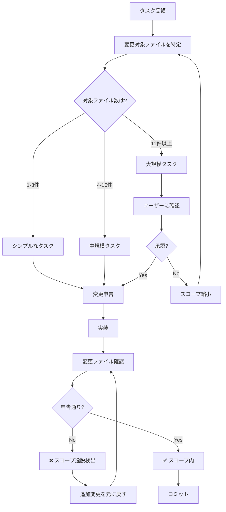

# スコープ制御・変更監視システム

**目的**: AIエージェントが「善意の暴走」で関係ないファイルを変更するのを防ぐ

---

## 🚨 最も重要な原則

```
⚠️ タスクで指定されたファイル以外は変更しない
⚠️ 「ついでに」の最適化は絶対禁止
⚠️ 変更前に影響範囲を明確に申告
```

---

## ❌ 禁止される「善意の暴走」パターン

### パターン1: ついでのリファクタリング

```markdown
❌ BAD Example:

タスク: 「QuestionScheduler.ts のバグを修正して」

AI の行動:
1. ✅ QuestionScheduler.ts のバグ修正 ← OK
2. ❌ AICoordinator.ts もリファクタリング ← NG!
3. ❌ 関連する5ファイルの変数名を統一 ← NG!
4. ❌ インポート順序を整理 ← NG!

問題点:
- どれがバグ修正で、どれが追加の変更か分からない
- レビューが困難
- ロールバックできない
- テストが複雑化
```

```markdown
✅ GOOD Example:

タスク: 「QuestionScheduler.ts のバグを修正して」

AI の行動:
1. ✅ QuestionScheduler.ts のバグのみ修正
2. ✅ 関連するテストファイルのみ更新
3. ✅ 変更を最小限に抑える

結果:
- 変更内容が明確
- レビューしやすい
- 必要ならロールバック可能
```

### パターン2: 過度な最適化

```markdown
❌ BAD Example:

タスク: 「TypeScript エラーを修正して」

AI の行動:
1. ✅ 型エラーを修正 ← OK
2. ❌ Prettier でコード全体を整形 ← NG!
3. ❌ ESLint ルールを適用 ← NG!
4. ❌ 30ファイルを自動修正 ← NG!

問題点:
- 元のタスクと関係ない変更が大量
- git diff が読めない
- CI が失敗するリスク
```

```markdown
✅ GOOD Example:

タスク: 「TypeScript エラーを修正して」

AI の行動:
1. ✅ エラーが出ているファイルのみ修正
2. ✅ 最小限の変更で型エラーを解消
3. ✅ 必要なファイルのみ Prettier 適用

結果:
- 型エラー解消に集中
- 差分が明確
```

### パターン3: 勝手な機能追加

```markdown
❌ BAD Example:

タスク: 「MemorizationView にローディング表示を追加して」

AI の行動:
1. ✅ ローディング表示を追加 ← OK
2. ❌ ついでにエラーハンドリングも改善 ← NG!
3. ❌ パフォーマンス最適化も実施 ← NG!
4. ❌ 新しい状態管理フックを追加 ← NG!

問題点:
- スコープが無制限に拡大
- テストが不十分になる
- バグが混入するリスク
```

```markdown
✅ GOOD Example:

タスク: 「MemorizationView にローディング表示を追加して」

AI の行動:
1. ✅ ローディング表示のみ追加
2. ✅ 関連するテストのみ追加

結果:
- タスクに集中
- テストが十分
```

---

## 📋 変更前チェックリスト（必須）

すべてのタスクで以下を実行：

### ステップ1: タスクの理解

```markdown
タスク分析:

[ ] タスクの目的は何か？
[ ] 変更が必要なファイルは何か？（リスト化）
[ ] 関連するテストファイルは何か？
[ ] ドキュメント更新は必要か？
```

### ステップ2: スコープの定義

```markdown
スコープ定義:

変更対象ファイル:
1. src/ai/scheduler/QuestionScheduler.ts
2. tests/unit/questionScheduler.test.ts

変更しないファイル（明示）:
- src/ai/AICoordinator.ts
- src/ai/specialists/*.ts
- その他すべてのファイル

理由: バグ修正のみのため、他ファイルへの影響なし
```

### ステップ3: 変更申告

```markdown
変更申告:

## 変更予定ファイル (2件)
1. src/ai/scheduler/QuestionScheduler.ts
   - 理由: バグ修正
   - 変更内容: null チェック追加（3行）
   
2. tests/unit/questionScheduler.test.ts
   - 理由: テストケース追加
   - 変更内容: エッジケーステスト追加（10行）

## 変更しないファイル
- その他すべて

## ユーザー確認
この変更で問題ないですか？
```

### ステップ4: 実行後確認

```markdown
実行後チェック:

[ ] 申告したファイルのみ変更したか？
[ ] 予期しない変更はないか？
[ ] git diff で差分を確認したか？
[ ] テストはすべてパスしたか？
```

---

## 🎯 スコープ判定フローチャート



---

## 🔍 スコープ逸脱の検出方法

### 方法1: Git Diff による検出

```bash
# 変更されたファイルをリスト化
git diff --name-only

# 期待: QuestionScheduler.ts, questionScheduler.test.ts のみ
# 実際: 10件のファイルが変更されている → ❌ 逸脱

# 差分の詳細確認
git diff --stat

# 変更行数が異常に多い場合も要注意
```

### 方法2: 変更理由の自己問答

すべての変更ファイルに対して：

```markdown
Q: なぜこのファイルを変更したのか？
A: [理由を明記]

Q: タスクの目的を達成するために必須か？
A: Yes/No

No の場合 → ❌ 変更を取り消す
```

### 方法3: レビュアー視点でのチェック

```markdown
レビュアーの視点:

「このコミットを見たレビュアーは、
 変更の目的をすぐに理解できるか？」

- ✅ Yes → スコープ内
- ❌ No → 関係ない変更が混ざっている可能性
```

---

## 📊 許可される変更の範囲

### ケース1: バグ修正

```markdown
✅ 許可される変更:
- バグがあるファイル本体
- 関連するテストファイル
- バグに関連するドキュメント（READMEなど）

❌ 許可されない変更:
- 「ついでに」発見した別のバグ
- コードスタイルの統一
- 変数名のリネーム（バグ修正に不要な場合）
```

### ケース2: 新機能実装

```markdown
✅ 許可される変更:
- 新機能の実装ファイル
- 新機能のテストファイル
- 新機能のドキュメント
- 必要最小限の既存ファイルの修正

❌ 許可されない変更:
- 既存機能のリファクタリング
- 関係ないファイルの最適化
- プロジェクト全体の整形
```

### ケース3: リファクタリング

```markdown
✅ 許可される変更:
- リファクタリング対象のファイル
- 影響を受けるテストファイル
- 関連ドキュメントの更新

❌ 許可されない変更:
- リファクタリング中に見つけた「改善点」
- 他のファイルの「ついでの」リファクタリング
```

---

## 🎓 実例: 良い例と悪い例

### 実例1: TypeScript エラー修正

```markdown
タスク: 「TypeScript コンパイルエラーを修正して」

❌ BAD Approach:

変更ファイル: 15件
- src/ai/scheduler/QuestionScheduler.ts (型エラー修正)
- src/ai/AICoordinator.ts (ついでにリファクタリング)
- src/components/MemorizationView.tsx (unused変数削除)
- src/components/GrammarQuizView.tsx (コメント追加)
- ... 他11件

問題:
- 型エラー修正がどれか分からない
- レビュー不可能
- ロールバック困難
```

```markdown
✅ GOOD Approach:

変更ファイル: 3件
- src/ai/scheduler/QuestionScheduler.ts (型エラー修正のみ)
- src/strategies/hybridQuestionSelector.ts (型エラー修正のみ)
- tests/unit/questionScheduler.test.ts (テスト更新)

利点:
- 変更が明確
- レビューしやすい
- 必要ならロールバック可能
```

### 実例2: README更新

```markdown
タスク: 「README にインストール手順を追加して」

❌ BAD Approach:

変更ファイル: 8件
- README.md (インストール手順追加)
- docs/guides/*.md (ついでに全ガイド更新)
- package.json (依存関係の並び替え)
- .gitignore (不要な行を削除)

問題:
- README更新以外の変更が多い
- 影響範囲が不明
```

```markdown
✅ GOOD Approach:

変更ファイル: 1件
- README.md (インストール手順のみ追加)

利点:
- 変更が明確
- 影響範囲が限定的
- 安全
```

---

## 🛡️ 強制ルール

以下は**例外なく**守ること：

### ルール1: 1タスク = 1目的

```
✅ OK: 「QuestionScheduler のバグを修正」
❌ NG: 「QuestionScheduler のバグを修正 + リファクタリング + テスト追加」

理由: 複数の目的が混ざると、失敗時の切り分けが困難
```

### ルール2: 変更は最小限

```
✅ OK: 必要最小限の行数のみ変更
❌ NG: ファイル全体を書き直し

理由: 差分が大きいと、何が変わったか分からない
```

### ルール3: スコープ外への拡大禁止

```
✅ OK: タスクで指定されたファイルのみ
❌ NG: 「ついでに」関連ファイルも修正

理由: スコープが無制限に拡大する
```

### ルール4: 変更申告の義務

```
✅ OK: 「以下の2ファイルを変更します」と先に宣言
❌ NG: 無言で10ファイルを変更

理由: ユーザーの予期しない変更を防ぐ
```

---

## 📝 変更申告テンプレート

すべてのタスクで以下のテンプレートを使用：

```markdown
## 📋 変更申告

### タスク概要
[タスクの簡潔な説明]

### 変更予定ファイル
1. [ファイルパス]
   - 変更理由: [理由]
   - 変更内容: [概要]
   - 変更行数: [予想行数]

2. [ファイルパス]
   - 変更理由: [理由]
   - 変更内容: [概要]
   - 変更行数: [予想行数]

### 変更しないファイル
- [明示的に変更しないことを宣言]
- 例: 「その他すべてのファイルは変更しません」

### スコープ外の誘惑
以下は誘惑されるが、変更**しない**:
- [ ] ついでのリファクタリング
- [ ] コードスタイルの統一
- [ ] 変数名の改善
- [ ] コメントの追加
- [ ] その他の最適化

### 確認
- [ ] 変更対象が明確
- [ ] スコープが限定的
- [ ] 必要最小限の変更

---

**この変更計画で問題ないですか？**
承認後に実装を開始します。
```

---

## 🚦 緊急時の例外規定

### 例外が許可されるケース

1. **P0バグ（アプリクラッシュ）**
   - 関連する複数ファイルの緊急修正は許可
   - ただし、修正後に変更内容を報告

2. **セキュリティ脆弱性**
   - 影響範囲が広い場合、複数ファイル修正を許可
   - セキュリティリスクを優先

3. **CI/CDが完全に壊れた**
   - ビルド修復のための複数ファイル修正を許可
   - 修復後、変更内容を整理

### 例外時の手順

```markdown
緊急時チェックリスト:

[ ] 本当に緊急か？（P0かP1か）
[ ] スコープ外変更の理由を記録
[ ] 変更後、追加の変更を別PRで整理
[ ] ユーザーに事後報告
```

---

## 🎯 成功指標

スコープ制御が適切に機能している状態：

| 指標 | 目標 |
|------|------|
| タスクあたり変更ファイル数 | 平均 1-3件 |
| スコープ逸脱率 | <5% |
| 変更申告の実施率 | 100% |
| ユーザーの予期しない変更 | 0件 |
| git revert の成功率 | 100% |

---

## 📚 関連ドキュメント

- [project-state.instructions.md](./project-state.instructions.md) - プロジェクト状態
- [technical-constraints.instructions.md](./technical-constraints.instructions.md) - 技術的制約
- [core-principles.instructions.md](../core-principles.instructions.md) - コア原則

---

**最終更新**: 2025-12-19  
**バージョン**: 1.0.0  
**適用**: すべてのタスク（例外なし）
