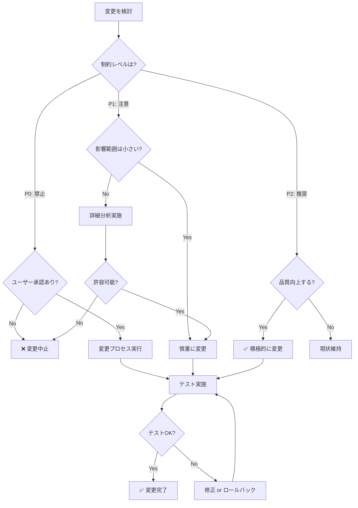

# 技術的制約認識システム

**目的**: 変更可能な範囲と絶対に変更してはいけない範囲を明確に定義

---

## 🚫 変更禁止事項（レベル P0: 絶対厳守）

### 1. レイアウト調整済み値

**禁止対象**:
```typescript
// ❌ これらの値を変更してはいけない
className="h-[600px] sm:h-[650px] md:h-[700px]"
className="w-full max-w-4xl"
className="py-8"
className="gap-4"
className="text-2xl sm:text-3xl"
className="px-4 sm:px-6"
```

**理由**: ユーザー体験のため何度もテストして調整済み

**例外**: ユーザーが「レイアウトを改善して」と明示的に依頼した場合のみ

**変更プロセス**:
1. ユーザーに変更理由と before/after を説明
2. 承認を得る
3. 変更を実施
4. 複数デバイスでテスト

### 2. データ構造とスキーマ

**禁止対象**:
```typescript
// ❌ IndexedDB スキーマの変更
interface ProgressData {
  word: string;
  correctCount: number;
  wrongCount: number;
  lastReviewed: number;
  memoryStrength: number;
  // ... 既存フィールドの削除/変更禁止
}

// ❌ localStorage キー名の変更
'questionSet' // 既存キー名
'enable-ai-coordination' // 既存キー名
'adaptive-network-settings' // 既存キー名
```

**理由**: 既存ユーザーのデータ互換性維持

**例外**: マイグレーション戦略を実装する場合のみ

**変更プロセス**:
1. マイグレーションコード作成
2. バックアップ機能実装
3. ロールバック機能実装
4. 段階的デプロイ

### 3. AI アルゴリズムのコアロジック

**禁止対象**:
```typescript
// ❌ 忘却曲線の計算式
const retention = Math.exp(-timeElapsed / (memoryStrength * 86400000));

// ❌ 記憶強度の更新ロジック
if (isCorrect) {
  newStrength = currentStrength * 1.3;
} else {
  newStrength = Math.max(0.1, currentStrength * 0.7);
}

// ❌ 優先度計算の重み付け
const priority = 
  urgency * 0.4 + 
  difficulty * 0.3 + 
  importance * 0.3;
```

**理由**: 学習効果が実証済み、変更は学習効率に影響

**例外**: シミュレーションで効果検証後

**変更プロセス**:
1. 現在のアルゴリズムのパフォーマンス測定
2. 新アルゴリズムのシミュレーション実行
3. A/Bテスト実施
4. 効果が実証された場合のみ適用

### 4. 品質基準

**禁止対象**:
```json
// ❌ tsconfig.json の strict 設定緩和
{
  "compilerOptions": {
    "strict": true,  // 変更禁止
    "noImplicitAny": true,  // 変更禁止
    "strictNullChecks": true  // 変更禁止
  }
}

// ❌ テストカバレッジの基準引き下げ
// 目標: 95%+ → 変更禁止
```

**理由**: プロジェクトの品質保証の要

**例外**: なし（絶対厳守）

---

## ⚠️ 変更注意事項（レベル P1: 慎重に判断）

### 1. パフォーマンス影響のある変更

**注意対象**:
```typescript
// ⚠️ 大量データの処理
const allProgress = await getAllProgress(); // 数千件
const filtered = allProgress.filter(...); // O(n)

// ⚠️ レンダリング最適化
const MemoizedComponent = React.memo(MyComponent);

// ⚠️ IndexedDB アクセス
const results = await db.questions.toArray(); // 全件取得
```

**判断基準**:
- データ量が 1,000件以上の場合は要最適化
- レンダリング頻度が高い（1秒間に10回以上）
- IndexedDB アクセスが連続する

**ベストプラクティス**:
1. ページネーション実装
2. React.memo / useMemo 活用
3. IndexedDB クエリ最適化
4. Web Worker 検討（重い処理）

### 2. ユーザー体験に影響する変更

**注意対象**:
```typescript
// ⚠️ デフォルト設定の変更
const defaultSettings = {
  autoPlay: true, // 変更前に確認
  showHints: true, // 変更前に確認
  difficulty: 'medium', // 変更前に確認
};

// ⚠️ 操作フローの変更
// Before: クリック → 確認 → 実行
// After: クリック → 実行（確認スキップ） ← 要検討
```

**判断基準**:
- 既存ユーザーの習慣に影響するか？
- 誤操作のリスクが増えるか？
- アクセシビリティに配慮されているか？

**変更プロセス**:
1. 影響範囲の分析
2. ユーザーテスト（可能なら）
3. 段階的ロールアウト
4. フィードバック収集

### 3. セキュリティ・プライバシー

**注意対象**:
```typescript
// ⚠️ ユーザーデータの取り扱い
localStorage.setItem('user-data', JSON.stringify(data));

// ⚠️ 外部API呼び出し
fetch('https://external-api.com/...'); // CORS, 認証確認

// ⚠️ エラーログ
console.error('Error:', sensitiveData); // 機密情報の除外
```

**判断基準**:
- 個人情報が含まれるか？
- 外部に送信されるデータか？
- エラーログに機密情報が含まれないか？

**ベストプラクティス**:
1. 最小限のデータのみ保存
2. 機密情報はメモリ内で処理
3. エラーログをサニタイズ
4. HTTPS必須（外部通信）

---

## ✅ 変更推奨事項（レベル P2: 積極的に改善）

### 1. コード品質改善

**推奨対象**:
```typescript
// ✅ 型定義の追加・改善
function processData(data: any) { // ❌
function processData(data: ProcessedData) { // ✅

// ✅ コメントの追加・改善
// Bad: // ループ
// Good: // 各問題の優先度を計算し、降順でソート

// ✅ マジックナンバーの定数化
const threshold = 0.7; // ❌
const MEMORY_RETENTION_THRESHOLD = 0.7; // ✅

// ✅ 関数の分割
function doEverything() { // 100行 ❌
function validateInput() { // 10行 ✅
function processData() { // 15行 ✅
function saveResults() { // 8行 ✅
```

**判断基準**:
- 可読性が向上するか？
- 保守性が向上するか？
- テストしやすくなるか？

### 2. テストカバレッジ向上

**推奨対象**:
```typescript
// ✅ 未テストのエッジケース
test('handles empty array', () => { ... });
test('handles undefined input', () => { ... });
test('handles negative numbers', () => { ... });

// ✅ 統合テスト追加
test('full user workflow', () => { ... });

// ✅ E2Eテスト追加
test('can complete a quiz session', () => { ... });
```

**目標**:
- ユニットテスト: 95%+ カバレッジ
- 統合テスト: 主要フロー 100%
- E2Eテスト: 重要機能 100%

### 3. ドキュメント充実

**推奨対象**:
```markdown
<!-- ✅ API ドキュメント -->
/**
 * 問題を選択します
 * @param pool - 問題プール
 * @param count - 選択数
 * @returns 選択された問題の配列
 * @throws {Error} プールが空の場合
 */
function selectQuestions(pool: Question[], count: number): Question[]

<!-- ✅ 使用例の追加 -->
## Example
```typescript
const questions = selectQuestions(myPool, 10);
```

<!-- ✅ トラブルシューティング追加 -->
## Troubleshooting
Q: エラーが出ます
A: 以下を確認してください...
```

---

## 🎯 判断フローチャート



---

## 📋 変更前チェックリスト

すべての変更で以下を確認：

```markdown
変更可否チェックリスト:

## 制約レベル判定
[ ] P0（禁止）に該当しないか？
[ ] P1（注意）の場合、慎重な検討をしたか？
[ ] P2（推奨）の場合でも、品質向上につながるか？

## 影響範囲確認
[ ] レイアウトに影響しないか？
[ ] データ構造に影響しないか？
[ ] AIアルゴリズムに影響しないか？
[ ] パフォーマンスに影響しないか？
[ ] ユーザー体験に影響しないか？

## 品質保証
[ ] TypeScript 型チェックは通るか？
[ ] 既存テストはすべてパスするか？
[ ] 新しいテストを追加したか？
[ ] ドキュメントを更新したか？

## 安全性確認
[ ] ロールバック可能か？
[ ] エラーハンドリングは適切か？
[ ] セキュリティリスクはないか？
```

---

## 🔍 具体例: 判断シナリオ

### シナリオ 1: ボタンの色を変更したい

```markdown
**変更内容**: primary ボタンの色を青→緑に変更

**判断**:
- 制約レベル: P1（注意）
- 理由: ユーザー体験に影響（視覚的変更）
- 影響: 既存ユーザーの認識に影響する可能性

**対応**:
1. ユーザーに提案
2. 変更理由を説明（例: アクセシビリティ向上）
3. スクリーンショットで比較
4. 承認後に実施

**結論**: ✅ 条件付きで変更可能
```

### シナリオ 2: メモリ強度の計算式を変更したい

```markdown
**変更内容**: 記憶強度の減衰率を 0.7 → 0.6 に変更

**判断**:
- 制約レベル: P0（禁止）
- 理由: AIアルゴリズムのコアロジック
- 影響: 学習効果に直接影響

**対応**:
1. シミュレーションで効果検証
2. A/Bテスト実施
3. データで効果を実証
4. 承認後に段階的ロールアウト

**結論**: ⚠️ 厳格なプロセスが必要
```

### シナリオ 3: 関数名を変更したい

```markdown
**変更内容**: `getData()` → `fetchUserProgress()` に変更

**判断**:
- 制約レベル: P2（推奨）
- 理由: 可読性向上
- 影響: 内部実装のみ（公開APIではない）

**対応**:
1. すべての参照箇所を更新
2. テストを実行
3. コミット

**結論**: ✅ 積極的に変更すべき
```

### シナリオ 4: 新しい依存パッケージを追加したい

```markdown
**変更内容**: lodash をインストール

**判断**:
- 制約レベル: P1（注意）
- 理由: バンドルサイズ、セキュリティに影響
- 影響: ビルドサイズ増加の可能性

**対応**:
1. 本当に必要か検討（標準APIで代替可能？）
2. バンドルサイズへの影響を確認
3. セキュリティ監査（npm audit）
4. 最小限の関数のみインポート（tree-shaking）

**結論**: ⚠️ 慎重に判断
```

---

## 🛡️ 制約違反の検出

### Pre-commit フックによる自動検出

```bash
# レイアウト変更の検出
git diff --cached | grep -E 'className.*h-\[|w-\[|p-\[|m-\['

# データ構造変更の検出
git diff --cached -- '*.ts' | grep -E 'interface.*Data|type.*Schema'

# AI アルゴリズム変更の検出
git diff --cached -- 'src/strategies/*.ts' 'src/ai/**/*.ts'
```

### 手動レビューポイント

レビュー時に以下を確認：

1. **差分確認**
   ```bash
   git diff main...feature-branch
   ```

2. **影響範囲分析**
   - 何個のファイルが変更されたか？
   - コアファイルは含まれるか？
   - テストは追加されたか？

3. **品質チェック**
   - TypeScript エラー 0
   - ESLint 警告 0
   - テストすべてパス

---

## 📚 関連ドキュメント

- [project-state.instructions.md](./project-state.instructions.md) - プロジェクト状態
- [SPECIFICATION_ENFORCEMENT.md](../../../.ai-instructions/SPECIFICATION_ENFORCEMENT.md) - 仕様遵守
- [core-principles.instructions.md](../core-principles.instructions.md) - コア原則

---

**最終更新**: 2025-12-19  
**バージョン**: 1.0.0  
**次回レビュー**: Phase 1完了時
