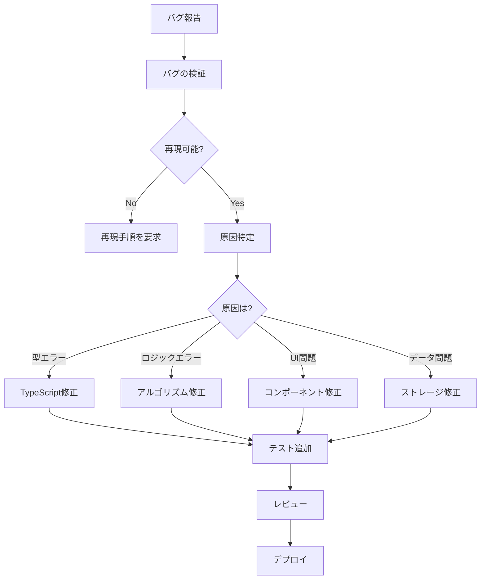

# バグ修正意思決定ツリー

**目的**: バグ報告に対して、修正方法と優先度を自動判断

---

## 🎯 バグ修正の基本フロー



---

## 🔍 バグ検証チェックリスト

### ステップ1: バグの確認

```markdown
バグ検証チェックリスト:

[ ] エラーメッセージは明確か?
[ ] 再現手順は明確か?
[ ] 期待される動作は何か?
[ ] 実際の動作は何か?
[ ] どの環境で発生するか? (ブラウザ、デバイス)
[ ] いつから発生しているか?
[ ] 回避策はあるか?
```

### ステップ2: 再現性の確認

```typescript
// 再現手順の記録

/**
 * バグ再現手順
 * 
 * 1. メモリゼーションモードを開く
 * 2. 問題を10問解答する
 * 3. スコアボードを開く
 * → 期待: 正解率が表示される
 * → 実際: undefined が表示される
 */
```

---

## 📊 バグの分類

### タイプ1: TypeScript型エラー

```markdown
**症状**:
- コンパイルエラー
- `Cannot read property 'x' of undefined`
- `Type 'X' is not assignable to type 'Y'`

**原因**:
- null/undefined チェック不足
- 型定義の不一致
- オプショナルプロパティの誤用

**修正方針**:
1. 型ガードを追加
2. null チェックを追加
3. 型定義を修正

**例**:
```typescript
// ❌ BAD: null チェックなし
function getScore(user: User): number {
  return user.progress.score; // user.progress が undefined の可能性
}

// ✅ GOOD: null チェック追加
function getScore(user: User): number {
  if (!user.progress) {
    return 0;
  }
  return user.progress.score;
}
```
```

### タイプ2: ロジックエラー

```markdown
**症状**:
- 期待と異なる結果
- 計算結果が間違っている
- 条件分岐が正しくない

**原因**:
- アルゴリズムの誤り
- 境界値の考慮不足
- エッジケースの見落とし

**修正方針**:
1. アルゴリズムを見直す
2. 境界値テストを追加
3. エッジケースを処理

**例**:
```typescript
// ❌ BAD: 境界値を考慮していない
function calculateRetention(days: number): number {
  return Math.exp(-days / 7); // days=0 のケースを考慮していない
}

// ✅ GOOD: 境界値を考慮
function calculateRetention(days: number): number {
  if (days < 0) {
    throw new Error('days must be non-negative');
  }
  if (days === 0) {
    return 1.0; // 完全な記憶
  }
  return Math.exp(-days / 7);
}
```
```

### タイプ3: UI/UX問題

```markdown
**症状**:
- ボタンが押せない
- 表示が崩れる
- レスポンシブが効かない

**原因**:
- CSS の優先順位
- z-index の問題
- レスポンシブ設定の不足

**修正方針**:
1. CSS を調整
2. レスポンシブテスト実施
3. 複数デバイスで確認

**例**:
```tsx
{/* ❌ BAD: モバイル対応なし */}
<button className="w-[200px] h-[50px]">
  Click Me
</button>

{/* ✅ GOOD: レスポンシブ対応 */}
<button className="w-full sm:w-[200px] h-[44px] sm:h-[50px]">
  Click Me
</button>
```
```

### タイプ4: データ問題

```markdown
**症状**:
- データが保存されない
- データが消える
- データ不整合

**原因**:
- IndexedDB の接続エラー
- トランザクションの失敗
- データスキーマの不一致

**修正方針**:
1. エラーハンドリング追加
2. データバリデーション実装
3. マイグレーション実装

**例**:
```typescript
// ❌ BAD: エラーハンドリングなし
async function saveProgress(data: ProgressData): Promise<void> {
  await db.progress.put(data);
}

// ✅ GOOD: エラーハンドリング追加
async function saveProgress(data: ProgressData): Promise<void> {
  try {
    await db.progress.put(data);
    logger.info('Progress saved successfully');
  } catch (error) {
    logger.error('Failed to save progress', error);
    // フォールバック: localStorage に保存
    localStorage.setItem('backup-progress', JSON.stringify(data));
    throw new Error('Failed to save progress. Data backed up.');
  }
}
```
```

### タイプ5: パフォーマンス問題

```markdown
**症状**:
- 処理が遅い
- メモリリーク
- UI がフリーズ

**原因**:
- 非効率なアルゴリズム
- 不要な再レンダリング
- メモリ解放の不足

**修正方針**:
1. アルゴリズムを最適化
2. React.memo を活用
3. メモリ管理を改善

**例**:
```typescript
// ❌ BAD: O(n²) の複雑度
function findDuplicates(questions: Question[]): Question[] {
  const duplicates: Question[] = [];
  for (let i = 0; i < questions.length; i++) {
    for (let j = i + 1; j < questions.length; j++) {
      if (questions[i].id === questions[j].id) {
        duplicates.push(questions[i]);
      }
    }
  }
  return duplicates;
}

// ✅ GOOD: O(n) に最適化
function findDuplicates(questions: Question[]): Question[] {
  const seen = new Set<string>();
  const duplicates: Question[] = [];
  
  for (const question of questions) {
    if (seen.has(question.id)) {
      duplicates.push(question);
    } else {
      seen.add(question.id);
    }
  }
  return duplicates;
}
```
```

---

## 🛠️ 修正手順テンプレート

### テンプレート: バグ修正の標準手順

```markdown
## バグ修正プロトコル

### 1. バグの再現 (15分)
- [ ] 再現手順を実行
- [ ] エラーログを確認
- [ ] スクリーンショット取得

### 2. 原因特定 (30分)
- [ ] エラーメッセージから原因を推測
- [ ] 関連コードを確認
- [ ] Git blame で変更履歴確認
- [ ] 最近の変更との関連を調査

### 3. 修正案の検討 (20分)
- [ ] 複数の修正案を検討
- [ ] 影響範囲を分析
- [ ] 最適な修正方法を選択

### 4. 修正の実装 (1時間)
- [ ] 最小限の変更で修正
- [ ] スコープ逸脱しない
- [ ] コメントで理由を記録

### 5. テストの追加 (30分)
- [ ] バグを再現するテスト
- [ ] 修正後にパスするテスト
- [ ] エッジケースのテスト

### 6. 検証 (20分)
- [ ] ローカルで動作確認
- [ ] 既存テストすべてパス
- [ ] TypeScript エラー 0
- [ ] ESLint 警告 0

### 7. デプロイ (10分)
- [ ] コミット
- [ ] PR作成 (必要なら)
- [ ] CI/CD 確認
- [ ] 本番確認
```

---

## 🎯 意思決定ルール

### ルール1: null/undefined エラー

```markdown
IF エラーが `Cannot read property 'x' of undefined`
  THEN
    1. エラー箇所を特定
    2. null チェックを追加
       ```typescript
       if (!obj || !obj.property) {
         // エラーハンドリング
       }
       ```
    3. Optional chaining を検討
       ```typescript
       const value = obj?.property?.nestedProperty;
       ```
    4. テストケース追加
    5. TypeScript strict mode で検証
  
  優先度: P1 (アプリクラッシュの原因)
  修正時間: 30分以内
```

### ルール2: 計算結果の誤り

```markdown
IF 計算結果が期待と異なる
  THEN
    1. 計算ロジックを確認
    2. 境界値をテスト
       - 最小値 (0, 負数)
       - 最大値 (無限大)
       - 特殊値 (NaN, Infinity)
    3. アルゴリズムを修正
    4. 単体テストを充実
    5. シミュレーションで検証
  
  優先度: P1 (学習効果に影響)
  修正時間: 1-2時間
```

### ルール3: データが保存されない

```markdown
IF データが保存されない
  THEN
    1. IndexedDB 接続を確認
    2. エラーハンドリングを追加
    3. フォールバック実装
       ```typescript
       try {
         await db.save(data);
       } catch (error) {
         localStorage.setItem('backup', JSON.stringify(data));
       }
       ```
    4. データバリデーション追加
    5. 保存成功の確認処理
  
  優先度: P0 (データ損失)
  修正時間: 1時間以内
```

### ルール4: UIが崩れている

```markdown
IF UIが崩れている
  THEN
    1. 影響範囲を確認
       - 全画面？特定の画面？
       - 全デバイス？特定のデバイス？
    2. レスポンシブ設定を確認
    3. CSS優先順位を確認
    4. ブラウザの開発ツールで検証
    5. 複数デバイスでテスト
  
  優先度: P2 (機能は動く)
  修正時間: 30分-1時間
```

### ルール5: パフォーマンスが悪い

```markdown
IF パフォーマンスが悪い
  THEN
    1. パフォーマンス測定
       - Chrome DevTools Profiler
       - React DevTools Profiler
    2. ボトルネックを特定
    3. 最適化方法を検討
       - アルゴリズム改善
       - React.memo 追加
       - 遅延ロード実装
    4. 最適化実施
    5. Before/After 測定
  
  優先度: P1 または P2 (劣化度合いに依存)
  修正時間: 2-4時間
```

---

## 📝 実例: バグ修正シナリオ

### 例1: TypeError - undefined プロパティアクセス

```markdown
**バグ報告**:
「メモリゼーションモードで問題が表示されない」

**エラーログ**:
```
TypeError: Cannot read property 'word' of undefined
  at MemorizationView.tsx:250
```

**再現手順**:
1. メモリゼーションモードを開く
2. 問題セットを選択
3. → エラーで画面が白くなる

**原因特定**:
```typescript
// src/components/MemorizationView.tsx:250
const word = currentQuestion.word; // currentQuestion が undefined
```

**修正**:
```typescript
// 修正前
const word = currentQuestion.word;

// 修正後
if (!currentQuestion) {
  return <LoadingIndicator />;
}
const word = currentQuestion.word;
```

**テスト追加**:
```typescript
test('handles undefined currentQuestion gracefully', () => {
  const { container } = render(
    <MemorizationView currentQuestion={undefined} />
  );
  expect(container).toHaveTextContent('Loading');
});
```

**結果**: ✅ 修正完了（20分）
```

### 例2: 記憶強度の計算が間違っている

```markdown
**バグ報告**:
「何度正解しても記憶強度が上がらない」

**再現手順**:
1. 同じ単語を5回正解
2. 記憶強度を確認
3. → 0.1 のまま変わらない

**原因特定**:
```typescript
// src/strategies/memoryAcquisitionAlgorithm.ts:45
function updateMemoryStrength(current: number, isCorrect: boolean): number {
  if (isCorrect) {
    return current * 1.3; // 整数演算の問題
  }
  return Math.max(0.1, current * 0.7);
}
```

**修正**:
```typescript
// 問題: current が 0 の場合、0 * 1.3 = 0
// 修正
function updateMemoryStrength(current: number, isCorrect: boolean): number {
  if (isCorrect) {
    // 初期値を考慮
    const newStrength = current === 0 ? 0.5 : current * 1.3;
    return Math.min(10.0, newStrength); // 上限も設定
  }
  return Math.max(0.1, current * 0.7);
}
```

**テスト追加**:
```typescript
describe('updateMemoryStrength', () => {
  test('handles zero initial strength', () => {
    const result = updateMemoryStrength(0, true);
    expect(result).toBeGreaterThan(0);
  });
  
  test('increases on correct answer', () => {
    const result = updateMemoryStrength(1.0, true);
    expect(result).toBeGreaterThan(1.0);
  });
  
  test('has upper limit', () => {
    const result = updateMemoryStrength(100, true);
    expect(result).toBeLessThanOrEqual(10.0);
  });
});
```

**結果**: ✅ 修正完了（1時間）
```

### 例3: データが保存されない

```markdown
**バグ報告**:
「学習進捗が保存されず、リロードすると消える」

**再現手順**:
1. 問題を解答
2. ブラウザをリロード
3. → 進捗が消えている

**原因特定**:
```typescript
// src/storage/progress/progressStorage.ts:120
async function saveProgress(data: ProgressData): Promise<void> {
  await db.progress.put(data); // エラーハンドリングなし
}
```

**エラーログ**:
```
QuotaExceededError: Failed to execute 'put' on 'IDBObjectStore'
```

**修正**:
```typescript
async function saveProgress(data: ProgressData): Promise<void> {
  try {
    await db.progress.put(data);
    logger.info('Progress saved to IndexedDB');
  } catch (error) {
    logger.error('IndexedDB save failed', error);
    
    // フォールバック: localStorage
    try {
      const backup = JSON.stringify(data);
      localStorage.setItem(`progress-backup-${data.word}`, backup);
      logger.info('Progress backed up to localStorage');
    } catch (storageError) {
      logger.error('localStorage backup failed', storageError);
      // ユーザーに通知
      throw new Error('Failed to save progress. Please free up storage space.');
    }
  }
}
```

**テスト追加**:
```typescript
test('falls back to localStorage on IndexedDB failure', async () => {
  // IndexedDB を強制的に失敗させる
  const mockDB = {
    progress: {
      put: jest.fn().mockRejectedValue(new Error('QuotaExceeded')),
    },
  };
  
  const data: ProgressData = { word: 'test', correctCount: 1 };
  await saveProgress(data);
  
  // localStorage にバックアップされているか確認
  const backup = localStorage.getItem('progress-backup-test');
  expect(backup).toBeDefined();
});
```

**結果**: ✅ 修正完了（1.5時間）
```

---

## 🚀 修正後の確認

### 確認チェックリスト

```markdown
修正後の確認:

[ ] バグが修正されたか? (再現手順で確認)
[ ] 新しいテストが追加されたか?
[ ] 既存のテストはすべてパスするか?
[ ] TypeScript エラー 0 か?
[ ] ESLint 警告 0 か?
[ ] スコープ逸脱していないか?
[ ] ドキュメントを更新したか? (必要なら)
[ ] コミットメッセージは適切か?
```

### デプロイ前の確認

```bash
# 最終確認コマンド

# 1. 型チェック
npx tsc --noEmit

# 2. Lint
npm run lint

# 3. テスト
npm test

# 4. ビルド
npm run build

# すべてパス → デプロイ OK
```

---

## 📚 関連ドキュメント

- [maintenance-decision.instructions.md](./maintenance-decision.instructions.md) - メンテナンス判断
- [scope-control.instructions.md](../context/scope-control.instructions.md) - スコープ制御
- [quality-standards.instructions.md](../context/quality-standards.instructions.md) - 品質基準

---

**最終更新**: 2025-12-19  
**バージョン**: 1.0.0  
**適用**: すべてのバグ修正
