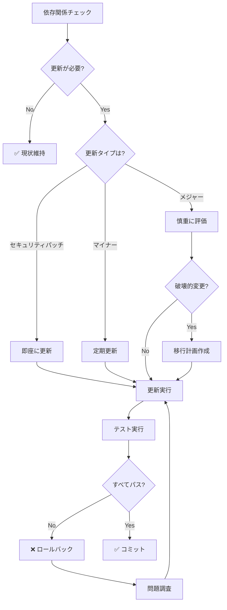

# 依存関係管理意思決定ツリー

**目的**: 依存関係の更新タイミングと手順を判断し、安全に実行

---

## 🎯 依存関係管理の基本原則

```
更新ポリシー:

✅ セキュリティパッチ: 即座に適用
✅ マイナーバージョン: 月1回確認
✅ メジャーバージョン: 慎重に評価
✅ 破壊的変更: 十分なテスト
✅ ロックファイル: 必ずコミット
```

---

## 🔍 更新判断フローチャート



---

## 📊 更新タイプ別判断

| 更新タイプ | 例 | 優先度 | テスト | リスク |
|----------|---|-------|-------|-------|
| **Patch** | 1.2.3 → 1.2.4 | P1 | ユニット | 低 |
| **Minor** | 1.2.3 → 1.3.0 | P2 | ユニット+統合 | 中 |
| **Major** | 1.2.3 → 2.0.0 | P3 | すべて | 高 |
| **Security** | 任意 → Patched | P0 | ユニット+E2E | Critical |

---

## 🛠️ 更新手順

### ステップ1: 現状確認

```markdown
**確認コマンド**:

1. 古い依存関係のチェック
   ```bash
   npm outdated
   ```
   
   出力例:
   ```
   Package      Current  Wanted  Latest  Location
   react        18.2.0   18.3.1  19.0.0  node_modules/react
   typescript   5.2.2    5.2.2   5.3.3   node_modules/typescript
   vite         5.0.0    5.0.8   5.1.0   node_modules/vite
   ```

2. セキュリティ脆弱性のチェック
   ```bash
   npm audit
   ```

3. 依存関係ツリーの確認
   ```bash
   npm list --depth=0
   ```

**時間**: 5分
```

### ステップ2: 更新計画

```markdown
**優先度付け**:

## P0（即座）: セキュリティパッチ
```bash
npm audit fix
```

## P1（今週）: パッチバージョン
```bash
# すべてのパッチバージョンを更新
npm update
```

## P2（今月）: マイナーバージョン
```bash
# 特定パッケージのマイナー更新
npm install react@^18.3.0
```

## P3（計画的）: メジャーバージョン
```bash
# 評価・テスト後に更新
npm install react@19.0.0
```

**時間**: 10-15分
```

### ステップ3: 更新実行

```markdown
**実行手順**:

1. ブランチ作成
   ```bash
   git checkout -b deps/update-react
   ```

2. 更新実行
   ```bash
   npm install react@latest
   ```

3. lockfile 確認
   ```bash
   git diff package-lock.json
   ```

4. 変更内容確認
   ```bash
   git diff package.json
   ```

**時間**: 5-10分
```

### ステップ4: テスト

```markdown
**テスト項目**:

1. TypeScript チェック
   ```bash
   npx tsc --noEmit
   ```

2. ユニットテスト
   ```bash
   npm test
   ```

3. ビルド確認
   ```bash
   npm run build
   ```

4. E2Eテスト（メジャー更新時）
   ```bash
   npm run test:e2e
   ```

5. 動作確認
   ```bash
   npm run preview
   # ブラウザで主要機能をテスト
   ```

**時間**: 15-30分
```

### ステップ5: コミット・デプロイ

```markdown
**コミット**:
```bash
git add package.json package-lock.json
git commit -m "chore(deps): update react to 18.3.1"
git push origin deps/update-react
```

**プルリクエスト**:
- 更新内容を説明
- テスト結果を記載
- 破壊的変更を明記（あれば）

**マージ後**:
- CI/CDで自動デプロイ
- 本番環境で動作確認

**時間**: 10-15分
```

---

## 🎯 意思決定ルール

### ルール1: セキュリティ脆弱性（P0）

```markdown
IF npm audit で脆弱性検出
  THEN
    優先度: P0（即座に対応）
    
    手順:
    1. 自動修正試行
       ```bash
       npm audit fix
       ```
    
    2. IF (自動修正不可)
         THEN
           # 手動更新
           npm update [package]
           # または
           npm install [package]@latest
    
    3. テスト実行
       ```bash
       npm test
       npm run build
       ```
    
    4. IF (テスト失敗)
         THEN
           - 代替パッケージを検討
           - 該当機能を一時無効化
           - セキュリティパッチ待ち
    
    5. 即座にデプロイ
  
  時間: 30-120分
  通知: チームに報告
```

### ルール2: パッチバージョン（P1）

```markdown
IF パッチバージョン更新が利用可能
  例: 1.2.3 → 1.2.4
  
  THEN
    優先度: P1（1週間以内）
    
    手順:
    1. 一括更新
       ```bash
       npm update
       ```
    
    2. ユニットテスト
       ```bash
       npm test
       ```
    
    3. ビルド確認
       ```bash
       npm run build
       ```
    
    4. コミット
       ```bash
       git commit -m "chore(deps): update patch versions"
       ```
  
  時間: 30分
  リスク: 低
```

### ルール3: マイナーバージョン（P2）

```markdown
IF マイナーバージョン更新が利用可能
  例: 1.2.3 → 1.3.0
  
  THEN
    優先度: P2（1ヶ月以内）
    
    手順:
    1. CHANGELOGを確認
       - 新機能は？
       - 非推奨APIは？
       - バグ修正は？
    
    2. 個別に更新
       ```bash
       npm install package@^1.3.0
       ```
    
    3. ユニット+統合テスト
       ```bash
       npm test
       npm run test:integration
       ```
    
    4. 動作確認
       ```bash
       npm run preview
       ```
    
    5. コミット
       ```bash
       git commit -m "chore(deps): update package to 1.3.0"
       ```
  
  時間: 1-2時間
  リスク: 中
```

### ルール4: メジャーバージョン（P3）

```markdown
IF メジャーバージョン更新が利用可能
  例: 1.2.3 → 2.0.0
  
  THEN
    優先度: P3（計画的に対応）
    
    手順:
    1. 移行ガイド確認
       - 破壊的変更のリスト
       - 移行手順
       - 非推奨APIの代替
    
    2. 影響範囲の調査
       ```bash
       # 使用箇所を検索
       grep -r "import.*from 'package'" src/
       ```
    
    3. 移行計画作成
       - タスクリスト
       - 時間見積もり
       - ロールバック計画
    
    4. 段階的に移行
       - 1機能ずつ更新
       - 各段階でテスト
    
    5. すべてのテスト
       ```bash
       npm test
       npm run test:e2e
       npm run build
       ```
    
    6. ベータ環境でテスト
    
    7. 本番デプロイ
  
  時間: 4-16時間
  リスク: 高
```

### ルール5: 定期メンテナンス

```markdown
定期実行（月1回）:

1. 依存関係チェック
   ```bash
   npm outdated
   ```

2. セキュリティ監査
   ```bash
   npm audit
   ```

3. 未使用依存関係の削除
   ```bash
   npx depcheck
   ```

4. package.json の整理
   - 未使用パッケージ削除
   - devDependencies への移動

5. ドキュメント更新
   - README の依存関係セクション
   - 互換性情報

時間: 2-4時間/月
```

---

## 📝 実例: 依存関係更新シナリオ

### 例1: React 18.2 → 18.3 更新

```markdown
**タイプ**: マイナーバージョン（P2）

**手順**:

1. CHANGELOGを確認
   - 新機能: `useOptimistic`, `useFormState`
   - 非推奨: なし
   - バグ修正: 15件

2. 更新実行
```bash
git checkout -b deps/react-18.3
npm install react@18.3.1 react-dom@18.3.1
```

3. TypeScript チェック
```bash
$ npx tsc --noEmit
✅ No errors
```

4. テスト実行
```bash
$ npm test
✅ 523 tests passed
```

5. ビルド確認
```bash
$ npm run build
✅ Build successful
dist/index.html  1.2 kB
```

6. 動作確認
```bash
$ npm run preview
# ブラウザで主要機能をテスト
✅ すべて正常
```

7. コミット
```bash
git add package.json package-lock.json
git commit -m "chore(deps): update react to 18.3.1

- Added useOptimistic and useFormState hooks
- Fixed 15 bugs
- No breaking changes"

git push origin deps/react-18.3
```

**結果**: ✅ 完了（90分）
```

### 例2: Vite 4 → 5 更新（メジャー）

```markdown
**タイプ**: メジャーバージョン（P3）

**準備**:

1. 移行ガイド確認
   - https://vitejs.dev/guide/migration.html
   
2. 破壊的変更のリスト
   - CJS Node API deprecated
   - `.env` file loading order changed
   - `server.middlewareMode` API changed

3. 影響範囲調査
```bash
# vite.config.ts を確認
cat vite.config.ts

# CJS 使用箇所を検索
grep -r "require.*vite" .
```

**移行**:

1. バックアップ作成
```bash
git checkout -b deps/vite-5-migration
cp vite.config.ts vite.config.ts.bak
```

2. Vite更新
```bash
npm install vite@5.0.0 --save-dev
```

3. 設定ファイル更新
```typescript
// vite.config.ts
// Before (Vite 4)
export default defineConfig({
  server: {
    middlewareMode: 'html'
  }
});

// After (Vite 5)
export default defineConfig({
  server: {
    middlewareMode: true
  }
});
```

4. .env ファイル順序確認
```bash
# .env.local が .env より優先されることを確認
cat .env
cat .env.local
```

5. テスト
```bash
# 開発サーバー起動確認
npm run dev
✅ Server started

# ビルド確認
npm run build
✅ Build successful

# すべてのテスト
npm test
✅ All tests passed

# E2E テスト
npm run test:e2e
✅ All scenarios passed
```

6. ドキュメント更新
```markdown
# README.md
## Requirements
- Node.js 18+
- Vite 5+
```

**結果**: ✅ 完了（6時間）
**注意**: メジャー更新のため十分なテスト実施
```

### 例3: セキュリティパッチ（lodash）

```markdown
**タイプ**: セキュリティパッチ（P0）

**脆弱性**:
```bash
$ npm audit
High         Prototype Pollution
Package      lodash
Patched in   >=4.17.21
```

**対応**:

1. 即座に修正
```bash
$ npm audit fix
npm WARN audit Updating lodash to 4.17.21
✅ fixed 1 of 1 vulnerability
```

2. 確認
```bash
$ npm audit
✅ found 0 vulnerabilities
```

3. テスト
```bash
$ npm test
✅ All tests passed
```

4. 緊急デプロイ
```bash
git add package.json package-lock.json
git commit -m "fix(deps): patch lodash security vulnerability

Fix: CVE-2021-23337 - Prototype Pollution
Severity: High
Updated: lodash 4.17.20 → 4.17.21"

git push origin main
```

**結果**: ✅ 完了（15分）
**通知**: チームに即座に報告
```

---

## 🚀 依存関係管理のベストプラクティス

### 1. 定期的な更新

```markdown
✅ GOOD: 定期的に小さく更新
- 月1回のメンテナンス
- パッチは随時適用
- リスクが分散

❌ BAD: 長期間放置
- 大量の更新が溜まる
- 破壊的変更が多数
- 更新が困難
```

### 2. lockfile の管理

```markdown
✅ GOOD: lockfile を必ずコミット
```bash
git add package-lock.json
git commit -m "chore: update lockfile"
```

❌ BAD: lockfile を gitignore
- ビルドの再現性なし
- 環境差異が発生
```

### 3. セマンティックバージョニングの理解

```markdown
バージョン: MAJOR.MINOR.PATCH (例: 1.2.3)

- PATCH (1.2.3 → 1.2.4): バグ修正のみ
- MINOR (1.2.3 → 1.3.0): 後方互換な機能追加
- MAJOR (1.2.3 → 2.0.0): 破壊的変更

package.json での指定:
- `^1.2.3`: 1.x.x の最新（2.0.0未満）
- `~1.2.3`: 1.2.x の最新（1.3.0未満）
- `1.2.3`: 厳密に1.2.3のみ
```

---

## 📚 関連ドキュメント

- [security-decision.instructions.md](./security-decision.instructions.md) - セキュリティ対応
- [quality-standards.instructions.md](../context/quality-standards.instructions.md) - 品質基準

---

**最終更新**: 2025-12-19  
**バージョン**: 1.0.0  
**適用**: package.json の変更時
