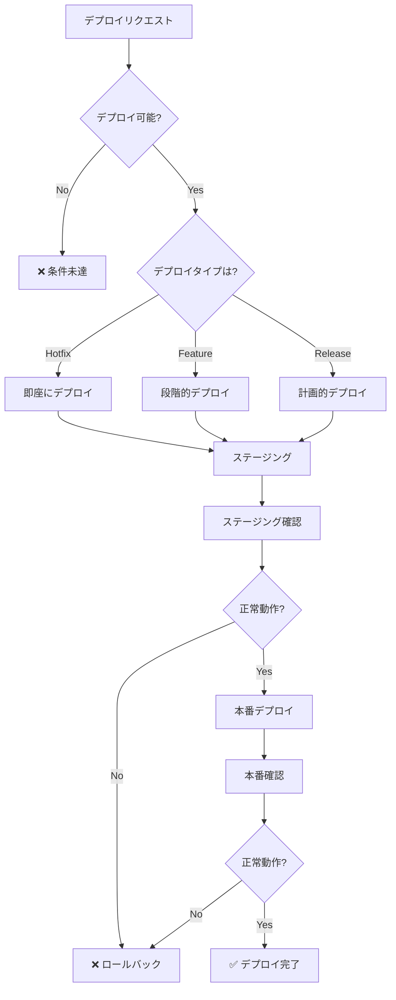

# デプロイ意思決定ツリー

**目的**: デプロイのタイミング・手順・確認項目を自動判断

---

## 🎯 デプロイの基本原則

```
デプロイ前チェック:

✅ すべてのテストパス
✅ ビルド成功
✅ コードレビュー完了
✅ CI/CD成功
✅ ロールバック計画
```

---

## 🔍 デプロイ判断フローチャート



---

## 📊 デプロイタイプ別判断

| タイプ | 緊急度 | 承認 | テスト | ダウンタイム |
|-------|-------|------|-------|------------|
| **Hotfix** | P0 | 最小限 | 必須 | 最小化 |
| **Feature** | P1-P2 | レビュー必須 | 完全 | なし |
| **Release** | P2 | 計画的 | 完全 | スケジュール |
| **Rollback** | P0 | 即座 | 事後 | 最小化 |

---

## 🛠️ デプロイ手順

### ステップ1: デプロイ前チェック

```markdown
**必須チェックリスト**:

□ すべてのテストがパス
  ```bash
  npm test
  npm run test:e2e
  ```

□ TypeScript エラー 0
  ```bash
  npx tsc --noEmit
  ```

□ ESLint エラー/警告 0
  ```bash
  npm run lint
  ```

□ ビルド成功
  ```bash
  npm run build
  ```

□ コードレビュー完了
  - GitHub PR approved

□ CI/CD パイプライン成功
  - GitHub Actions すべてグリーン

□ CHANGELOGの更新
  - 変更内容を記載

**時間**: 10-15分
```

### ステップ2: ステージングデプロイ

```markdown
**実行手順**:

1. ステージング環境にデプロイ
   ```bash
   # GitHub Pages の場合は自動
   git push origin main
   
   # 手動デプロイの場合
   npm run deploy:staging
   ```

2. CI/CD完了待ち
   ```bash
   # GitHub Actions の確認
   gh run list --limit 1
   gh run watch
   ```

3. デプロイURL確認
   ```bash
   # GitHub Pages
   https://nanashi8.github.io/
   ```

**時間**: 3-5分
```

### ステップ3: ステージング確認

```markdown
**確認項目**:

□ トップページの表示
  - レイアウトが正常
  - スタイルが適用されている

□ 主要機能の動作
  - 学習開始
  - 問題表示
  - 回答送信
  - 結果表示

□ パフォーマンス
  - ページロード < 3秒
  - API応答 < 200ms

□ エラーログ確認
  ```javascript
  // Browser Console
  console.log('Check for errors');
  ```

□ モバイル表示確認
  - レスポンシブデザイン
  - タッチ操作

**時間**: 15-20分
```

### ステップ4: 本番デプロイ

```markdown
**実行手順**:

1. 最終確認
   - ステージング正常
   - 承認済み
   - ロールバック計画

2. タグ作成
   ```bash
   git tag -a v1.2.3 -m "Release v1.2.3"
   git push origin v1.2.3
   ```

3. 本番デプロイ
   ```bash
   # GitHub Pages は mainブランチで自動
   # または手動
   npm run deploy:production
   ```

4. デプロイ完了待ち
   ```bash
   gh run watch
   ```

**時間**: 5-10分
```

### ステップ5: 本番確認

```markdown
**確認項目**:

□ デプロイ成功確認
  ```bash
  curl -I https://nanashi8.github.io/
  # Status: 200 OK
  ```

□ 主要機能の動作確認
  - ログイン
  - 学習セッション
  - データ保存

□ パフォーマンス確認
  - Lighthouse スコア > 90

□ エラー監視
  - エラーログなし
  - 5分間観察

□ ユーザー影響確認
  - 問い合わせなし
  - エラー報告なし

**時間**: 15-20分
```

---

## 🎯 意思決定ルール

### ルール1: Hotfixデプロイ（P0）

```markdown
IF 本番環境で重大なバグ発見
  THEN
    優先度: P0（即座に対応）
    
    手順:
    1. 緊急ブランチ作成
       ```bash
       git checkout -b hotfix/critical-bug
       ```
    
    2. 最小限の修正
       - バグ修正のみ
       - 新機能は含めない
    
    3. テスト
       ```bash
       npm test
       npm run build
       ```
    
    4. 最小限のレビュー
       - 1人以上の承認
    
    5. 即座にデプロイ
       ```bash
       git push origin hotfix/critical-bug
       # PR作成 → マージ → 自動デプロイ
       ```
    
    6. 本番確認
    
    7. ポストモーテム作成
       - 原因分析
       - 再発防止策
  
  時間: 30-120分
  ダウンタイム: 最小化
```

### ルール2: 機能デプロイ（P1）

```markdown
IF 新機能をデプロイ
  THEN
    優先度: P1（通常）
    
    手順:
    1. フィーチャーブランチ
       ```bash
       git checkout -b feature/new-feature
       ```
    
    2. 開発・テスト
       - ユニットテスト
       - 統合テスト
       - E2Eテスト
    
    3. コードレビュー
       - PR作成
       - 2人以上の承認
    
    4. ステージングデプロイ
       ```bash
       git push origin feature/new-feature
       # ステージング環境で確認
       ```
    
    5. ステージング確認（1-2時間）
    
    6. 本番デプロイ
       ```bash
       # mainブランチにマージ
       gh pr merge --squash
       ```
    
    7. 段階的ロールアウト
       - 10% のユーザー → 確認
       - 50% のユーザー → 確認
       - 100% のユーザー
    
    8. 監視（24時間）
  
  時間: 1-3時間
  ダウンタイム: なし
```

### ルール3: リリースデプロイ（P2）

```markdown
IF 定期リリース
  THEN
    優先度: P2（計画的）
    
    手順:
    1. リリースブランチ作成
       ```bash
       git checkout -b release/v1.2.0
       ```
    
    2. リリースノート作成
       ```markdown
       # v1.2.0
       
       ## Features
       - 新機能A
       - 新機能B
       
       ## Bug Fixes
       - バグ修正A
       
       ## Breaking Changes
       - なし
       ```
    
    3. すべてのテスト
       ```bash
       npm test
       npm run test:e2e
       npm run build
       ```
    
    4. ステージングデプロイ（1週間）
    
    5. ベータテスト
       - 一部ユーザーでテスト
       - フィードバック収集
    
    6. 修正対応
    
    7. 本番デプロイ
       ```bash
       git tag v1.2.0
       git push origin v1.2.0
       ```
    
    8. リリースアナウンス
    
    9. 監視（1週間）
  
  時間: 1-2週間
  ダウンタイム: スケジュール（深夜など）
```

### ルール4: ロールバック（P0）

```markdown
IF 本番で問題発生
  THEN
    優先度: P0（即座に対応）
    
    手順:
    1. 問題の確認
       - エラーログ
       - ユーザー報告
       - 監視アラート
    
    2. 即座にロールバック判断
       - 影響範囲が大きい
       - 修正に時間がかかる
       
       → ロールバック実行
    
    3. ロールバック実行
       ```bash
       # 前のバージョンにタグを切る
       git revert HEAD
       git push origin main
       
       # または前のコミットに戻す
       git reset --hard <previous-commit>
       git push --force origin main
       ```
    
    4. デプロイ完了確認
    
    5. 問題の調査
       - ログ分析
       - 再現手順
    
    6. 修正実装
    
    7. 再デプロイ
  
  時間: 15-30分（ロールバック）
  ダウンタイム: 最小化
```

---

## 📝 実例: デプロイシナリオ

### 例1: 通常の機能デプロイ

```markdown
**機能**: マルチソート機能

**手順**:

1. デプロイ前チェック
```bash
$ npm test
✅ 523 tests passed

$ npx tsc --noEmit
✅ No errors

$ npm run lint
✅ 0 errors, 0 warnings

$ npm run build
✅ Build successful
```

2. PR作成・レビュー
```bash
$ gh pr create --title "feat: add multi-sort feature" --body "..."
✅ PR #123 created

# レビュー待ち
✅ Approved by 2 reviewers
```

3. mainにマージ
```bash
$ gh pr merge --squash
✅ Merged to main
```

4. CI/CD自動実行
```bash
$ gh run watch
✅ All checks passed
✅ Deployed to production
```

5. 本番確認
```bash
# デプロイ完了
✅ https://nanashi8.github.io/ updated

# 機能確認
✅ Multi-sort working correctly

# Lighthouse スコア
✅ Performance: 95
✅ Accessibility: 100
✅ Best Practices: 100
✅ SEO: 100
```

**結果**: ✅ デプロイ成功（合計90分）
```

### 例2: Hotfixデプロイ

```markdown
**問題**: 本番で空文字列入力時にクラッシュ

**対応**:

1. 緊急ブランチ作成
```bash
$ git checkout -b hotfix/empty-input-crash
```

2. 最小限の修正
```typescript
// Before
function processAnswer(answer: string) {
  return answer.toLowerCase(); // crash if empty
}

// After
function processAnswer(answer: string) {
  if (!answer || answer.trim() === '') {
    return '';
  }
  return answer.toLowerCase();
}
```

3. テスト追加
```typescript
test('should handle empty input', () => {
  expect(() => processAnswer('')).not.toThrow();
  expect(processAnswer('')).toBe('');
});
```

4. テスト実行
```bash
$ npm test
✅ All tests passed
```

5. 最小限のレビュー
```bash
$ gh pr create --title "hotfix: handle empty input" --label "hotfix"
✅ Approved by 1 reviewer (緊急のため1人のみ)
```

6. 即座にマージ・デプロイ
```bash
$ gh pr merge --squash
✅ Merged and deployed
```

7. 本番確認
```bash
# 問題解消確認
✅ Empty input handled correctly
```

8. ポストモーテム作成
```markdown
# Postmortem: Empty Input Crash

## 問題
空文字列入力時にクラッシュ

## 原因
入力検証の欠落

## 影響
約15分間、一部ユーザーが影響を受けた

## 再発防止策
- すべての入力に検証を追加
- エッジケースのテストを強化
```

**結果**: ✅ 問題解決（合計45分）
```

### 例3: ロールバック

```markdown
**問題**: デプロイ後に重大なバグ発見

**状況**:
- 新機能デプロイ後、30分でエラー急増
- 修正に2時間以上かかる見込み

**判断**: ロールバック実行

**手順**:

1. 即座にロールバック
```bash
# 前のコミットを特定
$ git log --oneline -5
abc1234 feat: new feature (現在)
def5678 fix: bug fix (1つ前)

# revert実行
$ git revert abc1234
$ git push origin main
```

2. CI/CD自動実行
```bash
$ gh run watch
✅ Rollback deployed
```

3. 確認
```bash
# エラー停止確認
✅ Error rate normalized
```

4. ユーザー通知
```markdown
一時的にロールバックしました。
修正後に再デプロイします。
```

5. 問題調査・修正
```bash
# ログ分析
# バグ修正
# テスト追加
```

6. 再デプロイ
```bash
$ git push origin main
✅ Fixed version deployed
```

**結果**: ✅ ダウンタイム15分（ロールバック10分 + 確認5分）
```

---

## 🚀 デプロイのベストプラクティス

### 1. 小さく頻繁に

```markdown
✅ GOOD: 小さな変更を頻繁にデプロイ
- リスクが低い
- 問題の特定が容易
- ロールバックが簡単

❌ BAD: 大きな変更を一度に
- リスクが高い
- 問題の切り分けが困難
- ロールバックが大変
```

### 2. 自動化

```markdown
✅ GOOD: CI/CDで自動デプロイ
```yaml
# .github/workflows/deploy.yml
on:
  push:
    branches: [main]

jobs:
  deploy:
    runs-on: ubuntu-latest
    steps:
      - run: npm test
      - run: npm run build
      - run: npm run deploy
```

❌ BAD: 手動デプロイ
- 人的エラー
- 時間がかかる
- 再現性なし
```

### 3. 監視とアラート

```markdown
✅ GOOD: デプロイ後の監視
- エラーログ
- パフォーマンスメトリクス
- ユーザーフィードバック

❌ BAD: デプロイしたら放置
- 問題に気づかない
- 対応が遅れる
```

---

## 📚 関連ドキュメント

- [rollback-decision.instructions.md](./rollback-decision.instructions.md) - ロールバック手順
- [quality-decision.instructions.md](./quality-decision.instructions.md) - 品質チェック
- [.github/workflows/](../.github/workflows/) - CI/CD設定

---

**最終更新**: 2025-12-19  
**バージョン**: 1.0.0  
**適用**: すべてのデプロイ作業
