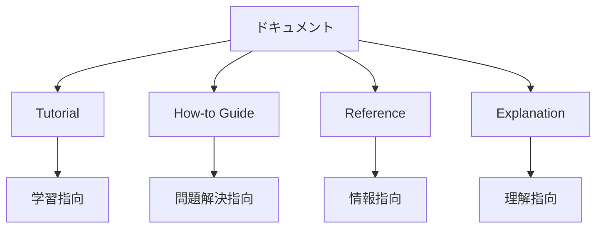
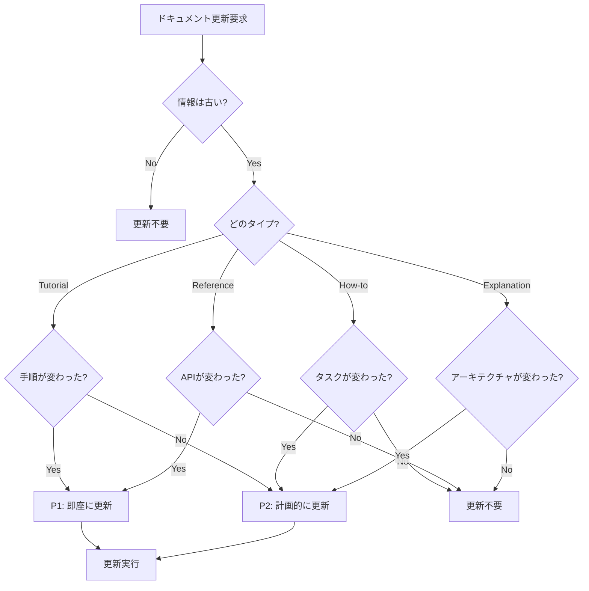

# ドキュメント更新意思決定ツリー

**目的**: ドキュメント更新要求に対して、適切な更新方法と優先度を判断

---

## 🎯 ドキュメント更新の基本原則

```
1. Always Up-to-Date（常に最新）
   → コードの変更と同時にドキュメント更新

2. Example-Driven（例示駆動）
   → すべてのドキュメントに5個以上の例

3. User-Centric（ユーザー中心）
   → 読者が誰かを明確にする
```

---

## 📊 ドキュメントの種類

### Diataxis Framework に基づく分類



### タイプ1: Tutorial（チュートリアル）

```markdown
**目的**: 初めてのユーザーが学ぶ

**特徴**:
- 学習指向
- ステップバイステップ
- 成功体験を提供

**例**:
- Getting Started
- Quick Start Guide
- First Steps

**更新が必要な時**:
- 初期セットアップ手順が変わった
- 依存関係が更新された
- 画面キャプチャが古くなった

**優先度**: P1（新規ユーザーに直接影響）
```

### タイプ2: How-to Guide（ハウツーガイド）

```markdown
**目的**: 特定のタスクを実行する方法を説明

**特徴**:
- 問題解決指向
- タスクベース
- 具体的な手順

**例**:
- How to add a new AI specialist
- How to debug QuestionScheduler
- How to run tests

**更新が必要な時**:
- 手順が変わった
- 新しいツールが追加された
- 既存の手順が古くなった

**優先度**: P2（計画的に更新）
```

### タイプ3: Reference（リファレンス）

```markdown
**目的**: 技術的な詳細を提供

**特徴**:
- 情報指向
- 網羅的
- 正確性重視

**例**:
- API Documentation
- Configuration Reference
- Command Reference

**更新が必要な時**:
- APIが変更された
- 設定項目が追加/削除された
- パラメータが変わった

**優先度**: P1（不正確な情報は危険）
```

### タイプ4: Explanation（解説）

```markdown
**目的**: 概念やアーキテクチャを説明

**特徴**:
- 理解指向
- コンテキスト提供
- Why を説明

**例**:
- Architecture Overview
- Design Decisions
- Best Practices

**更新が必要な時**:
- アーキテクチャが変わった
- 設計判断が変わった
- 新しいパターンが追加された

**優先度**: P2（時間をかけて更新）
```

---

## 🔍 更新判断フローチャート



---

## 📝 更新手順テンプレート

### テンプレート1: README更新

```markdown
## README更新プロトコル

### 1. 現状確認 (10分)
- [ ] 現在のREADMEを読む
- [ ] 古い情報を特定
- [ ] 不足している情報を特定

### 2. 更新計画 (15分)
- [ ] 更新箇所をリストアップ
- [ ] 追加する情報を決定
- [ ] 削除する情報を決定

### 3. 更新実行 (30分)
- [ ] セクションごとに更新
- [ ] スクリーンショットを更新（必要なら）
- [ ] リンクの動作確認
- [ ] Markdownlint チェック

### 4. レビュー (10分)
- [ ] 全体を通読
- [ ] 情報の正確性を確認
- [ ] 読みやすさを確認

合計時間: ~1時間
```

### テンプレート2: API ドキュメント更新

```markdown
## API ドキュメント更新プロトコル

### 1. 変更内容の確認 (15分)
- [ ] どのAPIが変更されたか?
- [ ] パラメータの変更は?
- [ ] 戻り値の変更は?
- [ ] 破壊的変更はあるか?

### 2. ドキュメント更新 (45分)
- [ ] 関数シグネチャを更新
- [ ] パラメータ説明を更新
- [ ] 戻り値の説明を更新
- [ ] 使用例を更新（5個以上）
- [ ] エラーケースを追加

### 3. 検証 (20分)
- [ ] コード例が動作するか実行
- [ ] TypeScript の型定義と一致するか
- [ ] リンクが正しいか確認

合計時間: ~1.5時間
```

### テンプレート3: 新規ドキュメント作成

```markdown
## 新規ドキュメント作成プロトコル

### 1. 計画 (20分)
- [ ] ドキュメントの目的を明確化
- [ ] 対象読者を定義
- [ ] 構成を設計

### 2. 執筆 (2時間)
- [ ] メタデータセクション
- [ ] 目的セクション
- [ ] 本文（詳細な説明）
- [ ] 使用例（5個以上）
- [ ] トラブルシューティング
- [ ] 関連ドキュメント
- [ ] 更新履歴

### 3. レビュー (30分)
- [ ] 全体を通読
- [ ] Markdownlint チェック
- [ ] リンク確認
- [ ] 例のテスト

合計時間: ~3時間
```

---

## 🎯 意思決定ルール

### ルール1: README の更新判断

```markdown
IF README の情報が古い
  THEN
    1. 確認: どのセクションが古いか?
       - インストール手順?
       - 使い方?
       - 開発環境セットアップ?
    2. 判定: 影響度
       - 新規ユーザーが困る → P1
       - 既存ユーザーが困る → P2
    3. 更新実施
       - 最小限の変更
       - スクリーンショット追加（必要なら）
       - 動作確認
  
  優先度: P1 (新規ユーザーへの影響大)
  時間: 30分-1時間
```

### ルール2: API ドキュメントの更新判断

```markdown
IF APIが変更された
  THEN
    1. 確認: 破壊的変更か?
       - Yes → P0 (即座に更新)
       - No → P1 (24時間以内)
    2. 更新内容
       - 関数シグネチャ
       - パラメータ説明
       - 戻り値の説明
       - 使用例（最低5個）
       - 変更履歴に記録
    3. 検証
       - コード例をすべて実行
       - TypeScript の型定義と一致を確認
  
  優先度: P0 または P1
  時間: 1-2時間
```

### ルール3: ガイドの更新判断

```markdown
IF ハウツーガイドの手順が古い
  THEN
    1. 確認: 手順が変わった理由
       - 新機能追加?
       - ツール変更?
       - ベストプラクティス更新?
    2. 判定: 影響範囲
       - 全体的な変更 → P1
       - 部分的な変更 → P2
    3. 更新
       - 手順を新しいものに置き換え
       - スクリーンショット更新
       - 実際に手順を実行して検証
  
  優先度: P2 (計画的に更新)
  時間: 1-2時間
```

### ルール4: アーキテクチャドキュメントの更新判断

```markdown
IF アーキテクチャが変わった
  THEN
    1. 確認: 変更の重要度
       - 構造的変更 → P1
       - 詳細の変更 → P2
    2. 更新内容
       - アーキテクチャ図
       - コンポーネント説明
       - データフロー図
       - 設計判断の理由
    3. レビュー
       - 技術的な正確性
       - 理解しやすさ
  
  優先度: P1 または P2
  時間: 2-4時間
```

### ルール5: ドキュメントの新規作成判断

```markdown
IF 新機能が追加された
  THEN
    1. 判定: ドキュメントが必要か?
       - 公開API → 必須
       - 内部実装のみ → コメントで十分
    2. 種類の決定
       - Tutorial（学習用）
       - How-to（タスク用）
       - Reference（詳細用）
       - Explanation（理解用）
    3. 作成
       - テンプレートを使用
       - 例を豊富に含める（5個以上）
       - 関連ドキュメントとリンク
  
  優先度: P1 (機能リリースと同時)
  時間: 2-3時間
```

---

## ✅ ドキュメント品質チェックリスト

### 必須要素

```markdown
すべてのドキュメントに含めるべき要素:

[ ] メタデータ
    ---
    description: ドキュメントの目的
    version: 1.0.0
    created: 2025-12-19
    ---

[ ] 目的セクション
    ## 目的
    このドキュメントの目的を1-2文で説明

[ ] 本文
    詳細な説明、手順、情報

[ ] 使用例（5個以上）
    ## 例
    実際の使用例を豊富に提供

[ ] トラブルシューティング
    ## Troubleshooting
    よくある問題と解決策

[ ] 関連ドキュメント
    ## 関連ドキュメント

[ ] 更新履歴
    **最終更新**: 2025-12-19
    **バージョン**: 1.0.0
```

### 品質基準

```markdown
品質チェック:

[ ] 情報は正確か?
[ ] 情報は最新か?
[ ] 例は動作するか?
[ ] リンクは正しいか?
[ ] Markdownlint エラー 0 か?
[ ] タイポはないか?
[ ] 読みやすいか?
[ ] 対象読者に適しているか?
```

---

## 📚 実例: ドキュメント更新シナリオ

### 例1: README のインストール手順が古い

```markdown
**要求**: 「README のインストール手順を更新して」

**現状確認**:
```markdown
# 現在の README (古い)
## Installation
1. Clone the repository
2. Run `npm install`
3. Run `npm start`
```

**問題点**:
- 依存関係のインストール手順が不足
- 環境変数の設定が必要なのに記載なし
- TypeScript のビルドステップが抜けている

**更新後**:
```markdown
# 更新後の README
## Installation

### Prerequisites
- Node.js 18.x or higher
- npm 9.x or higher

### Steps
1. Clone the repository
   ```bash
   git clone https://github.com/nanashi8/nanashi8.github.io.git
   cd nanashi8.github.io
   ```

2. Install dependencies
   ```bash
   npm install
   ```

3. Set up environment (optional)
   ```bash
   cp .env.example .env
   # Edit .env if needed
   ```

4. Start development server
   ```bash
   npm run dev
   ```

5. Open http://localhost:5173 in your browser

### Troubleshooting
- If you see EACCES error, try `sudo npm install`
- If port 5173 is in use, set PORT=3000 in .env
```

**検証**:
- [ ] 実際に手順を実行して動作確認
- [ ] スクリーンショット更新
- [ ] Markdownlint チェック

**結果**: ✅ 更新完了（45分）
```

### 例2: API ドキュメントの更新

```markdown
**要求**: 「QuestionScheduler の API ドキュメントを更新して」

**変更内容**:
- selectNext() に新しいパラメータ追加
- priorityThreshold: number (デフォルト: 0.5)

**更新前**:
```typescript
/**
 * 次の問題を選択します
 * @param pool - 問題プール
 * @returns 選択された問題
 */
selectNext(pool: Question[]): Question
```

**更新後**:
```typescript
/**
 * 次の問題を選択します
 * 
 * @param pool - 問題プール
 * @param options - オプション設定
 * @param options.priorityThreshold - 優先度の閾値 (0-1)。
 *        この値以上の優先度を持つ問題のみが選択対象になります。
 *        デフォルト: 0.5
 * @returns 選択された問題。候補がない場合は null
 * 
 * @throws {Error} pool が空の場合
 * 
 * @example
 * // 基本的な使用
 * const question = scheduler.selectNext(questions);
 * 
 * @example
 * // 優先度を指定
 * const urgentQuestion = scheduler.selectNext(questions, {
 *   priorityThreshold: 0.8
 * });
 * 
 * @example
 * // エラーハンドリング
 * try {
 *   const question = scheduler.selectNext([]);
 * } catch (error) {
 *   console.error('No questions available');
 * }
 */
selectNext(
  pool: Question[],
  options?: { priorityThreshold?: number }
): Question | null
```

**検証**:
- [ ] すべての例を実行
- [ ] TypeScript の型定義と一致を確認
- [ ] 変更履歴に記録

**結果**: ✅ 更新完了（1時間）
```

### 例3: 新規ガイドの作成

```markdown
**要求**: 「AI specialist の追加方法のガイドを作成して」

**計画**:
- タイプ: How-to Guide
- 対象: 開発者
- 構成:
  1. 概要
  2. 前提条件
  3. ステップバイステップ手順
  4. 例
  5. トラブルシューティング

**作成したドキュメント**:
```markdown
# How to Add a New AI Specialist

## 目的
プロジェクトに新しいAI specialistを追加する方法を説明します。

## 前提条件
- TypeScript の基礎知識
- AI システムのアーキテクチャ理解
- 既存の specialist の実装を確認済み

## ステップ

### 1. ファイル作成
```bash
touch src/ai/specialists/MyNewAI.ts
```

### 2. インターフェース実装
```typescript
import type { AISpecialist, Question } from '../types';

export class MyNewAI implements AISpecialist {
  analyze(question: Question): AnalysisResult {
    // 実装
  }
}
```

### 3. テスト作成
```bash
touch tests/unit/myNewAI.test.ts
```

### 4. AICoordinator に登録
```typescript
// src/ai/AICoordinator.ts
import { MyNewAI } from './specialists/MyNewAI';

this.specialists.push(new MyNewAI());
```

### 5. テスト実行
```bash
npm test -- myNewAI.test.ts
```

## 例

[5個以上の詳細な例]

## Troubleshooting

[よくある問題と解決策]

## 関連ドキュメント

**検証**:
- [ ] 手順を実際に実行
- [ ] すべての例が動作することを確認
- [ ] レビュー依頼

**結果**: ✅ 作成完了（2.5時間）
```

---

## 🔄 Markdown Linting

### 自動チェック

```bash
# Markdown lint チェック
npx markdownlint-cli docs/**/*.md README.md

# 自動修正
npx markdownlint-cli docs/**/*.md --fix
```

### よくあるエラーと修正

```markdown
# MD032: Lists should be surrounded by blank lines
❌ BAD:
Some text
- List item 1
- List item 2
More text

✅ GOOD:
Some text

- List item 1
- List item 2

More text

# MD040: Code blocks should specify language
❌ BAD:
```
const code = true;
```

✅ GOOD:
```typescript
const code = true;
```

# MD022: Headers should be surrounded by blank lines
❌ BAD:
Some text
## Header
More text

✅ GOOD:
Some text

## Header

More text
```

---

## 📚 関連ドキュメント

- [core-principles.instructions.md](../core-principles.instructions.md) - コア原則
- [quality-standards.instructions.md](../context/quality-standards.instructions.md) - 品質基準
- Diataxis Framework: https://diataxis.fr/

---

**最終更新**: 2025-12-19  
**バージョン**: 1.0.0  
**適用**: すべてのドキュメント更新
