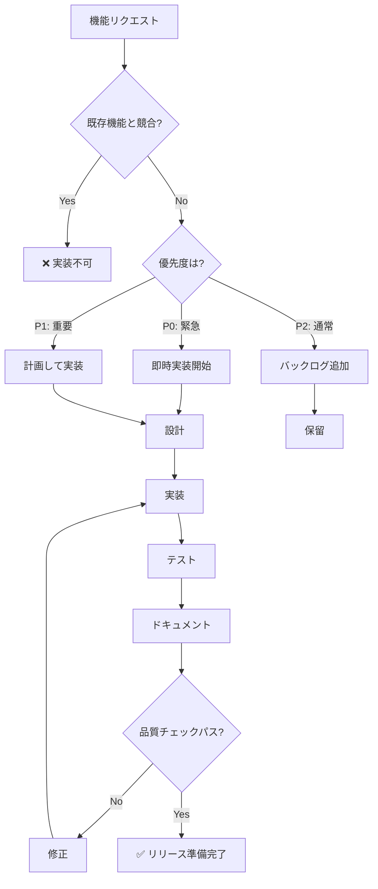

# 機能実装意思決定ツリー

**目的**: 新機能のリクエストを受けた際に、実装の優先度・方針・手順を自動判断

---

## 🎯 機能実装の基本原則

```
実装前の確認事項:

✅ 既存機能との競合確認
✅ 品質基準の維持
✅ テストカバレッジ 95%+
✅ 文書化の完備
✅ パフォーマンスへの影響評価
```

---

## 🔍 機能実装判断フローチャート



---

## 📊 優先度判定マトリクス

| 条件 | P0（緊急） | P1（重要） | P2（通常） |
|-----|-----------|-----------|-----------|
| **影響範囲** | 全ユーザー | 一部ユーザー | 限定的 |
| **リスク** | 高（データ損失等） | 中（UX低下） | 低（利便性） |
| **実装時間** | 即座に対応 | 1-3日以内 | スプリント計画 |
| **テスト** | 完全なE2E必須 | ユニット+統合 | ユニット |
| **レビュー** | 必須 | 推奨 | 任意 |

---

## 🛠️ 機能実装ステップ

### ステップ1: 要件分析

```markdown
**分析項目**:

1. 機能の目的は何か？
   - ユーザーストーリー: "〇〇として、〇〇したい、なぜなら〇〇だから"
   
2. 既存機能との関係は？
   - 競合: 同じ目的の機能がすでに存在
   - 補完: 既存機能を強化
   - 独立: 新規の独立機能

3. 技術的実現可能性は？
   - 必要なAPI・ライブラリ
   - パフォーマンス影響
   - セキュリティリスク

**時間**: 30-60分
```

### ステップ2: 設計

```markdown
**設計項目**:

1. アーキテクチャ設計
   - どのレイヤーに配置？
   - 既存コードの変更範囲は？
   
2. データ構造設計
   - 新しい型定義が必要？
   - 状態管理の変更は？

3. API設計
   - 関数シグネチャ
   - エラーハンドリング
   - 戻り値の型

4. テスト設計
   - テストケースのリストアップ
   - モックの必要性

**成果物**:
- 設計ドキュメント（Markdown）
- 型定義のスケッチ
- テストケースリスト

**時間**: 1-3時間
```

### ステップ3: 実装

```markdown
**実装順序**:

1. 型定義の作成
   ```typescript
   // types/feature.ts
   export interface NewFeature {
     id: string;
     name: string;
     // ...
   }
   ```

2. コア機能の実装
   ```typescript
   // features/newFeature.ts
   export function useNewFeature() {
     // 実装
   }
   ```

3. UIコンポーネント（必要な場合）
   ```typescript
   // components/NewFeatureView.tsx
   export function NewFeatureView() {
     // 実装
   }
   ```

4. テストの実装
   ```typescript
   // tests/newFeature.test.ts
   describe('NewFeature', () => {
     // テストケース
   });
   ```

**時間**: 3-8時間（機能の複雑さによる）
```

### ステップ4: テスト

```markdown
**テスト項目**:

1. ユニットテスト
   - すべての関数をテスト
   - エッジケースをカバー
   - カバレッジ 95%+

2. 統合テスト
   - 他のコンポーネントとの連携
   - データフローの確認

3. E2Eテスト（P0/P1のみ）
   - ユーザーシナリオの検証
   - 主要フローの確認

**時間**: 2-4時間
```

### ステップ5: ドキュメント作成

```markdown
**ドキュメント項目**:

1. README更新
   - 新機能の説明追加

2. APIドキュメント
   - JSDocコメント
   - 使用例

3. ユーザーガイド（必要な場合）
   - How-toガイド
   - スクリーンショット

**時間**: 1-2時間
```

---

## 🎯 意思決定ルール

### ルール1: 緊急機能（P0）

```markdown
IF 以下のいずれかに該当
  - データ損失のリスクがある
  - アプリが使用不能になる
  - セキュリティリスクがある
  
THEN
  優先度: P0（緊急）
  対応: 即時実装開始
  
  実装手順:
  1. 要件分析（30分）
  2. 最小限の設計（1時間）
  3. 実装（3-5時間）
  4. 完全なテスト（2-3時間）
  5. ドキュメント（1時間）
  6. 即デプロイ
  
  品質基準:
  - TypeScript: 0エラー必須
  - テスト: すべてパス必須
  - E2Eテスト: 必須
  - コードレビュー: 必須
```

### ルール2: 重要機能（P1）

```markdown
IF 以下のいずれかに該当
  - ユーザー体験を大きく向上させる
  - 競合優位性に関わる
  - 多数のユーザーが要望している
  
THEN
  優先度: P1（重要）
  対応: 1-3日以内に実装
  
  実装手順:
  1. 要件分析（1時間）
  2. 詳細設計（2-3時間）
  3. 実装（5-8時間）
  4. テスト（3-4時間）
  5. ドキュメント（2時間）
  6. 計画的デプロイ
  
  品質基準:
  - TypeScript: 0エラー必須
  - テスト: すべてパス必須
  - 統合テスト: 必須
  - ドキュメント: 充実必須
```

### ルール3: 通常機能（P2）

```markdown
IF 以下に該当
  - あると便利な機能
  - 特定ユーザーのみが使用
  - 緊急性が低い
  
THEN
  優先度: P2（通常）
  対応: スプリント計画に組み込む
  
  実装手順:
  1. バックログに追加
  2. 次回スプリント計画で検討
  3. 優先度を再評価
  4. 実装タイミングを決定
  
  品質基準:
  - 通常の品質基準に従う
```

### ルール4: 実装不可判定

```markdown
IF 以下のいずれかに該当
  - 既存機能と完全に重複
  - プロジェクトのスコープ外
  - 技術的に実現不可能
  - パフォーマンスへの悪影響が大きい
  
THEN
  判定: 実装不可
  対応:
  1. ユーザーに理由を説明
  2. 代替案を提示（可能な場合）
  3. issueにドキュメント化
```

---

## 📝 実例: 機能実装シナリオ

### 例1: 新しいソート機能（P1）

```markdown
**リクエスト**: "学習履歴を複数の条件でソートできるようにしたい"

**判断プロセス**:

1. 要件分析
   - 既存: 1つの条件のみでソート可能
   - 要望: 複数条件の組み合わせソート
   - 競合: なし（機能拡張）
   - 優先度: P1（UX向上）

2. 設計
```typescript
// 型定義
type SortKey = 'date' | 'difficulty' | 'accuracy' | 'category';
interface SortConfig {
  key: SortKey;
  order: 'asc' | 'desc';
}

// 関数シグネチャ
function multiSort(
  questions: Question[],
  sortConfigs: SortConfig[]
): Question[];
```

3. 実装
```typescript
export function multiSort(
  questions: Question[],
  sortConfigs: SortConfig[]
): Question[] {
  return questions.slice().sort((a, b) => {
    for (const config of sortConfigs) {
      const result = compareByKey(a, b, config.key);
      if (result !== 0) {
        return config.order === 'asc' ? result : -result;
      }
    }
    return 0;
  });
}
```

4. テスト
```typescript
describe('multiSort', () => {
  test('sorts by multiple keys in order', () => {
    const questions = [...];
    const sorted = multiSort(questions, [
      { key: 'date', order: 'desc' },
      { key: 'accuracy', order: 'asc' }
    ]);
    expect(sorted[0].date).toBeGreaterThan(sorted[1].date);
  });
});
```

5. ドキュメント
```markdown
## マルチソート機能

複数の条件でソートできます：

\`\`\`typescript
const sorted = multiSort(questions, [
  { key: 'date', order: 'desc' },
  { key: 'accuracy', order: 'asc' }
]);
\`\`\`
```

**結果**: ✅ 実装完了（合計8時間）
```

### 例2: AIチャット機能（P0）

```markdown
**リクエスト**: "学習中に質問できるAIチャットを追加"

**判断プロセス**:

1. 競合確認
   - 既存: 既に8種類のAI機能が存在
   - 学習AIメタAIは別のコンテキスト
   - 競合: なし（新規機能）

2. 実現可能性チェック
   - GitHub Models API使用可能
   - 既存のAIインフラ活用可能
   - セキュリティ: APIキーの安全な管理必要

3. 設計
```typescript
interface ChatMessage {
  role: 'user' | 'assistant';
  content: string;
  timestamp: number;
}

interface ChatSession {
  id: string;
  messages: ChatMessage[];
  context: LearningContext;
}
```

4. 実装計画
   - Phase 1: チャットUI（3時間）
   - Phase 2: API統合（2時間）
   - Phase 3: コンテキスト連携（3時間）
   - Phase 4: テスト（4時間）
   - Phase 5: ドキュメント（2時間）

**判定**: P1（重要機能）
**時間**: 合計14時間（2-3日）
```

### 例3: ダークモード（実装不可）

```markdown
**リクエスト**: "ダークモードを追加してほしい"

**判断プロセス**:

1. 制約確認
   - `.aitk/instructions/meta-ai-priority.instructions.md` を確認
   - ダークモード実装は **明示的に禁止**

2. 理由
   - プロジェクトのコアポリシー
   - UIの一貫性維持
   - 学習効果の最適化（明るい背景）

3. 対応
```markdown
申し訳ございませんが、ダークモードの実装は
プロジェクトの方針により対応できません。

理由:
- 学習効果の科学的根拠に基づく設計
- UIの一貫性維持
- プロジェクトのコアポリシー

代替案:
- OSの明るさ調整機能を使用
- ブルーライトフィルター機能の活用
```

**判定**: ❌ 実装不可
```

---

## 🚀 実装のベストプラクティス

### 1. 小さく始める（MVP）

```markdown
✅ GOOD: 最小限の機能で実装
- コア機能のみ実装
- 早期にフィードバック
- 段階的に拡張

❌ BAD: 最初から完璧を目指す
- 実装に時間がかかる
- 方向転換が困難
- リスクが高い
```

### 2. テストファースト

```markdown
✅ GOOD: 実装前にテストを書く
- 仕様が明確になる
- バグが混入しにくい
- リファクタリングしやすい

❌ BAD: 実装後にテストを書く
- テストが不十分になる
- カバレッジが低い
- バグが見逃される
```

### 3. ドキュメントファースト

```markdown
✅ GOOD: 設計段階でドキュメント作成
- 仕様が明確になる
- レビューしやすい
- 後から書く手間がない

❌ BAD: 実装後にドキュメント作成
- ドキュメントが不十分
- 仕様と実装がズレる
- メンテナンスコストが高い
```

---

## 📚 関連ドキュメント

- [scope-control.instructions.md](../context/scope-control.instructions.md) - スコープ管理
- [quality-standards.instructions.md](../context/quality-standards.instructions.md) - 品質基準
- [testing-decision.instructions.md](./testing-decision.instructions.md) - テスト戦略

---

**最終更新**: 2025-12-19  
**バージョン**: 1.0.0  
**適用**: すべての新機能実装
