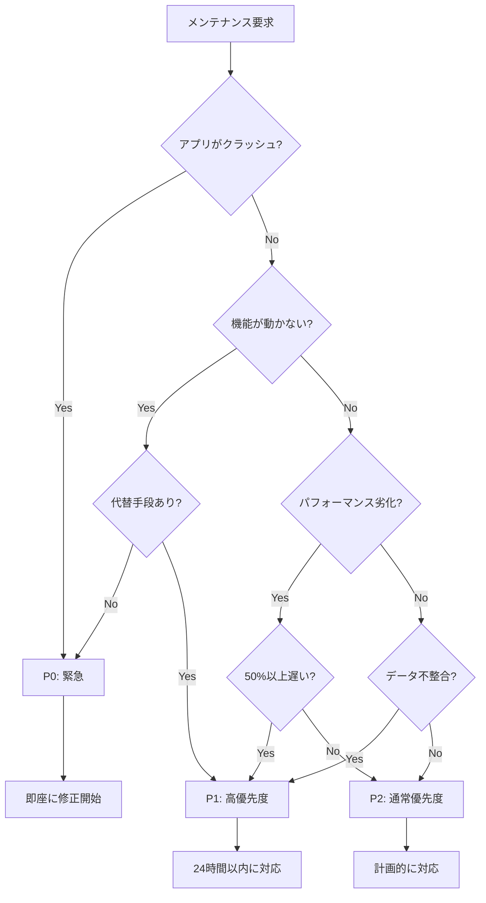

# メンテナンス意思決定ツリー

**目的**: AIメンテナンス要求に対して、適切な判断と実行手順を自動決定

---

## 🎯 基本フロー

```
メンテナンス要求
    ↓
問題分類（P0/P1/P2）
    ↓
影響範囲の特定
    ↓
診断プロトコル実行
    ↓
修復または報告
```

---

## 🔍 問題分類フローチャート



---

## 📊 問題分類マトリクス

### P0: 緊急（即座に対応）

| 症状 | 判定基準 | 例 |
|------|---------|-----|
| アプリクラッシュ | ユーザーが使用不可 | `Uncaught TypeError: Cannot read property 'x' of undefined` |
| データ消失 | ユーザーデータが失われる | 進捗が保存されない |
| セキュリティ | 脆弱性が公開された | `npm audit` で Critical |
| CI/CD 完全停止 | デプロイ不可能 | すべてのワークフローが失敗 |

### P1: 高優先度（24時間以内）

| 症状 | 判定基準 | 例 |
|------|---------|-----|
| 機能停止 | 代替手段なし | QuestionScheduler が動かない |
| パフォーマンス劣化 | 50%以上遅延 | 問題ロード時間が 5秒→10秒 |
| データ不整合 | 統計が合わない | スコアの計算が間違っている |
| AIが誤動作 | 学習効果に影響 | 記憶強度の更新が異常 |

### P2: 通常優先度（計画的に対応）

| 症状 | 判定基準 | 例 |
|------|---------|-----|
| UI の不具合 | 機能は動く | ボタンの配置がずれている |
| 軽微なバグ | 回避策あり | 特定条件でエラーメッセージ |
| パフォーマンス改善 | 最適化の余地 | 10%の高速化が可能 |
| ドキュメント不足 | 情報が不完全 | API ドキュメントが古い |

---

## 🛠️ 診断プロトコル

### ステップ1: 問題の特定

```markdown
## 情報収集チェックリスト

[ ] エラーメッセージは何か？
[ ] いつから発生しているか？
[ ] 再現手順は？
[ ] 影響範囲は？（どの機能？）
[ ] ユーザー数への影響は？
[ ] ログに記録されているか？
[ ] 最近の変更に関連するか？
```

### ステップ2: 影響範囲の分析

```typescript
// IF-THEN ルール

IF (問題が 8-AI System に関連)
  THEN 参照: docs/maintenance/AI_MAINTENANCE_GUIDE.md
  AND 確認: QuestionScheduler の状態

IF (問題が データストレージ に関連)
  THEN 確認: IndexedDB の状態
  AND 確認: localStorage の整合性

IF (問題が UI/UX に関連)
  THEN 確認: コンポーネントのレンダリング
  AND 確認: CSS の適用状態

IF (問題が パフォーマンス に関連)
  THEN 実行: パフォーマンスプロファイリング
  AND 確認: メモリリーク
```

### ステップ3: 診断手順の実行

```bash
# 基本診断コマンド

# 1. TypeScript チェック
npx tsc --noEmit
# → 型エラーがあれば表示

# 2. テスト実行
npm test -- --run
# → 失敗しているテストを特定

# 3. ビルド確認
npm run build
# → ビルドエラーを確認

# 4. Git 履歴確認
git log --oneline -10
git diff HEAD~5
# → 最近の変更を確認

# 5. ログ確認（ブラウザ）
# DevTools → Console
# → エラーログを確認
```

---

## 🎯 意思決定ルール

### ルール1: QuestionScheduler 問題の判断

```markdown
IF 「QuestionScheduler が動かない」
  THEN
    1. 参照: docs/maintenance/AI_MAINTENANCE_GUIDE.md
    2. 実行: 緊急診断フロー
    3. 確認: AI統合が有効か
       - localStorage['enable-ai-coordination'] === 'true'
    4. 確認: 問題プールが空でないか
    5. 確認: メモリ強度の計算が正常か
    6. ログ確認: 'QuestionScheduler' で検索
  
  優先度: P0 (即座に対応)
  理由: 学習体験の中核機能
```

### ルール2: データ不整合の判断

```markdown
IF 「進捗が保存されない」 OR 「統計が合わない」
  THEN
    1. 確認: IndexedDB の接続状態
    2. 実行: データ整合性チェック
       ```typescript
       const progress = await getAllProgress();
       const stats = await getStatistics();
       // 整合性を検証
       ```
    3. 確認: データマイグレーションが必要か
    4. バックアップ: 既存データ
    5. 修復 OR 報告
  
  優先度: P1 (24時間以内)
  理由: ユーザーデータの保全
```

### ルール3: パフォーマンス劣化の判断

```markdown
IF 「アプリが遅い」 OR 「ロード時間が長い」
  THEN
    1. 測定: パフォーマンスメトリクス
       - 問題ロード時間
       - レンダリング時間
       - メモリ使用量
    2. 比較: 基準値と現在値
       - 基準: ロード時間 < 1秒
       - 現在: ?秒
    3. IF (差が 50%以上)
         THEN 優先度: P1
         ELSE 優先度: P2
    4. 特定: ボトルネック
    5. 最適化 OR 報告
  
  優先度: P1 または P2
  理由: ユーザー体験に直接影響
```

### ルール4: UI 不具合の判断

```markdown
IF 「レイアウトがおかしい」 OR 「ボタンが動かない」
  THEN
    1. 確認: 再現性
       - 特定のブラウザ？
       - 特定の画面サイズ？
       - 特定の条件？
    2. 確認: 最近の変更
       - git log --grep="layout"
    3. IF (機能が使えない)
         THEN 優先度: P1
         ELSE 優先度: P2
    4. 修正 OR 報告
  
  優先度: P1 または P2
  理由: 影響範囲に依存
```

### ルール5: ドキュメント不足の判断

```markdown
IF 「ドキュメントがない」 OR 「情報が古い」
  THEN
    1. 確認: どのドキュメントが不足？
    2. 確認: 影響範囲
       - 開発者のみ？
       - ユーザーにも影響？
    3. 優先度: P2 (通常は計画的に対応)
    4. ドキュメント作成 OR 更新
  
  優先度: P2
  理由: 機能は動作している
```

---

## 📝 実行手順テンプレート

### テンプレート1: P0 緊急対応

```markdown
## P0 緊急対応プロトコル

### 1. 状況確認（5分以内）
- [ ] エラー内容を特定
- [ ] 影響範囲を確認
- [ ] ユーザー数への影響を推定

### 2. 緊急診断（10分以内）
- [ ] エラーログ確認
- [ ] 最近の変更を確認
- [ ] 再現手順を確立

### 3. 即座の対応（30分以内）
- [ ] 修正 OR ロールバック
- [ ] テスト実行
- [ ] 緊急デプロイ

### 4. 事後報告（1時間以内）
- [ ] 原因分析
- [ ] 対応内容の記録
- [ ] 再発防止策の提案
```

### テンプレート2: P1 高優先度対応

```markdown
## P1 高優先度対応プロトコル

### 1. 問題分析（1時間以内）
- [ ] 症状の詳細記録
- [ ] 影響範囲の特定
- [ ] 原因の仮説立て

### 2. 診断実施（3時間以内）
- [ ] 診断プロトコル実行
- [ ] 関連コードの確認
- [ ] テストケースの作成

### 3. 修復実施（12時間以内）
- [ ] 修正の実装
- [ ] テストの実行
- [ ] レビューの実施

### 4. デプロイと確認（24時間以内）
- [ ] ステージング確認
- [ ] 本番デプロイ
- [ ] 動作確認
```

### テンプレート3: P2 通常対応

```markdown
## P2 通常対応プロトコル

### 1. Issue 作成
- [ ] 問題の詳細記録
- [ ] 再現手順の記載
- [ ] スクリーンショット添付

### 2. 計画策定
- [ ] 修正方針の決定
- [ ] スプリント計画に含める
- [ ] 優先度の設定

### 3. 実装
- [ ] 修正の実装
- [ ] テストの追加
- [ ] ドキュメント更新

### 4. レビューとデプロイ
- [ ] コードレビュー
- [ ] 統合テスト
- [ ] 計画的デプロイ
```

---

## 🎓 実例: 意思決定シナリオ

### 例1: QuestionScheduler が問題を返さない

```markdown
**症状**: メモリゼーションモードで問題が表示されない

**診断**:
1. ログ確認 → 「No questions scheduled」
2. AI統合確認 → localStorage['enable-ai-coordination'] = 'true'
3. 問題プール確認 → 3000件存在
4. QuestionScheduler.ts 確認 → selectNext() が空配列を返す

**判定**: P0 (機能が完全停止)

**対応**:
1. QuestionScheduler.ts の selectNext() を修正
2. null チェックを追加
3. テストケース追加
4. 緊急デプロイ

**結果**: 15分で修復完了
```

### 例2: 統計データが合わない

```markdown
**症状**: スコアボードの数値が進捗と一致しない

**診断**:
1. IndexedDB 確認 → データは存在
2. statistics.ts 確認 → 集計ロジックにバグ
3. テスト実行 → statistics.test.ts が失敗

**判定**: P1 (データ不整合、代替表示可能)

**対応**:
1. statistics.ts の集計ロジック修正
2. テストケース追加
3. データ整合性チェック実装
4. 24時間以内にデプロイ

**結果**: 8時間で修復完了
```

### 例3: ロード時間が遅い

```markdown
**症状**: アプリの起動に5秒かかる

**診断**:
1. パフォーマンス測定 → IndexedDB アクセスがボトルネック
2. コード確認 → 全データを一度にロード
3. 基準値比較 → 通常は1秒、現在5秒（400%遅い）

**判定**: P1 (50%以上の劣化)

**対応**:
1. 遅延ロード実装
2. 必要なデータのみロード
3. パフォーマンステスト追加
4. 最適化をデプロイ

**結果**: 1.2秒に改善
```

### 例4: ボタンの配置がずれている

```markdown
**症状**: スマホ表示でボタンが画面外に出る

**診断**:
1. 再現確認 → iPhone SE サイズで再現
2. CSS 確認 → レスポンシブ対応の不足
3. 機能確認 → ボタンは動作する（見えないだけ）

**判定**: P2 (UIの問題、機能は動く)

**対応**:
1. Issue 作成
2. レスポンシブ CSS 修正
3. 複数デバイスでテスト
4. 次回デプロイに含める

**結果**: 計画的に修正
```

### 例5: ドキュメントが古い

```markdown
**症状**: README のインストール手順が古い

**診断**:
1. 現在の手順と比較 → 3ステップ古い
2. 影響確認 → 新規開発者が困る可能性

**判定**: P2 (ドキュメント更新)

**対応**:
1. README 更新
2. スクリーンショット追加
3. トラブルシューティング追加
4. 次回コミットに含める

**結果**: ドキュメント改善
```

---

## 🚀 自動化の可能性

### 自動診断スクリプト（Phase 2で実装予定）

```bash
# 将来的に実装予定

# メンテナンス診断スクリプト
npm run maintenance:diagnose

# 出力例:
# ✅ TypeScript: 0 errors
# ✅ Tests: All passed
# ⚠️ Performance: Load time 3.2s (baseline: 1.0s)
# ❌ IndexedDB: Connection failed
# 
# 推奨アクション:
# 1. IndexedDB 接続を確認 (P1)
# 2. パフォーマンス最適化を検討 (P2)
```

---

## 📚 関連ドキュメント

### 必須参照

- [AI_MAINTENANCE_GUIDE.md](../../../docs/maintenance/AI_MAINTENANCE_GUIDE.md) - AI メンテナンスの詳細
- [meta-ai-priority.instructions.md](../meta-ai-priority.instructions.md) - 優先度判断の詳細
- [scope-control.instructions.md](../context/scope-control.instructions.md) - スコープ制御

### 補助参照

- [QUESTION_SCHEDULER_QA_PIPELINE.md](../../../docs/quality/QUESTION_SCHEDULER_QA_PIPELINE.md) - QuestionScheduler 品質保証
- [QUALITY_SYSTEM.md](../../../docs/quality/QUALITY_SYSTEM.md) - 品質システム全体

---

**最終更新**: 2025-12-19  
**バージョン**: 1.0.0  
**次回レビュー**: Phase 1完了時
