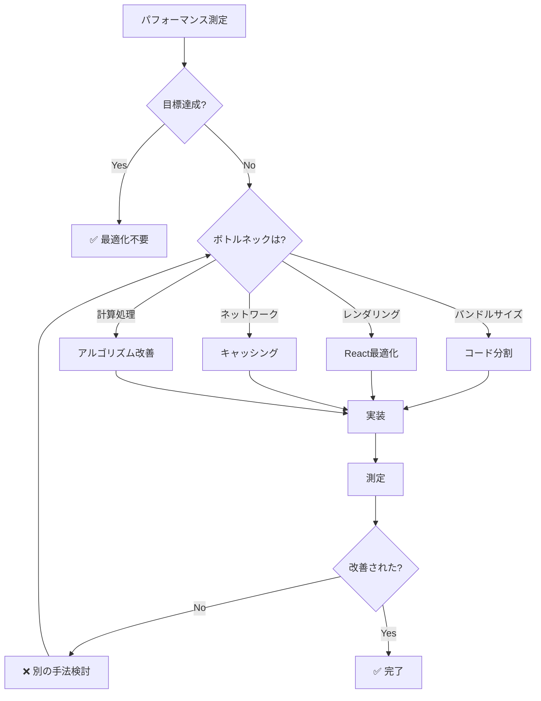

# パフォーマンス最適化意思決定ツリー

**目的**: パフォーマンス問題を検出し、適切な最適化戦略を判断

---

## 🎯 パフォーマンス目標

```
基準値:

✅ 初回ロード: <3秒
✅ ページ遷移: <500ms
✅ API応答: <200ms
✅ バンドルサイズ: <500KB
✅ Lighthouse スコア: 90+
```

---

## 🔍 最適化判断フローチャート



---

## 📊 パフォーマンス測定

### 測定ツール

| ツール | 用途 | コマンド |
|-------|------|---------|
| **Lighthouse** | 総合スコア | Chrome DevTools |
| **Vite Bundle Analyzer** | バンドルサイズ | `npm run build -- --report` |
| **React DevTools Profiler** | レンダリング | Chrome Extension |
| **Network タブ** | ネットワーク | Chrome DevTools |
| **Performance タブ** | 実行時間 | Chrome DevTools |

### 測定手順

```markdown
1. **Lighthouse 実行**
   ```bash
   # Production build
   npm run build
   npm run preview
   
   # Chrome DevTools → Lighthouse → Analyze
   ```

2. **バンドルサイズ確認**
   ```bash
   npm run build
   # dist/ フォルダのサイズを確認
   du -sh dist/
   ```

3. **レンダリング確認**
   - React DevTools Profiler で記録
   - コンポーネントごとのレンダリング時間を確認

**時間**: 15-30分
```

---

## 🛠️ 最適化手法

### 手法1: コード分割（バンドルサイズ削減）

```markdown
**適用条件**:
- バンドルサイズ > 500KB
- 初回ロード時間 > 3秒

**実装**:
```typescript
// Before: すべて同期読み込み
import { HeavyComponent } from './HeavyComponent';

// After: 動的インポート
const HeavyComponent = lazy(() => import('./HeavyComponent'));

function App() {
  return (
    <Suspense fallback={<Loading />}>
      <HeavyComponent />
    </Suspense>
  );
}
```

**期待効果**:
- 初回バンドル: -30%～50%
- 初回ロード: -1～2秒

**時間**: 30-60分
```

### 手法2: React メモ化（レンダリング最適化）

```markdown
**適用条件**:
- 不必要な再レンダリング発生
- リストアイテムが多い（50+）

**実装**:
```typescript
// Before: 毎回再レンダリング
function QuestionItem({ question }) {
  return <div>{question.text}</div>;
}

// After: Props変更時のみレンダリング
const QuestionItem = memo(function QuestionItem({ question }) {
  return <div>{question.text}</div>;
});

// useMemo で計算結果をキャッシュ
function QuestionList({ questions }) {
  const sortedQuestions = useMemo(
    () => questions.sort((a, b) => a.score - b.score),
    [questions]
  );
  
  return sortedQuestions.map(q => <QuestionItem key={q.id} question={q} />);
}

// useCallback で関数をキャッシュ
function Parent() {
  const handleClick = useCallback(
    (id: string) => { /* ... */ },
    []
  );
  
  return <Child onClick={handleClick} />;
}
```

**期待効果**:
- レンダリング時間: -50%～80%
- UI応答性: 大幅改善

**時間**: 1-2時間
```

### 手法3: 仮想スクロール（大量データ）

```markdown
**適用条件**:
- 表示アイテム数 > 100
- スクロールが重い

**実装**:
```typescript
import { FixedSizeList } from 'react-window';

function VirtualList({ items }) {
  return (
    <FixedSizeList
      height={600}
      itemCount={items.length}
      itemSize={50}
      width="100%"
    >
      {({ index, style }) => (
        <div style={style}>
          {items[index].text}
        </div>
      )}
    </FixedSizeList>
  );
}
```

**期待効果**:
- 初回レンダリング: -70%～90%
- スクロール: スムーズ

**時間**: 1-2時間
```

### 手法4: Web Worker（重い計算）

```markdown
**適用条件**:
- 計算処理 > 100ms
- UIがフリーズする

**実装**:
```typescript
// worker.ts
self.onmessage = (e: MessageEvent) => {
  const { questions } = e.data;
  const result = expensiveCalculation(questions);
  self.postMessage(result);
};

// main.ts
const worker = new Worker(new URL('./worker.ts', import.meta.url));

worker.postMessage({ questions });

worker.onmessage = (e: MessageEvent) => {
  const result = e.data;
  updateUI(result);
};
```

**期待効果**:
- UI応答性: 改善
- メインスレッド: ブロックなし

**時間**: 2-3時間
```

### 手法5: キャッシング（ネットワーク最適化）

```markdown
**適用条件**:
- 同じデータを繰り返し取得
- API応答 > 200ms

**実装**:
```typescript
// Service Worker でキャッシュ
self.addEventListener('fetch', (event) => {
  event.respondWith(
    caches.match(event.request).then((response) => {
      return response || fetch(event.request);
    })
  );
});

// React Query でクライアント側キャッシュ
const { data } = useQuery('questions', fetchQuestions, {
  staleTime: 5 * 60 * 1000, // 5分間キャッシュ
  cacheTime: 10 * 60 * 1000, // 10分間保持
});
```

**期待効果**:
- API呼び出し: -50%～90%
- ページ遷移: 高速化

**時間**: 1-2時間
```

---

## 🎯 意思決定ルール

### ルール1: バンドルサイズ問題

```markdown
IF バンドルサイズ > 500KB
  THEN
    優先度: P1
    
    最適化手順:
    1. バンドルアナライザーで大きいモジュールを特定
       ```bash
       npm run build -- --report
       ```
    
    2. コード分割を適用
       - ルートごとに分割
       - 重いコンポーネントを動的インポート
    
    3. 不要な依存を削除
       - 使っていないライブラリ
       - tree-shaking されないライブラリ
    
    4. 再測定
    
  目標: <500KB
  時間: 1-3時間
```

### ルール2: レンダリング問題

```markdown
IF React DevTools で長いレンダリング時間
  THEN
    優先度: P1
    
    最適化手順:
    1. 不必要な再レンダリングを特定
       - React DevTools Profiler で記録
    
    2. memo() を適用
       - Pure component に変換
    
    3. useMemo/useCallback を適用
       - 重い計算をキャッシュ
       - 関数をキャッシュ
    
    4. 再測定
    
  目標: レンダリング時間 -50%
  時間: 1-2時間
```

### ルール3: 大量データ問題

```markdown
IF 表示アイテム数 > 100 AND スクロールが重い
  THEN
    優先度: P1
    
    最適化手順:
    1. react-window を導入
       ```bash
       npm install react-window
       ```
    
    2. リストコンポーネントを置き換え
       - FixedSizeList または VariableSizeList
    
    3. 再測定
    
  目標: スムーズなスクロール
  時間: 1-2時間
```

### ルール4: 重い計算問題

```markdown
IF 計算処理 > 100ms AND UIがブロックされる
  THEN
    優先度: P0（UXに重大な影響）
    
    最適化手順:
    1. Web Worker を作成
    2. 重い計算を Worker に移動
    3. メインスレッドは結果を受信するのみ
    4. 再測定
    
  目標: メインスレッドブロック 0ms
  時間: 2-3時間
```

---

## 📝 実例: 最適化シナリオ

### 例1: バンドルサイズ削減

```markdown
**問題**: バンドルサイズ 750KB

**測定**:
```bash
$ npm run build
dist/index.js  750 KB
```

**分析**:
- moment.js: 300KB（日付ライブラリ）
- lodash: 150KB（ユーティリティ）
- chart.js: 200KB（グラフライブラリ）

**最適化**:

1. moment.js → date-fns に置き換え
```typescript
// Before
import moment from 'moment';
const formatted = moment(date).format('YYYY-MM-DD');

// After
import { format } from 'date-fns';
const formatted = format(date, 'yyyy-MM-dd');
```

2. lodash の tree-shaking
```typescript
// Before
import _ from 'lodash';
const sorted = _.sortBy(array, 'field');

// After
import sortBy from 'lodash/sortBy';
const sorted = sortBy(array, 'field');
```

3. chart.js を動的インポート
```typescript
// Before
import Chart from 'chart.js';

// After
const Chart = lazy(() => import('chart.js'));
```

**結果**:
```bash
$ npm run build
dist/index.js  380 KB (-370KB, -49%)
```

✅ 目標達成（<500KB）
**時間**: 2時間
```

### 例2: レンダリング最適化

```markdown
**問題**: QuestionList の再レンダリングが遅い

**測定**:
React DevTools Profiler:
- QuestionList: 350ms
- 不必要な再レンダリング: 120回

**分析**:
- 親コンポーネントの state 変更で全体が再レンダリング
- QuestionItem がメモ化されていない
- ソート処理が毎回実行

**最適化**:

1. QuestionItem をメモ化
```typescript
const QuestionItem = memo(function QuestionItem({ question }) {
  return <div>{question.text}</div>;
});
```

2. ソート処理をメモ化
```typescript
const sortedQuestions = useMemo(
  () => questions.sort((a, b) => a.score - b.score),
  [questions]
);
```

3. イベントハンドラーをキャッシュ
```typescript
const handleClick = useCallback(
  (id: string) => selectQuestion(id),
  [selectQuestion]
);
```

**結果**:
React DevTools Profiler:
- QuestionList: 80ms (-77%)
- 不必要な再レンダリング: 15回 (-87%)

✅ 目標達成
**時間**: 90分
```

### 例3: 仮想スクロール導入

```markdown
**問題**: 1000問の表示でスクロールが重い

**測定**:
- 初回レンダリング: 2.5秒
- スクロール FPS: 15-20（目標: 60）

**最適化**:

react-window導入
```typescript
// Before: すべてレンダリング
{questions.map(q => (
  <QuestionItem key={q.id} question={q} />
))}

// After: 表示領域のみレンダリング
<FixedSizeList
  height={600}
  itemCount={questions.length}
  itemSize={80}
  width="100%"
>
  {({ index, style }) => (
    <div style={style}>
      <QuestionItem question={questions[index]} />
    </div>
  )}
</FixedSizeList>
```

**結果**:
- 初回レンダリング: 180ms (-93%)
- スクロール FPS: 60（+300%）

✅ 目標達成
**時間**: 90分
```

---

## 🚀 最適化のベストプラクティス

### 1. 測定ファースト

```markdown
✅ GOOD: 最適化前に測定
- ボトルネックを特定
- 効果を定量評価
- 優先度を判断

❌ BAD: 勘で最適化
- 効果が不明
- 時間の無駄
- 逆効果の可能性
```

### 2. 80/20ルール

```markdown
✅ GOOD: 影響の大きい20%に集中
- バンドルの大部分を占めるモジュール
- 頻繁に実行される処理
- ユーザーが待つ箇所

❌ BAD: すべてを最適化
- 時間がかかる
- 効果が薄い
- コードが複雑化
```

### 3. ユーザー視点

```markdown
✅ GOOD: ユーザーが体感する部分を優先
- 初回ロード時間
- ページ遷移速度
- UI応答性

❌ BAD: 内部的な最適化のみ
- ユーザーは気づかない
- 効果が限定的
```

---

## 📚 関連ドキュメント

- [quality-standards.instructions.md](../context/quality-standards.instructions.md) - 品質基準
- [PERFORMANCE_GUIDE.md](../../../docs/quality/PERFORMANCE_GUIDE.md) - パフォーマンスガイド

---

**最終更新**: 2025-12-19  
**バージョン**: 1.0.0  
**適用**: すべてのパフォーマンス最適化
