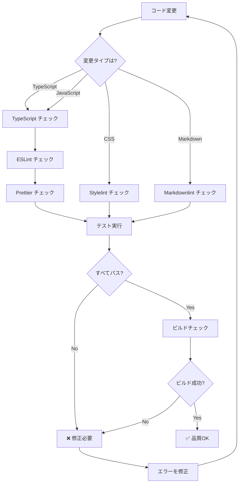

# 品質チェック意思決定ツリー

**目的**: コード変更時に必要な品質チェックを自動判断し、適切な検証を実行

---

## 🎯 品質チェックの基本原則

```
Zero Tolerance Policy（ゼロトレランス方針）

❌ TypeScript エラー: 0 必須
❌ ESLint エラー: 0 必須
❌ ESLint 警告: 0 必須
❌ Markdown エラー: 0 必須
✅ テストカバレッジ: 95%+ 推奨
✅ すべてのテスト: パス必須
```

---

## 🔍 品質チェックフローチャート



---

## 📊 チェック項目マトリクス

### ファイルタイプ別チェック

| ファイルタイプ | TypeScript | ESLint | Prettier | Tests | Build | Markdown |
|--------------|-----------|--------|----------|-------|-------|----------|
| `.ts` | ✅ | ✅ | ✅ | ✅ | ✅ | - |
| `.tsx` | ✅ | ✅ | ✅ | ✅ | ✅ | - |
| `.js` | - | ✅ | ✅ | ✅ | ✅ | - |
| `.css` | - | - | ✅ | - | ✅ | - |
| `.md` | - | - | ✅ | - | - | ✅ |
| `.json` | - | - | ✅ | - | - | - |

### 変更規模別チェック

| 変更規模 | 最小チェック | 推奨チェック | 完全チェック |
|---------|------------|------------|------------|
| 1-5行 | Type + Lint | + Tests | + Build + E2E |
| 6-50行 | Type + Lint + Tests | + Build | + E2E + Coverage |
| 51-200行 | Type + Lint + Tests + Build | + E2E | + Performance |
| 201+行 | すべて必須 | すべて必須 | すべて必須 |

---

## 🛠️ チェック実行手順

### ステップ1: TypeScript 型チェック

```bash
# 実行コマンド
npx tsc --noEmit

# 期待結果
# 出力なし（0エラー）

# エラー例
src/ai/scheduler/QuestionScheduler.ts:45:20 - error TS2345: 
  Argument of type 'undefined' is not assignable to parameter of type 'Question'.

# 対応
1. エラー箇所を特定
2. 型エラーを修正
3. 再チェック
```

### ステップ2: ESLint チェック

```bash
# 実行コマンド
npm run lint

# 期待結果
✨ Done in 2.3s
0 errors, 0 warnings

# エラー例
/src/components/MemorizationView.tsx
  142:7  error  'reAddQuestion' is defined but never used  @typescript-eslint/no-unused-vars

# 対応
1. エラー箇所を確認
2. 未使用変数を削除 OR 使用
3. 再チェック
```

### ステップ3: Prettier チェック

```bash
# 実行コマンド
npm run format:check

# 期待結果
All matched files use Prettier code style!

# エラー例
[warn] src/components/MemorizationView.tsx
[warn] Code style issues found in 1 file.

# 対応（自動修正）
npm run format
```

### ステップ4: テスト実行

```bash
# 実行コマンド
npm test

# 期待結果
Test Files  45 passed (45)
     Tests  523 passed (523)

# エラー例
FAIL tests/unit/questionScheduler.test.ts
  ● QuestionScheduler › should select urgent question
    Expected: 1
    Received: 2

# 対応
1. テストを確認
2. 実装を修正 OR テストを修正
3. 再実行
```

### ステップ5: ビルドチェック

```bash
# 実行コマンド
npm run build

# 期待結果
✓ built in 3.2s
dist/index.html  1.2 kB │ gzip: 0.5 kB

# エラー例
[vite] Error: Failed to parse source
  at node_modules/vite/...

# 対応
1. エラー原因を特定
2. 構文エラーを修正
3. 再ビルド
```

---

## 🎯 意思決定ルール

### ルール1: TypeScript ファイル変更時

```markdown
IF .ts または .tsx ファイルを変更
  THEN
    1. TypeScript チェック実行
       ```bash
       npx tsc --noEmit
       ```
       → エラー 0 必須
    
    2. ESLint チェック実行
       ```bash
       npm run lint
       ```
       → エラー 0、警告 0 必須
    
    3. Prettier チェック実行
       ```bash
       npm run format:check
       ```
       → すべて整形済み必須
    
    4. 関連テスト実行
       ```bash
       npm test -- [changed-file].test.ts
       ```
       → すべてパス必須
    
    5. ビルドチェック
       ```bash
       npm run build
       ```
       → ビルド成功必須
  
  優先度: P0（すべて必須）
  時間: 5-10分
```

### ルール2: テストファイル変更時

```markdown
IF .test.ts または .spec.ts ファイルを変更
  THEN
    1. TypeScript チェック実行
    2. ESLint チェック実行
    3. 該当テストのみ実行
       ```bash
       npm test -- tests/unit/specific.test.ts
       ```
    4. IF (テストがパス)
         THEN 関連する実装のテストも実行
       
  優先度: P0（テストは必ずパス）
  時間: 3-5分
```

### ルール3: Markdown ファイル変更時

```markdown
IF .md ファイルを変更
  THEN
    1. Markdownlint チェック実行
       ```bash
       npx markdownlint-cli [file].md
       ```
       → エラー 0 必須
    
    2. 自動修正試行
       ```bash
       npx markdownlint-cli [file].md --fix
       ```
    
    3. リンク確認
       - 内部リンクが正しいか
       - 相対パスが正しいか
    
    4. IF (コードブロックを含む)
         THEN コード例の動作確認
  
  優先度: P1（コミット前に必須）
  時間: 2-3分
```

### ルール4: 大規模変更時

```markdown
IF 変更が 50行以上 OR 5ファイル以上
  THEN
    1. すべての基本チェック実行
       - TypeScript
       - ESLint
       - Prettier
       - Tests
       - Build
    
    2. カバレッジ確認
       ```bash
       npm test -- --coverage
       ```
       → 95%+ 維持必須
    
    3. E2E テスト実行
       ```bash
       npm run test:e2e
       ```
       → 主要フローすべてパス必須
    
    4. パフォーマンステスト
       ```bash
       npm run build
       # バンドルサイズ確認
       ```
       → 500KB 以下維持
  
  優先度: P0（完全な検証必須）
  時間: 15-30分
```

### ルール5: コミット前チェック

```markdown
IF コミットしようとしている
  THEN
    1. Pre-commit フックが自動実行
       - ダークモード禁止チェック
       - 仕様書遵守チェック
       - Prettier 自動適用
       - TypeScript 型チェック
       - プロジェクト構造検証
    
    2. IF (フックが失敗)
         THEN
           - エラーメッセージを確認
           - 問題を修正
           - 再コミット試行
    
    3. IF (フックがパス)
         THEN
           - コミット成功
           - GitHub Actions が自動実行
  
  優先度: P0（自動実行）
  時間: 1-2分（自動）
```

---

## ✅ 品質基準の判定

### 合格基準

```markdown
すべて満たす必要あり:

✅ TypeScript エラー: 0
✅ ESLint エラー: 0
✅ ESLint 警告: 0
✅ Prettier: すべて整形済み
✅ テスト: すべてパス
✅ ビルド: 成功
✅ Markdown: エラー 0（.mdファイル変更時）

推奨基準:
✅ テストカバレッジ: 95%+
✅ E2E テスト: すべてパス
✅ バンドルサイズ: <500KB
```

### 不合格時の対応

```markdown
不合格パターン別対応:

## パターン1: TypeScript エラー
→ 型エラーを修正
→ 再チェック
→ 時間: 5-30分

## パターン2: ESLint エラー/警告
→ コード品質を改善
→ 未使用変数削除
→ 時間: 5-15分

## パターン3: テスト失敗
→ 実装 OR テストを修正
→ 再テスト
→ 時間: 10-60分

## パターン4: ビルド失敗
→ 構文エラー修正
→ 依存関係確認
→ 時間: 10-30分
```

---

## 📝 実例: 品質チェックシナリオ

### 例1: TypeScript ファイルの変更

```markdown
**変更内容**: QuestionScheduler.ts を修正

**チェックプロセス**:

1. TypeScript チェック
```bash
$ npx tsc --noEmit
✅ 出力なし（0エラー）
```

2. ESLint チェック
```bash
$ npm run lint
⚠️ 1 warning found:
  142:7  warning  'reAddQuestion' is defined but never used
```

3. 修正
```typescript
// 未使用変数を削除
- const { reAddQuestion, clearExpiredFlags } = useQuestionRequeue();
+ const { clearExpiredFlags } = useQuestionRequeue();
```

4. 再チェック
```bash
$ npm run lint
✅ 0 errors, 0 warnings
```

5. テスト実行
```bash
$ npm test -- questionScheduler.test.ts
✅ All tests passed (12/12)
```

6. ビルド確認
```bash
$ npm run build
✅ Built in 3.2s
```

**結果**: ✅ すべてパス（合計10分）
```

### 例2: 大規模リファクタリング

```markdown
**変更内容**: 5ファイル、200行変更

**完全チェックプロセス**:

1. 基本チェック
```bash
$ npx tsc --noEmit && npm run lint && npm test
✅ TypeScript: 0 errors
✅ ESLint: 0 errors, 0 warnings
✅ Tests: 523 passed
```

2. カバレッジ確認
```bash
$ npm test -- --coverage
Statements: 92.5% (目標: 95%)
❌ カバレッジ不足
```

3. テスト追加
```typescript
// 不足しているテストケースを追加
test('handles edge case with empty array', () => { ... });
test('handles null input gracefully', () => { ... });
```

4. 再測定
```bash
$ npm test -- --coverage
✅ Statements: 95.2%
```

5. E2E テスト
```bash
$ npm run test:e2e
✅ All scenarios passed (8/8)
```

6. パフォーマンス確認
```bash
$ npm run build
Bundle size: 348KB
✅ < 500KB
```

**結果**: ✅ すべてパス（合計30分）
```

### 例3: Markdown ドキュメント更新

```markdown
**変更内容**: README.md を更新

**チェックプロセス**:

1. Markdownlint チェック
```bash
$ npx markdownlint-cli README.md
❌ 3 errors found:
  15:1 MD032 Lists should be surrounded by blank lines
  42:1 MD040 Code blocks should specify language
  88:1 MD022 Headers should be surrounded by blank lines
```

2. 自動修正
```bash
$ npx markdownlint-cli README.md --fix
✅ Fixed 2 errors automatically
❌ 1 error remains (manual fix needed)
```

3. 手動修正
```markdown
# Before (MD040 violation)
```
npm install
```

# After
```bash
npm install
```
```

4. 再チェック
```bash
$ npx markdownlint-cli README.md
✅ 0 errors
```

5. リンク確認
```bash
# 手動でリンクをクリックして確認
✅ すべてのリンクが正常
```

**結果**: ✅ すべてパス（合計5分）
```

---

## 🚀 自動化されたチェック

### Pre-commit フック（Husky）

```bash
# .husky/pre-commit が自動実行

1. ダークモード禁止チェック
   → dark mode class を検出

2. 仕様書遵守チェック
   → レイアウト無断変更を検出

3. Prettier フォーマット
   → 自動整形

4. TypeScript 型チェック
   → 型エラー検出

5. プロジェクト構造検証
   → 構造違反を検出

すべてパス → コミット許可
1つでも失敗 → コミット拒否
```

### GitHub Actions（CI/CD）

```yaml
# .github/workflows/ が自動実行

1. Install dependencies
   → npm install

2. TypeScript check
   → npx tsc --noEmit

3. ESLint check
   → npm run lint

4. Unit tests
   → npm test

5. Integration tests
   → npm run test:integration

6. E2E tests
   → npm run test:e2e

7. Build
   → npm run build

8. Deploy (mainブランチのみ)
   → GitHub Pages

すべてパス → デプロイ
1つでも失敗 → デプロイ中止、通知
```

---

## 📊 品質メトリクスの追跡

### ダッシュボード（目標値）

```markdown
## コード品質
- TypeScript エラー: 0 / 0 ✅
- ESLint 警告: 0 / 0 ✅
- Markdown エラー: 0 / 0 ✅

## テスト
- ユニットテスト: 523 passed ✅
- カバレッジ: 92.5% 🟡 (目標: 95%)
- E2E テスト: 8 passed ✅

## ビルド
- ビルド時間: 3.2秒 ✅ (目標: <30秒)
- バンドルサイズ: 348KB ✅ (目標: <500KB)
- ビルド成功率: 100% ✅

## デプロイ
- CI/CD 成功率: 100% ✅
- デプロイ時間: 3分 ✅
```

---

## 🎓 品質チェックのベストプラクティス

### 1. 早期チェック

```markdown
✅ GOOD: コーディング中に随時チェック
- IDE の型チェック機能を活用
- 保存時の自動フォーマット
- テストを書きながら実行

❌ BAD: コミット直前に一斉チェック
- エラーが大量に発見される
- 修正に時間がかかる
- リスクが高い
```

### 2. 小さな変更を頻繁に

```markdown
✅ GOOD: 小さな変更を頻繁にコミット
- 1機能 = 1コミット
- チェックが高速
- 問題の特定が容易

❌ BAD: 大きな変更を一度にコミット
- チェックに時間がかかる
- 問題の切り分けが困難
- ロールバックが大変
```

### 3. テストファースト

```markdown
✅ GOOD: 実装前にテストを書く
- 仕様が明確になる
- テストが自然と充実
- リファクタリングしやすい

❌ BAD: 実装後にテストを書く
- テストが不十分になりがち
- カバレッジが低い
- バグが混入しやすい
```

---

## 📚 関連ドキュメント

- [quality-standards.instructions.md](../context/quality-standards.instructions.md) - 品質基準の詳細
- [QUALITY_SYSTEM.md](../../../docs/quality/QUALITY_SYSTEM.md) - 品質システム全体
- [INTEGRATED_QUALITY_PIPELINE.md](../../../docs/quality/INTEGRATED_QUALITY_PIPELINE.md) - 品質パイプライン

---

**最終更新**: 2025-12-19  
**バージョン**: 1.0.0  
**適用**: すべてのコード変更
