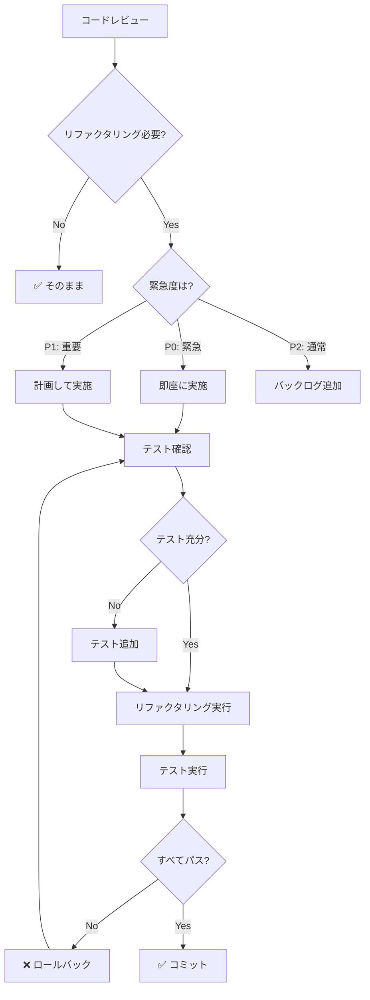

# リファクタリング意思決定ツリー

**目的**: コードのリファクタリングが必要かを判断し、安全に実行する手順を提供

---

## 🎯 リファクタリングの基本原則

```
リファクタリングの鉄則:

✅ 機能は変更しない（動作は同じ）
✅ テストを先に書く/確認する
✅ 小さなステップで進める
✅ 各ステップでテストを実行
✅ コミットを頻繁に行う
```

---

## 🔍 リファクタリング判断フローチャート



---

## 📊 リファクタリング必要性の判定

### コードスメル（悪臭）チェックリスト

| スメル | 説明 | 優先度 | 対応時間 |
|-------|------|-------|---------|
| **長いメソッド** | 50行以上 | P1 | 30-60分 |
| **大きなクラス** | 300行以上 | P1 | 1-3時間 |
| **重複コード** | 3箇所以上 | P0 | 30-90分 |
| **長いパラメータリスト** | 4個以上 | P2 | 15-30分 |
| **分岐の複雑さ** | ネスト3階層以上 | P1 | 30-60分 |
| **マジックナンバー** | 定数未定義 | P2 | 10-20分 |
| **未使用コード** | デッドコード | P2 | 5-15分 |
| **不適切な命名** | 意味不明な名前 | P2 | 10-30分 |

### リファクタリング優先度

```markdown
## P0（緊急）
- 重複コードが3箇所以上
- バグを引き起こしやすい構造
- セキュリティリスクがある

## P1（重要）
- メンテナンス性が著しく低い
- 新機能追加が困難
- テストが書けない構造

## P2（通常）
- 可読性の問題
- 命名の問題
- 小規模な最適化
```

---

## 🛠️ リファクタリング手順

### ステップ1: テスト確認・追加

```markdown
**必須チェック**:

1. 既存テストの確認
   ```bash
   npm test -- [target-file].test.ts
   ```
   - すべてパス必須
   - カバレッジ確認

2. テストが不足している場合
   ```typescript
   // 先にテストを追加
   describe('Target function', () => {
     test('current behavior', () => {
       // 現在の動作を保証するテスト
     });
   });
   ```

3. カバレッジ目標
   - 80%+ : 最低ライン
   - 90%+ : 推奨
   - 95%+ : 理想

**時間**: 30-60分
```

### ステップ2: 小さなステップで実行

```markdown
**リファクタリング手法**:

1. 関数の抽出
   ```typescript
   // Before
   function processData(data: Data[]) {
     // 50 lines of code
     const filtered = data.filter(d => d.valid);
     const sorted = filtered.sort((a, b) => a.score - b.score);
     const top10 = sorted.slice(0, 10);
     return top10;
   }
   
   // After
   function processData(data: Data[]) {
     const filtered = filterValidData(data);
     const sorted = sortByScore(filtered);
     return takeTop10(sorted);
   }
   
   function filterValidData(data: Data[]) {
     return data.filter(d => d.valid);
   }
   
   function sortByScore(data: Data[]) {
     return data.sort((a, b) => a.score - b.score);
   }
   
   function takeTop10(data: Data[]) {
     return data.slice(0, 10);
   }
   ```

2. 変数名の改善
   ```typescript
   // Before
   const d = new Date();
   const x = d.getTime();
   
   // After
   const now = new Date();
   const timestamp = now.getTime();
   ```

3. マジックナンバーの定数化
   ```typescript
   // Before
   if (attempts > 3) { ... }
   
   // After
   const MAX_RETRY_ATTEMPTS = 3;
   if (attempts > MAX_RETRY_ATTEMPTS) { ... }
   ```

**時間**: 各ステップ15-30分
```

### ステップ3: 各ステップでテスト

```markdown
**テストサイクル**:

1. リファクタリング実行
2. TypeScript チェック
   ```bash
   npx tsc --noEmit
   ```
3. テスト実行
   ```bash
   npm test
   ```
4. すべてパス確認
5. 次のステップへ

**失敗した場合**:
- 即座にロールバック
- 問題を特定
- 小さなステップに分割

**時間**: 各サイクル5-10分
```

### ステップ4: コミット

```markdown
**コミットのタイミング**:

- 1つの手法完了ごと
- すべてのテストパス後
- 動作する状態を維持

**コミットメッセージ**:
```bash
git commit -m "refactor: extract filterValidData function"
git commit -m "refactor: rename variable d to now"
git commit -m "refactor: extract MAX_RETRY_ATTEMPTS constant"
```

**時間**: 各コミット2-3分
```

---

## 🎯 意思決定ルール

### ルール1: 重複コード発見時（P0）

```markdown
IF 同じコードが3箇所以上存在
  THEN
    優先度: P0（即座に対応）
    
    手順:
    1. 重複箇所を特定
    2. 共通関数を抽出
       ```typescript
       // 重複していたコード
       function extractCommonLogic(...) {
         // 共通ロジック
       }
       ```
    3. すべての箇所を置き換え
    4. テスト実行
    5. コミット
    
  時間: 30-90分
  
  例:
  - データバリデーション
  - エラーハンドリング
  - フォーマット処理
```

### ルール2: 長いメソッド発見時（P1）

```markdown
IF 関数が50行以上
  THEN
    優先度: P1（計画して対応）
    
    手順:
    1. 責任を分析
       - この関数は何をしている？
       - 複数の責任を持っていないか？
    
    2. 小さな関数に分割
       ```typescript
       // Before: 1つの大きな関数
       function bigFunction() {
         // 50+ lines
       }
       
       // After: 複数の小さな関数
       function mainFunction() {
         step1();
         step2();
         step3();
       }
       
       function step1() { ... }
       function step2() { ... }
       function step3() { ... }
       ```
    
    3. テスト追加（各関数）
    4. 統合テスト
    
  時間: 30-60分
```

### ルール3: 複雑な条件分岐（P1）

```markdown
IF ネストが3階層以上 OR 条件式が複雑
  THEN
    優先度: P1（計画して対応）
    
    手順:
    1. 早期リターンを使用
       ```typescript
       // Before
       function process(data) {
         if (data) {
           if (data.valid) {
             if (data.score > 80) {
               return 'excellent';
             }
           }
         }
         return 'poor';
       }
       
       // After
       function process(data) {
         if (!data) return 'poor';
         if (!data.valid) return 'poor';
         if (data.score > 80) return 'excellent';
         return 'poor';
       }
       ```
    
    2. 条件を関数に抽出
       ```typescript
       function isExcellent(data) {
         return data && data.valid && data.score > 80;
       }
       ```
    
  時間: 30-60分
```

### ルール4: 不適切な命名（P2）

```markdown
IF 変数名・関数名が不明確
  THEN
    優先度: P2（通常対応）
    
    手順:
    1. 意味のある名前に変更
       ```typescript
       // Before
       const d = getData();
       const x = d.map(i => i.v);
       
       // After
       const questions = getData();
       const scores = questions.map(q => q.score);
       ```
    
    2. IDEのリファクタリング機能を使用
       - VSCode: F2 (Rename Symbol)
       - すべての参照を自動更新
    
    3. テスト実行
    
  時間: 10-30分
```

### ルール5: 未使用コード（P2）

```markdown
IF ESLintが未使用変数・関数を検出
  THEN
    優先度: P2（通常対応）
    
    手順:
    1. 本当に未使用か確認
       - 動的呼び出しの可能性
       - 将来使う予定の有無
    
    2. 削除
       ```bash
       # ESLintで検出
       npm run lint
       ```
    
    3. テスト実行（念のため）
    
    4. コミット
       ```bash
       git commit -m "refactor: remove unused function"
       ```
    
  時間: 5-15分
```

---

## 📝 実例: リファクタリングシナリオ

### 例1: 重複コード除去

```markdown
**発見**: データバリデーションが3箇所に重複

**Before**:
```typescript
// Location 1
function processQuestions(questions: Question[]) {
  const valid = questions.filter(q =>
    q.id && q.text && q.text.length > 0 && q.category
  );
  // ...
}

// Location 2
function saveQuestions(questions: Question[]) {
  const valid = questions.filter(q =>
    q.id && q.text && q.text.length > 0 && q.category
  );
  // ...
}

// Location 3
function exportQuestions(questions: Question[]) {
  const valid = questions.filter(q =>
    q.id && q.text && q.text.length > 0 && q.category
  );
  // ...
}
```

**リファクタリング手順**:

1. 共通関数を抽出
```typescript
// utils/validation.ts
export function isValidQuestion(q: Question): boolean {
  return !!(q.id && q.text && q.text.length > 0 && q.category);
}

export function filterValidQuestions(questions: Question[]): Question[] {
  return questions.filter(isValidQuestion);
}
```

2. すべての箇所を置き換え
```typescript
// Location 1
function processQuestions(questions: Question[]) {
  const valid = filterValidQuestions(questions);
  // ...
}

// Location 2
function saveQuestions(questions: Question[]) {
  const valid = filterValidQuestions(questions);
  // ...
}

// Location 3
function exportQuestions(questions: Question[]) {
  const valid = filterValidQuestions(questions);
  // ...
}
```

3. テスト追加
```typescript
// tests/validation.test.ts
describe('isValidQuestion', () => {
  test('returns true for valid question', () => {
    const question = {
      id: '1',
      text: 'Test',
      category: 'grammar'
    };
    expect(isValidQuestion(question)).toBe(true);
  });
  
  test('returns false for invalid question', () => {
    const question = { id: '1', text: '', category: 'grammar' };
    expect(isValidQuestion(question)).toBe(false);
  });
});
```

**結果**: ✅ 完了（合計45分）
- 重複削除: 3箇所
- コード行数削減: 15行
- テストカバレッジ: 100%
```

### 例2: 長いメソッドの分割

```markdown
**発見**: processUserAnswer 関数が80行

**Before**:
```typescript
function processUserAnswer(answer: string, question: Question) {
  // 80 lines of code
  const normalized = answer.trim().toLowerCase();
  const correct = normalized === question.correctAnswer.toLowerCase();
  
  if (correct) {
    const newScore = calculateScore(question.difficulty);
    updateUserScore(newScore);
    showSuccessMessage();
    
    if (isFirstAttempt()) {
      grantBonus();
    }
    
    const nextQuestion = selectNextQuestion();
    displayQuestion(nextQuestion);
  } else {
    decreaseScore();
    showErrorMessage();
    
    if (attemptsRemaining() > 0) {
      allowRetry();
    } else {
      showCorrectAnswer();
      const nextQuestion = selectNextQuestion();
      displayQuestion(nextQuestion);
    }
  }
  
  updateStatistics();
  saveProgress();
  // ... more code
}
```

**リファクタリング手順**:

1. 責任を分析
   - 回答の正規化
   - 正誤判定
   - 正解時の処理
   - 不正解時の処理
   - 統計更新

2. 小さな関数に分割
```typescript
function processUserAnswer(answer: string, question: Question) {
  const normalized = normalizeAnswer(answer);
  const isCorrect = checkAnswer(normalized, question);
  
  if (isCorrect) {
    handleCorrectAnswer(question);
  } else {
    handleIncorrectAnswer(question);
  }
  
  finalizeAnswer();
}

function normalizeAnswer(answer: string): string {
  return answer.trim().toLowerCase();
}

function checkAnswer(normalized: string, question: Question): boolean {
  return normalized === question.correctAnswer.toLowerCase();
}

function handleCorrectAnswer(question: Question) {
  const score = calculateScore(question.difficulty);
  updateUserScore(score);
  showSuccessMessage();
  
  if (isFirstAttempt()) {
    grantBonus();
  }
  
  moveToNextQuestion();
}

function handleIncorrectAnswer(question: Question) {
  decreaseScore();
  showErrorMessage();
  
  if (attemptsRemaining() > 0) {
    allowRetry();
  } else {
    showCorrectAnswer();
    moveToNextQuestion();
  }
}

function finalizeAnswer() {
  updateStatistics();
  saveProgress();
}
```

3. テスト追加（各関数）
```typescript
describe('processUserAnswer', () => {
  test('normalizes answer correctly', () => {
    expect(normalizeAnswer('  TeSt  ')).toBe('test');
  });
  
  test('checks answer correctly', () => {
    const question = { correctAnswer: 'test' };
    expect(checkAnswer('test', question)).toBe(true);
  });
  
  // ... more tests
});
```

**結果**: ✅ 完了（合計90分）
- 1つの関数 → 6つの関数
- 各関数: 10-15行
- テストカバレッジ: 95%
```

---

## 🚀 リファクタリングのベストプラクティス

### 1. テストファースト

```markdown
✅ GOOD: テストを先に確認・追加
- 動作を保証
- 安全にリファクタリング
- リグレッションを防ぐ

❌ BAD: テストなしでリファクタリング
- バグが混入しやすい
- 動作変更に気づかない
- ロールバックが困難
```

### 2. 小さなステップ

```markdown
✅ GOOD: 1つずつ変更してテスト
- 問題の切り分けが容易
- ロールバックが簡単
- レビューしやすい

❌ BAD: 大量の変更を一度に
- 問題の特定が困難
- ロールバックが大変
- レビュー不可能
```

### 3. 頻繁なコミット

```markdown
✅ GOOD: 動作する状態で頻繁にコミット
- 安全なセーブポイント
- 履歴が明確
- ロールバックが容易

❌ BAD: 完了するまでコミットしない
- 作業が失われるリスク
- 履歴が不明確
- ロールバックが困難
```

---

## 📚 関連ドキュメント

- [testing-decision.instructions.md](./testing-decision.instructions.md) - テスト戦略
- [quality-standards.instructions.md](../context/quality-standards.instructions.md) - 品質基準
- [scope-control.instructions.md](../context/scope-control.instructions.md) - スコープ管理

---

**最終更新**: 2025-12-19  
**バージョン**: 1.0.0  
**適用**: すべてのリファクタリング
