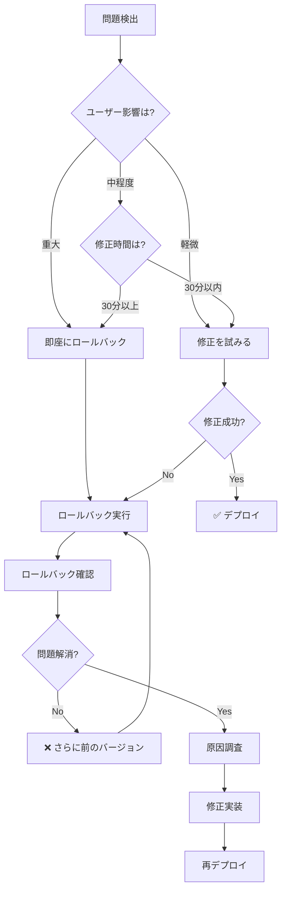

# ロールバック意思決定ツリー

**目的**: 本番環境で問題発生時に、ロールバックの判断と実行を迅速に行う

---

## 🎯 ロールバックの基本原則

```
ロールバック判断:

✅ ユーザー影響が大きい → 即座にロールバック
✅ 修正に時間がかかる → ロールバック後に修正
✅ データ損失のリスク → 即座にロールバック
✅ 迅速な決断 → 15分以内
✅ 完全な記録 → ポストモーテム必須
```

---

## 🔍 ロールバック判断フローチャート



---

## 📊 ロールバック判断マトリクス

| 問題の深刻度 | ユーザー影響 | 修正時間 | 判断 | 対応時間 |
|------------|------------|---------|------|---------|
| **Critical** | 全ユーザー | 不明 | 即座にロールバック | <5分 |
| **High** | 多数 | >30分 | ロールバック | <10分 |
| **Medium** | 一部 | >1時間 | ロールバック | <15分 |
| **Low** | 限定的 | <30分 | 修正を試みる | 30分 |

---

## 🛠️ ロールバック手順

### ステップ1: 問題の確認

```markdown
**確認項目**:

1. エラーの種類
   ```bash
   # ブラウザコンソール
   F12 → Console → エラーメッセージ確認
   ```

2. 影響範囲
   - すべてのユーザー？
   - 特定のブラウザ？
   - 特定の機能？

3. 発生タイミング
   - デプロイ直後？
   - 何分後？

4. エラー率
   - 100%発生？
   - 50%発生？
   - 稀に発生？

**時間**: 3-5分
```

### ステップ2: ロールバック判断

```markdown
**判断基準**:

□ ユーザー影響が重大
  - アプリが使用不能
  - データが破損・消失
  - セキュリティリスク

□ 修正に時間がかかる
  - 原因不明
  - 修正に30分以上
  - テストが必要

□ エラー率が高い
  - 50%以上のユーザーが影響
  - すべての環境で発生

IF 上記のいずれかに該当
  THEN → ロールバック実行

**時間**: 2-3分
```

### ステップ3: ロールバック実行

```markdown
**方法1: Git Revert（推奨）**

```bash
# 問題のコミットを特定
git log --oneline -10

# 問題のコミットをrevert
git revert <commit-hash>

# 強制的にmainに適用
git push origin main
```

**方法2: 前のタグに戻す**

```bash
# 安定版のタグを特定
git tag -l

# 前のバージョンにチェックアウト
git checkout v1.2.2

# 新しいブランチ作成
git checkout -b rollback-to-v1.2.2

# mainに強制適用（注意！）
git push origin rollback-to-v1.2.2:main --force
```

**方法3: GitHub PR のrevert**

```bash
# GitHub UI で
PR画面 → "Revert" ボタン → 新しいPR作成 → マージ
```

**時間**: 5-10分
```

### ステップ4: ロールバック確認

```markdown
**確認項目**:

□ デプロイ完了
  ```bash
  gh run watch
  # または
  curl -I https://nanashi8.github.io/
  ```

□ 問題が解消
  - エラーが発生しない
  - 主要機能が動作

□ パフォーマンス正常
  - ページロード正常
  - API応答正常

□ ユーザー通知
  ```markdown
  一時的に前のバージョンに戻しました。
  修正後に再度アップデートします。
  ```

**時間**: 5-10分
```

### ステップ5: ポストモーテム作成

```markdown
**記録項目**:

1. 問題の詳細
   - 何が起きたか
   - いつ起きたか
   - どのように発見したか

2. 影響範囲
   - 影響を受けたユーザー数
   - ダウンタイム
   - データ損失の有無

3. 原因
   - 根本原因
   - なぜ見逃されたか

4. 対応
   - ロールバック実施時間
   - 問題解消までの時間

5. 再発防止策
   - テストの追加
   - 監視の強化
   - プロセスの改善

**時間**: 30-60分（後で作成）
```

---

## 🎯 意思決定ルール

### ルール1: Critical - 即座にロールバック

```markdown
IF 以下のいずれかに該当
  - アプリが完全に動作しない
  - データが破損・消失している
  - セキュリティ侵害の可能性
  - すべてのユーザーが影響を受けている
  
THEN
  優先度: P0（Critical）
  対応: 即座にロールバック（<5分）
  
  手順:
  1. 即座にチームに通知
  2. ロールバック実行
     ```bash
     git revert HEAD
     git push origin main --force
     ```
  3. デプロイ完了確認
  4. 問題解消確認
  5. ユーザー通知
  6. 原因調査開始
  
  時間: 5-10分
  通知: 即座にステークホルダーに報告
```

### ルール2: High - 条件付きロールバック

```markdown
IF 以下のいずれかに該当
  - 主要機能が動作しない
  - 50%以上のユーザーが影響
  - 修正に30分以上かかる見込み
  
THEN
  優先度: P1（High）
  対応: 10分以内にロールバック判断
  
  手順:
  1. 修正の可能性を評価（5分）
     - 原因が明確か？
     - 修正が簡単か？
  
  2. IF (修正困難 OR 時間がかかる)
       THEN ロールバック実行
     ELSE
       修正を試みる（30分タイムボックス）
  
  3. ロールバック実行
     ```bash
     git revert HEAD
     git push origin main
     ```
  
  4. 確認・通知
  
  時間: 10-15分
```

### ルール3: Medium - 修正を優先

```markdown
IF 以下に該当
  - 一部の機能が動作しない
  - 一部のユーザーのみ影響
  - 修正に30分程度で可能
  
THEN
  優先度: P2（Medium）
  対応: 修正を試みる（30分タイムボックス）
  
  手順:
  1. 修正実装（20分）
  2. テスト（5分）
  3. デプロイ（5分）
  
  4. IF (修正成功)
       THEN 問題解決
     ELSE
       ロールバック実行
  
  時間: 30-45分
```

### ルール4: Low - 監視と修正

```markdown
IF 以下に該当
  - 軽微な問題
  - 限定的な影響
  - ユーザー体験への影響が小さい
  
THEN
  優先度: P3（Low）
  対応: 通常の修正プロセス
  
  手順:
  1. 問題をイシュー化
  2. 修正PR作成
  3. レビュー
  4. 通常のデプロイプロセス
  
  ロールバック: 不要
```

---

## 📝 実例: ロールバックシナリオ

### 例1: Critical - アプリクラッシュ

```markdown
**状況**: デプロイ5分後、すべてのページで白画面

**判断**: 即座にロールバック（P0）

**対応**:

1. 問題確認（2分）
```bash
# ブラウザコンソール
Uncaught TypeError: Cannot read property 'map' of undefined
  at QuestionList.tsx:42

# エラー率
100% (すべてのユーザー)
```

2. 即座にロールバック実行（3分）
```bash
$ git log --oneline -3
abc1234 feat: new list component
def5678 fix: minor bug
ghi9012 docs: update readme

$ git revert abc1234
[main xyz4567] Revert "feat: new list component"

$ git push origin main
✅ Pushed successfully
```

3. CI/CD確認（3分）
```bash
$ gh run watch
✅ Deploy completed
```

4. 問題解消確認（2分）
```bash
# ブラウザでアクセス
✅ アプリが正常に表示される
```

5. ユーザー通知（1分）
```markdown
一時的なエラーが発生しましたが、
現在は復旧しております。
ご不便をおかけして申し訳ございません。
```

6. ポストモーテム作成（後で）
```markdown
# Postmortem: App Crash on 2025-12-19

## 問題
新しいリストコンポーネントで undefined エラー

## 原因
data プロパティが undefined の場合の処理欠落

## 影響
- ダウンタイム: 11分
- 影響ユーザー: 全ユーザー
- データ損失: なし

## 対応
- 11分でロールバック完了
- 問題修正後に再デプロイ

## 再発防止策
- undefined チェックの強化
- E2Eテストの追加
- ステージング期間の延長
```

**結果**: ✅ ダウンタイム11分
```

### 例2: High - パフォーマンス劣化

```markdown
**状況**: デプロイ30分後、ページロードが10秒以上

**判断**: ロールバック実行（P1）

**対応**:

1. 問題確認（5分）
```bash
# Lighthouse スコア
Performance: 45 (通常は 95)

# ネットワークタブ
bundle.js: 2.5MB (通常は 350KB)
```

2. 修正可能性評価（3分）
```markdown
原因: バンドルサイズの急増
修正時間: 不明（調査必要）

判断: ロールバック
```

3. ロールバック実行（8分）
```bash
$ git revert HEAD
$ git push origin main
$ gh run watch
✅ Deployed
```

4. 確認（5分）
```bash
# Lighthouse スコア
Performance: 95 ✅
```

5. 原因調査（後で）
```markdown
原因: 新しいライブラリが大きかった
対策: 動的インポートに変更
```

**結果**: ✅ ロールバック完了21分
```

### 例3: Medium - 一部機能の不具合

```markdown
**状況**: ソート機能が一部のブラウザで動作しない

**判断**: 修正を試みる（P2）

**対応**:

1. 問題確認（5分）
```bash
影響: Safari のみ
エラー: Array.prototype.toSorted is not a function
原因: Safari が toSorted() 未対応
```

2. 修正実装（15分）
```typescript
// Before
const sorted = array.toSorted();

// After (polyfill)
const sorted = array.slice().sort();
```

3. テスト（5分）
```bash
$ npm test
✅ All tests passed
```

4. デプロイ（5分）
```bash
$ git commit -m "fix: use sort() instead of toSorted()"
$ git push origin main
```

5. 確認（5分）
```bash
# Safariで動作確認
✅ Sorting works correctly
```

**結果**: ✅ 修正成功35分（ロールバック不要）
```

---

## 🚀 ロールバックのベストプラクティス

### 1. 迅速な判断

```markdown
✅ GOOD: 15分以内に判断
- 影響を最小化
- ユーザーの信頼維持
- チームの負担軽減

❌ BAD: 長時間悩む
- ダウンタイム延長
- ユーザー離脱
- 被害拡大
```

### 2. 自動ロールバック

```markdown
✅ GOOD: 自動検知・自動ロールバック
```yaml
# .github/workflows/auto-rollback.yml
on:
  workflow_run:
    workflows: ["Deploy"]
    types: [completed]

jobs:
  health-check:
    runs-on: ubuntu-latest
    steps:
      - name: Health Check
        run: |
          response=$(curl -s -o /dev/null -w "%{http_code}" $URL)
          if [ $response -ne 200 ]; then
            gh workflow run rollback.yml
          fi
```

❌ BAD: 手動検知・手動ロールバック
- 検知が遅れる
- 対応が遅れる
```

### 3. 完全な記録

```markdown
✅ GOOD: ポストモーテム作成
- 問題の詳細記録
- 原因分析
- 再発防止策
- チームの学習

❌ BAD: 記録なし
- 同じ問題が再発
- ナレッジが蓄積されない
```

---

## 📚 関連ドキュメント

- [deployment-decision.instructions.md](./deployment-decision.instructions.md) - デプロイ手順
- [maintenance-decision.instructions.md](./maintenance-decision.instructions.md) - メンテナンス対応
- [ROLLBACK_PLAYBOOK.md](../../../docs/operations/ROLLBACK_PLAYBOOK.md) - ロールバックプレイブック

---

**最終更新**: 2025-12-19  
**バージョン**: 1.0.0  
**適用**: すべてのロールバック判断
