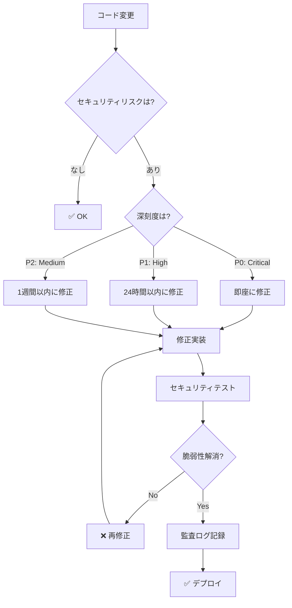

# セキュリティ意思決定ツリー

**目的**: セキュリティ脆弱性を検出し、適切な対応を判断

---

## 🎯 セキュリティの基本原則

```
セキュリティポリシー:

✅ 既知の脆弱性: 0 必須
✅ 機密情報の漏洩: 0 必須
✅ XSS/CSRF対策: 必須
✅ 依存関係の監査: 定期実行
✅ セキュリティヘッダー: 必須
```

---

## 🔍 セキュリティチェックフローチャート



---

## 📊 セキュリティリスク分類

| リスクタイプ | 深刻度 | 対応時間 | 例 |
|------------|-------|---------|-----|
| **機密情報漏洩** | P0 | 即座 | APIキー露出 |
| **認証バイパス** | P0 | 即座 | 認証チェック欠落 |
| **XSS** | P0 | 即座 | 未サニタイズ出力 |
| **SQL Injection** | P0 | 即座 | 未検証クエリ |
| **CSRF** | P1 | 24h | CSRFトークン欠落 |
| **依存関係脆弱性** | P1-P2 | 1週間 | 古いライブラリ |
| **情報漏洩** | P2 | 1週間 | 詳細なエラーメッセージ |

---

## 🛠️ セキュリティチェック手順

### ステップ1: 依存関係監査

```markdown
**実行コマンド**:
```bash
# npm audit で脆弱性チェック
npm audit

# 深刻度別表示
npm audit --production

# 自動修正（可能な場合）
npm audit fix
```

**期待結果**:
```
found 0 vulnerabilities
```

**脆弱性発見時**:
```
# High severity
Prototype Pollution in lodash
Package: lodash
Dependency of: react-scripts
Path: react-scripts > lodash
More info: https://npmjs.com/advisories/1673

# 対応
npm update lodash
# または
npm install lodash@latest
```

**時間**: 5-10分
```

### ステップ2: コードスキャン

```markdown
**チェック項目**:

1. **機密情報の露出**
   ```bash
   # .env ファイルが git にコミットされていないか
   git ls-files | grep '.env$'
   # → 何も出力されないこと
   
   # ソースコード内にAPIキーがないか
   grep -r "sk-" src/
   grep -r "API_KEY" src/
   # → 何も出力されないこと
   ```

2. **XSS脆弱性**
   ```typescript
   // ❌ BAD: dangerouslySetInnerHTML
   <div dangerouslySetInnerHTML={{ __html: userInput }} />
   
   // ✅ GOOD: エスケープされた出力
   <div>{userInput}</div>
   ```

3. **認証チェック**
   ```typescript
   // ❌ BAD: 認証チェックなし
   function deleteUser(id: string) {
     database.delete(id);
   }
   
   // ✅ GOOD: 認証チェックあり
   function deleteUser(id: string, currentUser: User) {
     if (!currentUser.isAdmin) {
       throw new Error('Unauthorized');
     }
     database.delete(id);
   }
   ```

**時間**: 15-30分
```

### ステップ3: セキュリティヘッダー確認

```markdown
**必須ヘッダー**:

```typescript
// vite.config.ts
export default defineConfig({
  server: {
    headers: {
      'X-Content-Type-Options': 'nosniff',
      'X-Frame-Options': 'DENY',
      'X-XSS-Protection': '1; mode=block',
      'Strict-Transport-Security': 'max-age=31536000; includeSubDomains',
      'Content-Security-Policy': "default-src 'self'"
    }
  }
});
```

**確認方法**:
```bash
# ローカルで確認
curl -I http://localhost:5173

# 本番で確認
curl -I https://nanashi8.github.io
```

**時間**: 10-15分
```

---

## 🎯 意思決定ルール

### ルール1: 機密情報漏洩（P0）

```markdown
IF APIキー・パスワード等が露出
  THEN
    優先度: P0（Critical）
    対応: 即座に対応
    
    手順:
    1. 該当のキーを即座に無効化
       - GitHub: Settings → Secrets → Delete
       - API provider: Revoke key
    
    2. 新しいキーを生成
    3. 環境変数に設定
       ```bash
       # .env.local（gitignoreに含める）
       VITE_API_KEY=new_key_here
       ```
    
    4. コードから削除
       ```typescript
       // ❌ BAD
       const API_KEY = 'sk-1234567890';
       
       // ✅ GOOD
       const API_KEY = import.meta.env.VITE_API_KEY;
       ```
    
    5. Git履歴から削除（必要な場合）
       ```bash
       git filter-branch --force --index-filter \
         'git rm --cached --ignore-unmatch .env' \
         --prune-empty --tag-name-filter cat -- --all
       ```
    
    6. 強制プッシュ（注意）
       ```bash
       git push --force
       ```
  
  時間: 30-60分
  通知: 即座にチームに報告
```

### ルール2: XSS脆弱性（P0）

```markdown
IF ユーザー入力が未サニタイズで出力
  THEN
    優先度: P0（Critical）
    対応: 即座に修正
    
    手順:
    1. 脆弱な箇所を特定
       ```bash
       grep -r "dangerouslySetInnerHTML" src/
       grep -r "innerHTML" src/
       ```
    
    2. サニタイズを実装
       ```typescript
       // ❌ BAD
       <div dangerouslySetInnerHTML={{ __html: userInput }} />
       
       // ✅ GOOD: DOMPurify使用
       import DOMPurify from 'dompurify';
       <div dangerouslySetInnerHTML={{ 
         __html: DOMPurify.sanitize(userInput)
       }} />
       
       // ✅ BETTER: Reactのエスケープ利用
       <div>{userInput}</div>
       ```
    
    3. テスト追加
       ```typescript
       test('should prevent XSS', () => {
         const malicious = '<script>alert("XSS")</script>';
         render(<Component input={malicious} />);
         
         // スクリプトが実行されないこと
         expect(screen.queryByText(/alert/)).not.toBeInTheDocument();
       });
       ```
    
    4. 全体をスキャン
       ```bash
       npm run lint
       ```
  
  時間: 1-2時間
```

### ルール3: 依存関係脆弱性（P1/P2）

```markdown
IF npm audit で脆弱性検出
  THEN
    優先度:
      - Critical/High: P1（24時間以内）
      - Moderate: P2（1週間以内）
      - Low: P2（次回更新時）
    
    手順:
    1. 脆弱性の詳細確認
       ```bash
       npm audit
       ```
    
    2. 自動修正試行
       ```bash
       npm audit fix
       ```
    
    3. 手動更新（自動修正不可の場合）
       ```bash
       npm update [package-name]
       # または
       npm install [package-name]@latest
       ```
    
    4. 破壊的変更の確認
       ```bash
       npm test
       npm run build
       ```
    
    5. IF (修正不可能)
         THEN
           - 代替パッケージを検討
           - 該当機能を無効化
           - セキュリティパッチ待ち
  
  時間: 30-120分
```

### ルール4: CSRF対策（P1）

```markdown
IF フォーム送信でCSRF対策なし
  THEN
    優先度: P1（24時間以内）
    
    手順:
    1. CSRFトークン生成
       ```typescript
       // サーバー側
       const csrfToken = crypto.randomBytes(32).toString('hex');
       session.csrfToken = csrfToken;
       ```
    
    2. フォームに埋め込み
       ```typescript
       <form onSubmit={handleSubmit}>
         <input type="hidden" name="csrf_token" value={csrfToken} />
         {/* other fields */}
       </form>
       ```
    
    3. サーバー側で検証
       ```typescript
       if (request.body.csrf_token !== session.csrfToken) {
         throw new Error('CSRF token mismatch');
       }
       ```
    
    4. テスト追加
       ```typescript
       test('should reject request without CSRF token', () => {
         const response = submitForm({ data: 'test' });
         expect(response.status).toBe(403);
       });
       ```
  
  時間: 1-2時間
```

### ルール5: 情報漏洩（P2）

```markdown
IF エラーメッセージが詳細すぎる
  THEN
    優先度: P2（1週間以内）
    
    手順:
    1. エラーハンドリングを改善
       ```typescript
       // ❌ BAD: 詳細を露出
       catch (error) {
         console.error(error); // スタックトレースが見える
         alert(error.message); // 内部情報が見える
       }
       
       // ✅ GOOD: 一般的なメッセージ
       catch (error) {
         console.error('Error code: 500'); // コードのみ
         alert('An error occurred. Please try again.'); // 一般的
         logError(error); // サーバー側に詳細ログ
       }
       ```
    
    2. 本番環境で console.log を削除
       ```typescript
       // vite.config.ts
       export default defineConfig({
         build: {
           minify: 'terser',
           terserOptions: {
             compress: {
               drop_console: true, // console.log を削除
             }
           }
         }
       });
       ```
  
  時間: 30-60分
```

---

## 📝 実例: セキュリティ対応シナリオ

### 例1: APIキー漏洩の対応

```markdown
**発見**: .env ファイルが誤ってコミットされた

**対応手順**:

1. キーを即座に無効化
   - GitHub → Settings → Secrets → Delete OPENAI_API_KEY
   - OpenAI → API Keys → Revoke

2. 新しいキーを生成
   - OpenAI → API Keys → Create new key
   - 安全に保管

3. 環境変数に設定
```bash
# .env.local（.gitignoreに含める）
VITE_OPENAI_API_KEY=sk-new-key-here
```

4. コードから削除
```typescript
// Before
const API_KEY = 'sk-old-key-exposed';

// After
const API_KEY = import.meta.env.VITE_OPENAI_API_KEY;
```

5. Git履歴から削除
```bash
git filter-branch --force --index-filter \
  'git rm --cached --ignore-unmatch .env' \
  --prune-empty -- --all

git push --force
```

6. .gitignore に追加
```bash
# .gitignore
.env
.env.local
.env*.local
```

**結果**: ✅ 完了（45分）
**通知**: チームに報告、ポストモーテム作成
```

### 例2: XSS脆弱性の修正

```markdown
**発見**: ユーザー入力が未サニタイズで表示

**脆弱なコード**:
```typescript
function CommentDisplay({ comment }) {
  // ❌ 危険: XSS可能
  return (
    <div dangerouslySetInnerHTML={{ __html: comment.text }} />
  );
}
```

**修正**:

1. DOMPurify導入
```bash
npm install dompurify
npm install --save-dev @types/dompurify
```

2. サニタイズ実装
```typescript
import DOMPurify from 'dompurify';

function CommentDisplay({ comment }) {
  // ✅ 安全: サニタイズ済み
  const clean = DOMPurify.sanitize(comment.text);
  return (
    <div dangerouslySetInnerHTML={{ __html: clean }} />
  );
}
```

3. テスト追加
```typescript
describe('CommentDisplay XSS protection', () => {
  test('should prevent script injection', () => {
    const malicious = {
      text: ''
    };
    
    render(<CommentDisplay comment={malicious} />);
    
    // script が実行されないこと
    const img = screen.getByRole('img');
    expect(img).not.toHaveAttribute('onerror');
  });
  
  test('should allow safe HTML', () => {
    const safe = {
      text: '<strong>Bold text</strong>'
    };
    
    render(<CommentDisplay comment={safe} />);
    
    expect(screen.getByText('Bold text')).toBeInTheDocument();
  });
});
```

**結果**: ✅ 完了（90分）
```

### 例3: 依存関係脆弱性の対応

```markdown
**発見**: npm audit で High severity 検出

**脆弱性**:
```
High         Prototype Pollution
Package      lodash
Patched in   >=4.17.21
Dependency   react-scripts
```

**対応**:

1. 自動修正試行
```bash
$ npm audit fix
npm WARN audit fix lodash@4.17.20
npm WARN audit Updating lodash to 4.17.21
```

2. テスト実行
```bash
$ npm test
✅ All tests passed
```

3. ビルド確認
```bash
$ npm run build
✅ Build successful
```

4. 再監査
```bash
$ npm audit
✅ found 0 vulnerabilities
```

**結果**: ✅ 完了（15分）
```

---

## 🚀 セキュリティのベストプラクティス

### 1. Defense in Depth（多層防御）

```markdown
✅ GOOD: 複数のレイヤーで防御
- クライアント側: バリデーション
- サーバー側: 認証・認可
- データベース: パラメータ化クエリ
- ネットワーク: HTTPS、ファイアウォール

❌ BAD: 1つの防御のみ
- クライアント側のみ（バイパス可能）
```

### 2. 最小権限の原則

```markdown
✅ GOOD: 必要最小限の権限
```typescript
// 一般ユーザーは読み取りのみ
if (user.role === 'admin') {
  allowDelete();
}
```

❌ BAD: すべてに管理者権限
```

### 3. 定期的な監査

```markdown
✅ GOOD: 自動化された定期チェック
```yaml
# .github/workflows/security.yml
on:
  schedule:
    - cron: '0 0 * * 0' # 毎週日曜日

jobs:
  security-audit:
    runs-on: ubuntu-latest
    steps:
      - run: npm audit
```

❌ BAD: 手動チェックのみ
```

---

## 📚 関連ドキュメント

- [SECURITY.md](../../../SECURITY.md) - セキュリティポリシー
- [quality-standards.instructions.md](../context/quality-standards.instructions.md) - 品質基準

---

**最終更新**: 2025-12-19  
**バージョン**: 1.0.0  
**適用**: すべてのセキュリティ関連作業
