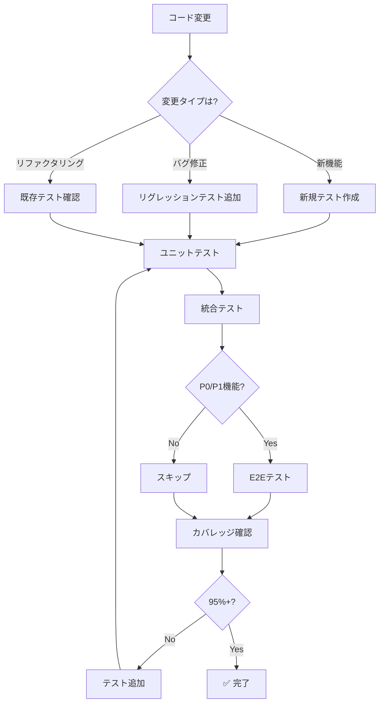

# テスト意思決定ツリー

**目的**: コード変更時に必要なテストの種類・範囲・優先度を自動判断

---

## 🎯 テストの基本原則

```
テスト戦略:

✅ カバレッジ 95%+ 維持
✅ すべてのテストパス必須
✅ テストファースト開発
✅ AAA パターン（Arrange-Act-Assert）
✅ 1テスト1アサーション推奨
```

---

## 🔍 テスト戦略フローチャート



---

## 📊 テストレベル別判断

| テストレベル | タイミング | 必須度 | 実行時間 | カバー範囲 |
|------------|----------|-------|---------|-----------|
| **ユニット** | コーディング中 | 必須 | <5秒 | 関数・クラス |
| **統合** | 機能完成時 | 必須 | <30秒 | モジュール間 |
| **E2E** | リリース前 | P0/P1のみ | <5分 | ユーザーフロー |
| **パフォーマンス** | 最適化時 | 推奨 | <1分 | 速度・メモリ |
| **セキュリティ** | リリース前 | P0のみ | <10分 | 脆弱性 |

---

## 🛠️ テスト作成手順

### ステップ1: ユニットテストの作成

```markdown
**作成基準**:

1. すべての公開関数
2. すべての公開クラス
3. すべての条件分岐
4. すべてのエッジケース

**AAA パターン**:
```typescript
test('should calculate total score correctly', () => {
  // Arrange（準備）
  const questions = [
    { score: 10, difficulty: 'easy' },
    { score: 20, difficulty: 'medium' }
  ];
  
  // Act（実行）
  const total = calculateTotalScore(questions);
  
  // Assert（検証）
  expect(total).toBe(30);
});
```

**時間**: 関数あたり5-15分
```

### ステップ2: 統合テストの作成

```markdown
**作成基準**:

1. モジュール間の連携
2. データフロー全体
3. 状態管理の正確性

**例**:
```typescript
describe('Question Flow Integration', () => {
  test('should handle complete question lifecycle', () => {
    // Arrange
    const question = createQuestion();
    const scheduler = new QuestionScheduler();
    
    // Act
    scheduler.addQuestion(question);
    const selected = scheduler.selectNext();
    const result = processAnswer(selected, 'correct');
    
    // Assert
    expect(result.isCorrect).toBe(true);
    expect(scheduler.getStats().correct).toBe(1);
  });
});
```

**時間**: シナリオあたり15-30分
```

### ステップ3: E2Eテストの作成（P0/P1のみ）

```markdown
**作成基準**:

1. 主要ユーザーフロー
2. クリティカルパス
3. レグレッションが懸念される箇所

**Playwright例**:
```typescript
test('user can complete a learning session', async ({ page }) => {
  // Arrange
  await page.goto('/');
  
  // Act: ログイン
  await page.fill('[data-testid="username"]', 'testuser');
  await page.click('[data-testid="login-button"]');
  
  // Act: 学習開始
  await page.click('[data-testid="start-learning"]');
  
  // Act: 問題回答
  await page.fill('[data-testid="answer-input"]', 'correct answer');
  await page.click('[data-testid="submit-answer"]');
  
  // Assert: 結果表示
  await expect(page.locator('[data-testid="result"]')).toContainText('Correct');
  
  // Act: 次の問題
  await page.click('[data-testid="next-question"]');
  
  // Assert: 問題が表示される
  await expect(page.locator('[data-testid="question"]')).toBeVisible();
});
```

**時間**: シナリオあたり30-60分
```

---

## 🎯 意思決定ルール

### ルール1: 新機能追加時

```markdown
IF 新しい関数・クラスを追加
  THEN
    必須テスト:
    1. ユニットテスト
       - すべての公開メソッド
       - 正常系・異常系
       - エッジケース
    
    2. 統合テスト
       - 既存機能との連携
       - データフロー
    
    3. E2Eテスト（P0/P1のみ）
       - ユーザーシナリオ
       - クリティカルパス
    
  カバレッジ目標:
    - ユニット: 100%
    - 統合: 90%+
    - E2E: 主要フロー
  
  時間: 1-3時間
```

### ルール2: バグ修正時

```markdown
IF バグを修正
  THEN
    必須テスト:
    1. リグレッションテスト
       ```typescript
       test('should not reproduce bug #123', () => {
         // バグが再現しないことを確認
         const result = functionThatHadBug(edgeCaseInput);
         expect(result).toBe(expectedValue);
       });
       ```
    
    2. 既存テストの実行
       - すべてパス必須
    
    3. 関連テストの追加
       - 同様のバグを防ぐ
  
  時間: 30-60分
```

### ルール3: リファクタリング時

```markdown
IF リファクタリングを実行
  THEN
    必須テスト:
    1. 既存テストの実行
       ```bash
       npm test
       ```
       - すべてパス必須
       - カバレッジ維持必須
    
    2. 不足テストの追加
       - リファクタリング後にテストが不十分な場合
    
    3. テストのリファクタリング
       - 重複テストの除去
       - テストの可読性向上
  
  時間: 30-90分
```

### ルール4: パフォーマンス最適化時

```markdown
IF パフォーマンス最適化を実施
  THEN
    必須テスト:
    1. ベンチマークテスト
       ```typescript
       test('should process 1000 items in <100ms', () => {
         const items = generateTestData(1000);
         const start = performance.now();
         
         processItems(items);
         
         const duration = performance.now() - start;
         expect(duration).toBeLessThan(100);
       });
       ```
    
    2. メモリ使用量テスト
       ```typescript
       test('should not exceed 50MB memory', () => {
         const before = process.memoryUsage().heapUsed;
         
         processLargeDataset();
         
         const after = process.memoryUsage().heapUsed;
         const increase = (after - before) / 1024 / 1024;
         expect(increase).toBeLessThan(50);
       });
       ```
    
    3. 機能テスト
       - 最適化前と同じ動作
  
  時間: 1-2時間
```

### ルール5: 依存関係更新時

```markdown
IF 依存ライブラリを更新
  THEN
    必須テスト:
    1. すべてのテスト実行
       ```bash
       npm test
       npm run test:e2e
       ```
    
    2. ビルド確認
       ```bash
       npm run build
       ```
    
    3. 互換性テスト
       - 非推奨API使用チェック
       - 破壊的変更の確認
  
  時間: 30-60分
```

---

## 📝 実例: テストシナリオ

### 例1: 新機能のテスト（multiSort）

```markdown
**機能**: 複数条件でソート

**ユニットテスト**:
```typescript
describe('multiSort', () => {
  test('sorts by single key', () => {
    const data = [
      { date: 2, score: 1 },
      { date: 1, score: 2 }
    ];
    const sorted = multiSort(data, [{ key: 'date', order: 'asc' }]);
    expect(sorted[0].date).toBe(1);
  });
  
  test('sorts by multiple keys', () => {
    const data = [
      { date: 1, score: 2 },
      { date: 1, score: 1 },
      { date: 2, score: 1 }
    ];
    const sorted = multiSort(data, [
      { key: 'date', order: 'asc' },
      { key: 'score', order: 'desc' }
    ]);
    expect(sorted[0]).toEqual({ date: 1, score: 2 });
    expect(sorted[1]).toEqual({ date: 1, score: 1 });
  });
  
  test('handles empty array', () => {
    const sorted = multiSort([], [{ key: 'date', order: 'asc' }]);
    expect(sorted).toEqual([]);
  });
  
  test('does not mutate original array', () => {
    const data = [{ date: 2 }, { date: 1 }];
    const original = [...data];
    multiSort(data, [{ key: 'date', order: 'asc' }]);
    expect(data).toEqual(original);
  });
});
```

**統合テスト**:
```typescript
describe('multiSort integration', () => {
  test('integrates with question list display', () => {
    const { getByTestId } = render(<QuestionList />);
    const sortButton = getByTestId('sort-button');
    
    fireEvent.click(sortButton);
    
    const questions = getAllByTestId('question-item');
    expect(questions[0]).toHaveAttribute('data-date', '2023-12-01');
  });
});
```

**カバレッジ**: ✅ 100%
**時間**: 合計90分
```

### 例2: バグ修正のテスト

```markdown
**バグ**: 空文字列の回答でクラッシュ

**リグレッションテスト**:
```typescript
describe('processAnswer bug fix', () => {
  test('should not crash with empty answer', () => {
    // Bug #123: empty string caused crash
    const question = { id: '1', correctAnswer: 'test' };
    
    expect(() => {
      processAnswer('', question);
    }).not.toThrow();
  });
  
  test('should treat empty answer as incorrect', () => {
    const question = { id: '1', correctAnswer: 'test' };
    const result = processAnswer('', question);
    
    expect(result.isCorrect).toBe(false);
  });
  
  test('should handle whitespace-only answer', () => {
    const question = { id: '1', correctAnswer: 'test' };
    const result = processAnswer('   ', question);
    
    expect(result.isCorrect).toBe(false);
  });
});
```

**既存テスト**: ✅ すべてパス
**時間**: 30分
```

### 例3: E2Eテスト

```markdown
**シナリオ**: 学習セッション完了

**Playwrightテスト**:
```typescript
test.describe('Learning Session', () => {
  test('complete full learning session', async ({ page }) => {
    // ログイン
    await page.goto('/');
    await page.fill('[data-testid="username"]', 'testuser');
    await page.click('[data-testid="login"]');
    await expect(page).toHaveURL('/dashboard');
    
    // 学習開始
    await page.click('[data-testid="start-learning"]');
    await expect(page).toHaveURL('/learn');
    
    // 問題1: 正解
    await expect(page.locator('[data-testid="question"]')).toBeVisible();
    await page.fill('[data-testid="answer"]', 'correct answer');
    await page.click('[data-testid="submit"]');
    await expect(page.locator('[data-testid="result"]')).toContainText('Correct');
    
    // 問題2: 不正解
    await page.click('[data-testid="next"]');
    await page.fill('[data-testid="answer"]', 'wrong answer');
    await page.click('[data-testid="submit"]');
    await expect(page.locator('[data-testid="result"]')).toContainText('Incorrect');
    
    // リトライ: 正解
    await page.click('[data-testid="retry"]');
    await page.fill('[data-testid="answer"]', 'correct answer');
    await page.click('[data-testid="submit"]');
    await expect(page.locator('[data-testid="result"]')).toContainText('Correct');
    
    // セッション完了
    await page.click('[data-testid="finish"]');
    await expect(page).toHaveURL('/results');
    await expect(page.locator('[data-testid="score"]')).toBeVisible();
  });
  
  test('can resume interrupted session', async ({ page }) => {
    // セッション開始
    await page.goto('/learn');
    await page.fill('[data-testid="answer"]', 'answer1');
    await page.click('[data-testid="submit"]');
    
    // ページリロード（中断）
    await page.reload();
    
    // セッション復元確認
    await expect(page.locator('[data-testid="resume-message"]')).toBeVisible();
    await page.click('[data-testid="resume"]');
    await expect(page.locator('[data-testid="progress"]')).toContainText('1/10');
  });
});
```

**時間**: 合計2時間
```

---

## 🚀 テストのベストプラクティス

### 1. テストファースト

```markdown
✅ GOOD: 実装前にテストを書く
- 仕様が明確になる
- バグが混入しにくい
- カバレッジが自然と高くなる

❌ BAD: 実装後にテストを書く
- テストが不十分になりがち
- カバレッジが低くなる
- 後回しにされやすい
```

### 2. 1テスト1アサーション

```markdown
✅ GOOD: 1つのテストで1つを検証
```typescript
test('should add item', () => {
  list.add(item);
  expect(list.size()).toBe(1);
});

test('should find added item', () => {
  list.add(item);
  expect(list.find(item.id)).toBe(item);
});
```

❌ BAD: 1つのテストで複数を検証
```typescript
test('should add and find item', () => {
  list.add(item);
  expect(list.size()).toBe(1); // 失敗したらどっちが原因？
  expect(list.find(item.id)).toBe(item);
});
```
```

### 3. 独立したテスト

```markdown
✅ GOOD: テスト間で独立
```typescript
beforeEach(() => {
  list = new List();
});

test('test 1', () => { ... });
test('test 2', () => { ... });
```

❌ BAD: テスト間で依存
```typescript
test('test 1', () => {
  list.add(item); // test 2に影響
});

test('test 2', () => {
  expect(list.size()).toBe(1); // test 1に依存
});
```
```

---

## 📚 関連ドキュメント

- [quality-decision.instructions.md](./quality-decision.instructions.md) - 品質チェック
- [quality-standards.instructions.md](../context/quality-standards.instructions.md) - 品質基準
- [TESTING_GUIDE.md](../../../docs/quality/TESTING_GUIDE.md) - テストガイド

---

**最終更新**: 2025-12-19  
**バージョン**: 1.0.0  
**適用**: すべてのテスト作成・実行
