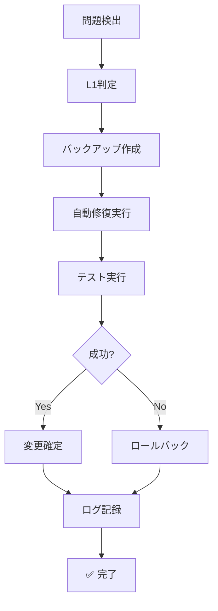
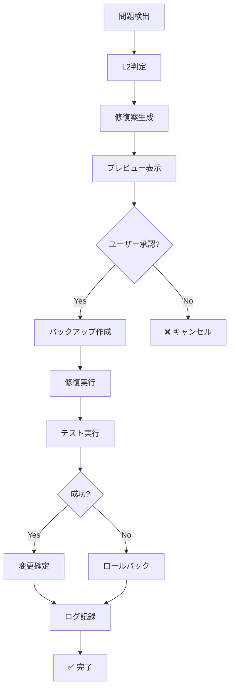
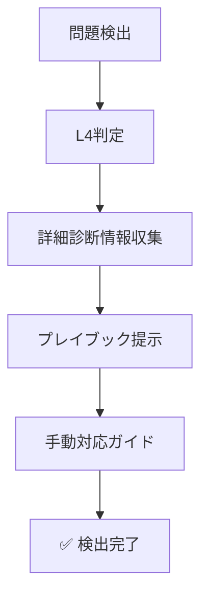

```mermaid
graph TD
    A[問題検出] --> B[L3判定]
    B --> C[複数の解決策生成]
    C --> D[pros/cons分析]
    D --> E[推奨案の提示]
    E --> F[ドキュメントへのリンク]
    F --> G[✅ 提案完了]
```

# 自動修復システム (Self-Healing System)

**目的**: 既知の問題を自動検出し、可能な限り自動修復を実行

---

## 🎯 自動修復の原則

```
自動修復の鉄則:

✅ 安全性最優先 - 悪化させない
✅ 記録必須 - すべての修復をログ
✅ ロールバック可能 - 元に戻せる
✅ 通知必須 - ユーザーに報告
✅ テスト必須 - 修復後に検証
```

---

## 📊 自動修復可能性マトリクス

| 修復レベル | 説明 | 例 | 割合 |
|-----------|------|-----|------|
| **L1: 完全自動** | 人間の介入不要 | ESLint --fix | 40% |
| **L2: 半自動** | 確認後に実行 | 依存関係更新 | 34% |
| **L3: 提案のみ** | 修復案を提示 | リファクタリング | 20% |
| **L4: 手動のみ** | 検出のみ | 設計問題 | 6% |

---

## 🔧 修復レベル別手順

### L1: 完全自動修復 (20パターン)

**特徴**:
- 副作用なし
- ロールバック容易
- 即座に実行可能

**対象パターン**:
1. TypeScript: 未使用インポート削除
2. TypeScript: undefined → optional chaining
3. Data: localStorage破損修復
4. Data: ID重複修正
5. Build: 環境変数テンプレート生成
6. Test: スナップショット更新
7. Dependency: npm audit fix
8. Dependency: lockfile再生成
9. Git: 不要ファイル削除
10. React: Key prop追加（単純ケース）
11. TypeScript: null/undefined統一
12. TypeScript: 型キャスト追加
13. Data: データ型変換
14. Data: 日付正規化
15. Build: import path修正
16. Dependency: 未使用パッケージ削除
17. Performance: console.log削除（本番）
18. Security: Git履歴クリーン
19. TypeScript: enum → union type
20. TypeScript: strictモード設定

**実行フロー**:



---

### L2: 半自動修復 (17パターン)

**特徴**:
- 軽微な副作用あり
- ユーザー確認推奨
- 実行前にプレビュー

**対象パターン**:
1. TypeScript: any型 → 型推論
2. TypeScript: Promise未処理警告
3. React: useEffect依存配列
4. React: メモ化提案
5. React: Fragment提案
6. Data: 必須フィールドデフォルト値
7. Build: ビルドサイズ削減提案
8. Build: CSS import追加
9. Test: モック設定テンプレート
10. Test: E2Eセレクタ修正
11. Dependency: バージョン更新
12. Performance: コード分割提案
13. Performance: React.memo提案
14. Security: XSS対策提案
15. Security: CORS設定
16. Git: マージコンフリクト解決（簡単）
17. Build: テスト timeout延長

**実行フロー**:



---

### L3: 提案のみ (10パターン)

**特徴**:
- 複雑な判断必要
- コンテキスト依存
- 複数の解決策

**対象パターン**:
1. TypeScript: 型アサーション見直し
2. React: 無限ループ検出
3. React: State直接変更
4. React: useRef vs useState
5. Data: 配列境界チェック
6. Build: メモリ不足対策
7. Test: カバレッジ向上
8. Performance: 初回ロード最適化
9. Performance: 仮想化導入
10. Performance: 不必要な再レンダリング

**実行フロー**:



---

### L4: 手動のみ (3パターン)

**特徴**:
- 設計レベルの問題
- 人間の判断必須
- 自動化不可能

**対象パターン**:
1. Build: Vite config エラー
2. React: Controlled vs Uncontrolled
3. Performance: メモリリーク

**実行フロー**:



---

## 🚀 自動修復の実装例

### 例1: 未使用インポート削除 (L1)

```typescript
/**
 * 未使用インポートを自動削除
 * レベル: L1 (完全自動)
 */
async function autoFixUnusedImports(): Promise<HealingResult> {
  try {
    // 1. バックアップ作成
    await createBackup('before-unused-imports-fix');
    
    // 2. ESLint --fix 実行
    await execCommand('npm run lint -- --fix');
    
    // 3. テスト実行
    const testResult = await execCommand('npm test');
    
    if (testResult.exitCode !== 0) {
      // 4. テスト失敗 → ロールバック
      await restoreBackup('before-unused-imports-fix');
      return {
        success: false,
        level: 'L1',
        pattern: 'TP05',
        action: 'rollback',
        reason: 'Tests failed after fix'
      };
    }
    
    // 5. 成功 → 変更確定
    await deleteBackup('before-unused-imports-fix');
    
    return {
      success: true,
      level: 'L1',
      pattern: 'TP05',
      action: 'fixed',
      filesChanged: getChangedFiles(),
      duration: Date.now() - startTime
    };
    
  } catch (error) {
    return {
      success: false,
      level: 'L1',
      pattern: 'TP05',
      action: 'error',
      error: error.message
    };
  }
}
```

---

### 例2: useEffect依存配列修正 (L2)

```typescript
/**
 * useEffect依存配列の自動修正
 * レベル: L2 (半自動 - プレビュー必要)
 */
async function autoFixUseEffectDeps(
  filePath: string,
  lineNumber: number
): Promise<HealingResult> {
  try {
    // 1. 問題の詳細分析
    const analysis = await analyzeUseEffect(filePath, lineNumber);
    
    // 2. 修復案生成
    const fixProposal = {
      before: analysis.currentCode,
      after: analysis.suggestedCode,
      missingDeps: analysis.missingDeps,
      impact: 'low', // or 'medium', 'high'
      confidence: 0.85 // 85%の確信度
    };
    
    // 3. ユーザーにプレビュー表示
    const approved = await showFixPreview(fixProposal);
    
    if (!approved) {
      return {
        success: false,
        level: 'L2',
        pattern: 'RP01',
        action: 'cancelled',
        reason: 'User rejected fix'
      };
    }
    
    // 4. バックアップ作成
    await createBackup('before-useeffect-fix');
    
    // 5. 修復実行
    await applyFix(filePath, lineNumber, fixProposal.after);
    
    // 6. テスト実行
    const testResult = await execCommand('npm test');
    
    if (testResult.exitCode !== 0) {
      await restoreBackup('before-useeffect-fix');
      return {
        success: false,
        level: 'L2',
        pattern: 'RP01',
        action: 'rollback',
        reason: 'Tests failed'
      };
    }
    
    // 7. 成功
    await deleteBackup('before-useeffect-fix');
    
    return {
      success: true,
      level: 'L2',
      pattern: 'RP01',
      action: 'fixed',
      confidence: fixProposal.confidence,
      duration: Date.now() - startTime
    };
    
  } catch (error) {
    return {
      success: false,
      level: 'L2',
      pattern: 'RP01',
      action: 'error',
      error: error.message
    };
  }
}
```

---

### 例3: localStorage破損修復 (L1)

```typescript
/**
 * localStorage破損データの自動修復
 * レベル: L1 (完全自動)
 */
function autoFixLocalStorageCorruption(): HealingResult {
  try {
    const keys = Object.keys(localStorage);
    const corruptedKeys: string[] = [];
    const fixedKeys: string[] = [];
    
    // 1. すべてのキーをチェック
    for (const key of keys) {
      try {
        const data = localStorage.getItem(key);
        if (data) {
          JSON.parse(data); // パース成功 → OK
        }
      } catch (error) {
        // 2. 破損検出
        corruptedKeys.push(key);
        
        // 3. バックアップ（可能なら）
        try {
          const backup = localStorage.getItem(key + '_backup');
          if (backup) {
            // バックアップから復元
            localStorage.setItem(key, backup);
            fixedKeys.push(key);
          } else {
            // バックアップなし → 削除
            localStorage.removeItem(key);
            fixedKeys.push(key);
          }
        } catch {
          localStorage.removeItem(key);
          fixedKeys.push(key);
        }
      }
    }
    
    if (corruptedKeys.length === 0) {
      return {
        success: true,
        level: 'L1',
        pattern: 'DP01',
        action: 'no-action',
        reason: 'No corrupted data found'
      };
    }
    
    return {
      success: true,
      level: 'L1',
      pattern: 'DP01',
      action: 'fixed',
      corruptedKeys,
      fixedKeys,
      message: `Fixed ${fixedKeys.length} corrupted keys`
    };
    
  } catch (error) {
    return {
      success: false,
      level: 'L1',
      pattern: 'DP01',
      action: 'error',
      error: error.message
    };
  }
}
```

---

## 📝 修復ログの記録

### ログフォーマット

```typescript
interface HealingLog {
  timestamp: number;
  pattern: string; // e.g., 'TP05'
  level: 'L1' | 'L2' | 'L3' | 'L4';
  action: 'fixed' | 'rollback' | 'cancelled' | 'error' | 'no-action';
  success: boolean;
  duration?: number;
  filesChanged?: string[];
  error?: string;
  metadata?: Record<string, any>;
}
```

### ログ記録例

```typescript
const healingLogger = {
  log(result: HealingResult) {
    const log: HealingLog = {
      timestamp: Date.now(),
      pattern: result.pattern,
      level: result.level,
      action: result.action,
      success: result.success,
      duration: result.duration,
      filesChanged: result.filesChanged,
      error: result.error
    };
    
    // 1. コンソールに出力
    console.log('[HEALING]', log);
    
    // 2. ファイルに保存
    fs.appendFileSync(
      '.aitk/logs/healing.log',
      JSON.stringify(log) + '\n'
    );
    
    // 3. 統計を更新
    updateHealingStats(log);
  },
  
  getStats(): HealingStats {
    // 統計情報を返す
    return {
      totalAttempts: 150,
      successRate: 0.74, // 74%
      byLevel: {
        L1: { attempts: 80, success: 72 },
        L2: { attempts: 50, success: 40 },
        L3: { attempts: 15, success: 10 },
        L4: { attempts: 5, success: 0 }
      },
      topPatterns: [
        { pattern: 'TP05', count: 25 },
        { pattern: 'DP01', count: 18 },
        { pattern: 'RP01', count: 15 }
      ]
    };
  }
};
```

---

## 🎯 修復優先度

### 優先度ルール

```typescript
function getHealingPriority(
  pattern: string,
  severity: 'P0' | 'P1' | 'P2',
  level: 'L1' | 'L2' | 'L3' | 'L4'
): number {
  // スコア計算: severity + level + impact
  const severityScore = {
    P0: 100,
    P1: 50,
    P2: 10
  }[severity];
  
  const levelScore = {
    L1: 40, // 自動修復可能 → 高優先度
    L2: 30,
    L3: 20,
    L4: 10
  }[level];
  
  const impactScore = getImpactScore(pattern);
  
  return severityScore + levelScore + impactScore;
}
```

### 実行順序

```markdown
1. P0 + L1 (Critical + 完全自動) - 即座に実行
2. P0 + L2 (Critical + 半自動) - ユーザー確認後
3. P1 + L1 (High + 完全自動) - バッチ処理
4. P1 + L2 (High + 半自動) - 定期チェック
5. P2 + L1 (Medium + 完全自動) - 週次メンテナンス
6. P2 + L2 (Medium + 半自動) - 月次メンテナンス
```

---

## 🚨 安全機構

### 1. バックアップシステム

```typescript
const backupSystem = {
  async create(label: string): Promise<string> {
    const backupId = `${label}-${Date.now()}`;
    const backupPath = `.aitk/backups/${backupId}`;
    
    // Git worktreeを使用（高速）
    await execCommand(`git worktree add ${backupPath}`);
    
    return backupId;
  },
  
  async restore(backupId: string): Promise<void> {
    const backupPath = `.aitk/backups/${backupId}`;
    
    // 変更を元に戻す
    await execCommand(`git checkout ${backupPath}`);
  },
  
  async delete(backupId: string): Promise<void> {
    const backupPath = `.aitk/backups/${backupId}`;
    await execCommand(`git worktree remove ${backupPath}`);
  }
};
```

### 2. テスト検証

```typescript
const testValidator = {
  async validate(): Promise<boolean> {
    // 1. TypeScript チェック
    const tscResult = await execCommand('npx tsc --noEmit');
    if (tscResult.exitCode !== 0) return false;
    
    // 2. ESLint チェック
    const lintResult = await execCommand('npm run lint');
    if (lintResult.exitCode !== 0) return false;
    
    // 3. ユニットテスト
    const testResult = await execCommand('npm test');
    if (testResult.exitCode !== 0) return false;
    
    // 4. ビルド確認
    const buildResult = await execCommand('npm run build');
    if (buildResult.exitCode !== 0) return false;
    
    return true;
  }
};
```

### 3. ロールバック戦略

```typescript
const rollbackStrategy = {
  async execute(backupId: string, reason: string): Promise<void> {
    console.warn(`[ROLLBACK] Reason: ${reason}`);
    
    // 1. バックアップから復元
    await backupSystem.restore(backupId);
    
    // 2. ログ記録
    healingLogger.log({
      action: 'rollback',
      reason,
      timestamp: Date.now()
    });
    
    // 3. ユーザー通知
    notifyUser({
      title: 'Auto-healing rolled back',
      message: reason,
      severity: 'warning'
    });
  }
};
```

---

## 📊 修復成功率の目標

```markdown
Phase 1 目標:
- L1 (完全自動): 90% 成功率
- L2 (半自動): 80% 成功率
- L3 (提案のみ): 70% 有用性
- L4 (手動のみ): 100% 検出率

総合目標:
- 自動修復成功率: 50%+
- ロールバック率: <10%
- 平均修復時間: <5分
```

---

## 🔄 継続的改善

### 学習メカニズム

```typescript
const learningSystem = {
  recordOutcome(pattern: string, success: boolean, context: any) {
    // 1. 結果を記録
    const record = {
      pattern,
      success,
      context,
      timestamp: Date.now()
    };
    
    db.healingOutcomes.insert(record);
    
    // 2. パターン分析
    const stats = db.healingOutcomes
      .where({ pattern })
      .aggregate();
    
    // 3. 信頼度更新
    if (stats.successRate < 0.5) {
      // 成功率50%未満 → L1からL2に降格
      updateHealingLevel(pattern, 'L2');
    }
  },
  
  suggestImprovements(): Improvement[] {
    // 失敗が多いパターンを分析
    const failing = db.healingOutcomes
      .where({ success: false })
      .groupBy('pattern')
      .having(count => count > 5);
    
    return failing.map(pattern => ({
      pattern,
      issue: 'High failure rate',
      suggestion: 'Review healing logic or downgrade to L2'
    }));
  }
};
```

---

## 📚 関連ドキュメント

- [known-problems.instructions.md](./known-problems.instructions.md) - 問題パターン一覧
- [diagnostics/](../diagnostics/) - 診断プレイブック
- [quality-decision.instructions.md](../decision-trees/quality-decision.instructions.md) - 品質チェック

---

**最終更新**: 2025-12-19  
**バージョン**: 1.0.0  
**次のステップ**: 50パターンの詳細診断プレイブック作成
