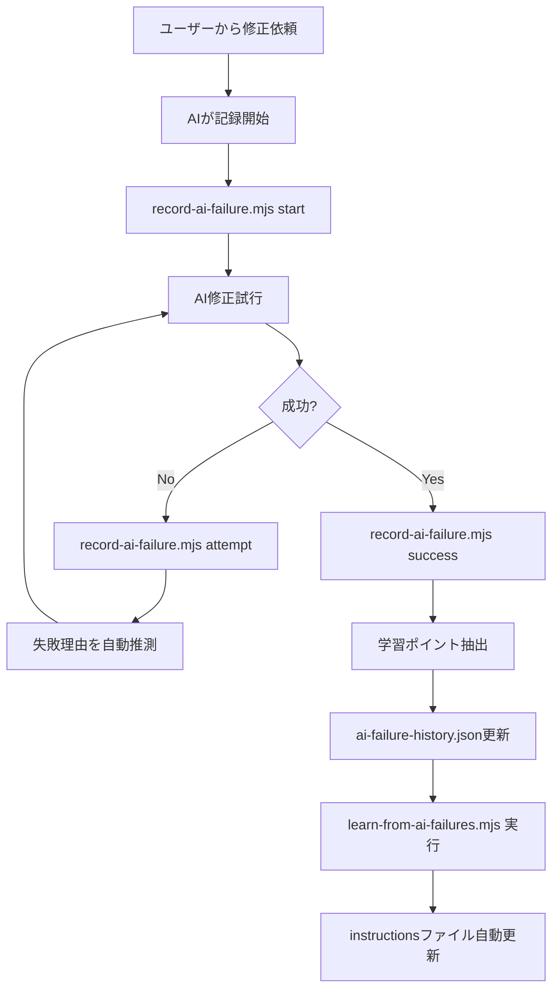
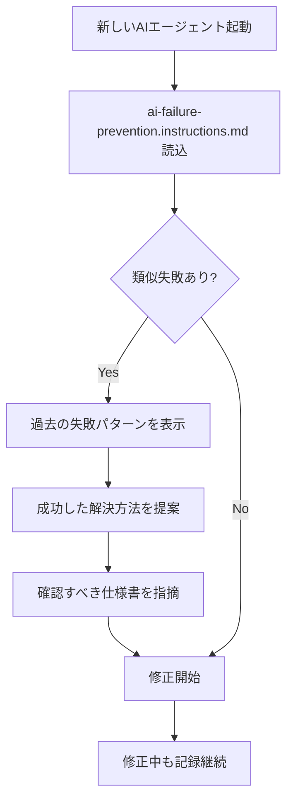

# AI修正失敗収集・水先案内人システム

## 🎯 概要

AIエージェントとユーザーの対話における修正失敗パターンを収集し、サーバントが「水先案内人」として次回のAIを導くシステム。

**目的**: 同じ失敗を繰り返さない

---

## 📊 システム構成

### 1. データ収集層

#### `.aitk/ai-failure-history.json`
AI修正失敗履歴のデータベース

```json
{
  "version": "1.0.0",
  "conversationFailures": [
    {
      "id": "session-1735545600000",
      "timestamp": "2025-12-30T12:00:00Z",
      "userRequest": "バッチ完全消化後の次バッチ生成を実装して",
      "attempts": [
        {
          "attemptNumber": 1,
          "changes": ["MemorizationView.tsx"],
          "userFeedback": "無限ループが発生している",
          "failureReason": "useEffect依存配列の設定ミス",
          "success": false
        },
        {
          "attemptNumber": 2,
          "changes": ["MemorizationView.tsx"],
          "userFeedback": "Success",
          "solutionDescription": "needsBatchRegenerationフラグで解決",
          "success": true
        }
      ],
      "totalAttempts": 2,
      "status": "success",
      "learningPoints": [
        "useEffect依存配列の適切な設定が重要"
      ]
    }
  ]
}
```

### 2. 記録スクリプト

#### `scripts/record-ai-failure.mjs`
対話中の失敗を記録

**使用方法**:
```bash
# セッション開始
node scripts/record-ai-failure.mjs start "ユーザー依頼内容"

# 修正試行を記録
node scripts/record-ai-failure.mjs attempt "変更ファイル" "ユーザーフィードバック"

# 成功を記録
node scripts/record-ai-failure.mjs success "解決方法"

# キャンセル
node scripts/record-ai-failure.mjs cancel

# 状態確認
node scripts/record-ai-failure.mjs status
```

**機能**:
- 失敗理由の自動推測
- 学習ポイントの自動抽出
- セッション管理（一時ファイル）

### 3. 学習・分析層

#### `scripts/learn-from-ai-failures.mjs`
サーバント水先案内人の学習スクリプト

**実行タイミング**:
- 手動実行: `node scripts/learn-from-ai-failures.mjs`
- 自動実行: GitHub Actions（毎日深夜2時 + 15コミットごと）
- 即時実行: `record-ai-failure.mjs success` 実行時

**機能**:
1. 頻出失敗カテゴリーの分析
2. 成功パターンの抽出
3. 予防ルールの自動生成
4. instructionsファイルの自動更新
5. 学習レポートの生成

### 4. ガード層

#### `.aitk/instructions/ai-failure-prevention.instructions.md`
AI修正失敗防止ガイド（自動更新）

**内容**:
- 修正前の必須チェックリスト
- 過去の失敗パターンDB
- 頻出失敗カテゴリーと予防策
- 成功パターンのベストプラクティス
- 修正プロセスフロー

**適用範囲**: 全ファイル (`applyTo: '**'`)
**優先度**: Critical
**強制**: 修正前に必須確認

---

## 🔄 ワークフロー

### 修正依頼時



### 次回修正開始時



---

## 📈 統計・分析

### 収集データ

1. **対話メタデータ**
   - 依頼内容
   - 試行回数
   - 所要時間

2. **失敗情報**
   - 変更ファイル
   - ユーザーフィードバック
   - 推定失敗理由

3. **成功情報**
   - 解決方法
   - 学習ポイント
   - キーワード

### 分析結果

- **頻出失敗カテゴリー**: Top 10
- **平均試行回数**: 統計値
- **成功率**: カテゴリー別
- **ソリューションキーワード**: 頻出順

---

## 🛡️ 予防ルール

サーバントが自動生成する予防ルール例:

```javascript
{
  "id": "prevent-infinite-loop",
  "name": "無限ループ防止",
  "condition": "useEffectまたは依存配列を変更する場合",
  "action": "state更新とuseEffect実行の因果関係を図示し、無限ループが発生しないことを確認",
  "severity": "critical",
  "occurrences": 5
}
```

**ルール適用**:
- 自動検出: コード変更時にパターンマッチング
- AIへの警告: instructionsファイルで表示
- 強制チェック: 修正前のチェックリストに追加

---

## 🔗 既存システムとの統合

### Git履歴学習との連携

```bash
# 既存: Git履歴から学習
node scripts/learn-from-git-history.mjs

# 新規: AI失敗履歴から学習
node scripts/learn-from-ai-failures.mjs
```

**統合ポイント**:
- 両方のデータを `failure-patterns.json` に統合
- Git履歴: コード修正パターン
- AI失敗履歴: 対話・試行パターン

### GitHub Actionsとの統合

`.github/workflows/servant-auto-learning.yml` に追加:

```yaml
- name: Run AI Failure Learning
  run: |
    echo "🛡️ AI失敗履歴から学習中..."
    node scripts/learn-from-ai-failures.mjs || echo "ℹ️ AI失敗履歴なし（スキップ）"
```

**実行タイミング**:
- 毎日深夜2時（JST）
- 15コミット以上の変更時
- 手動トリガー

---

## 📝 使用例

### シナリオ1: バッチ方式の修正失敗

```bash
# ユーザー: "バッチ完全消化後の次バッチ生成を実装して"
node scripts/record-ai-failure.mjs start "バッチ完全消化後の次バッチ生成を実装"

# AI試行1: 無限ループ発生
node scripts/record-ai-failure.mjs attempt "MemorizationView.tsx" "無限ループが発生している"
# 出力: 🔍 推定失敗理由: useEffect依存配列の設定ミス

# AI試行2: 成功
node scripts/record-ai-failure.mjs success "needsBatchRegenerationフラグで解決"
# 出力: ✅ 修正成功を記録しました！試行回数: 2回
```

### シナリオ2: 次回同じ依頼

新しいAIエージェントが起動して同じような修正依頼を受けた場合:

1. `ai-failure-prevention.instructions.md` を自動読込
2. 「バッチ」キーワードで過去の失敗を検索
3. 水先案内:
   ```
   📚 過去の類似失敗: バッチ完全消化後の次バッチ生成
   
   ⚠️ 注意点:
   - useEffect依存配列の設定ミスで無限ループ発生の可能性
   
   ✅ 成功した解決方法:
   - needsBatchRegenerationフラグを使用
   - 依存配列に新しいフラグを追加
   
   📖 確認すべき仕様書:
   - batch-system-enforcement.instructions.md
   ```

---

## 🎓 学習サイクル

```
失敗 → 記録 → 分析 → ガード生成 → 次回防止
  ↑                                    ↓
  └────────────── 継続的改善 ──────────┘
```

**改善メカニズム**:
1. 失敗が発生するたびに記録
2. サーバントが定期的に分析
3. 予防ルールを自動生成・更新
4. 次回AIが参照して同じ失敗を防ぐ
5. 成功率が向上

---

## 📊 期待効果

### 短期的効果
- 同一失敗の繰り返し防止
- 修正試行回数の削減
- ユーザーストレスの軽減

### 長期的効果
- AI全体の修正精度向上
- 平均試行回数の継続的減少
- 予防ルールの自動蓄積
- プロジェクト品質の向上

### 測定指標
- **平均試行回数**: 目標 1.5回以下
- **初回成功率**: 目標 70%以上
- **同一失敗の再発率**: 目標 10%以下

---

## 🚀 今後の拡張

### Phase 2: GitHub Issues連携
- Issuesからの自動学習
- 「まだ直っていない」コメントの自動検出

### Phase 3: リアルタイム推奨
- 修正中のリアルタイム警告
- ESLintカスタムルール統合

### Phase 4: 予測モデル
- 失敗確率の予測
- 最適な修正順序の提案

---

**作成日**: 2025-12-30
**最終更新**: 2025-12-30
**ステータス**: ✅ 実装完了
