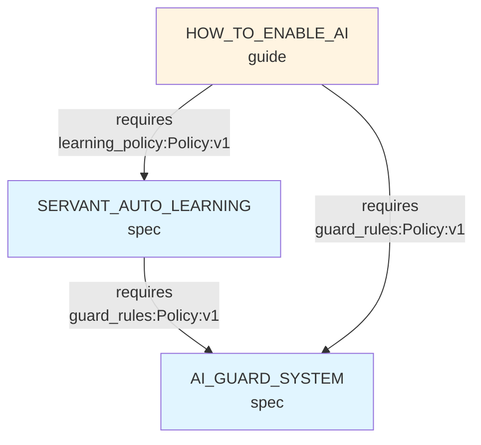

# Document Component System (DocPart) - 技術仕様書

## 📋 概要

**ドキュメントを電子部品のように扱うシステム**

各ドキュメントを「部品（Component）」として定義し、「ポート（Port）」で接続し、「信号（Signal）」で型を定義することで、ドキュメント間の依存関係を機械的に検証・可視化します。

---

## 🎯 設計原則

### 1. **レゴブロック原則**
- 接続点（Port）は最大3個まで
- 型（Signal）は5〜7種類で固定
- 見れば分かる、間違えても壊れない

### 2. **コンセント原則**
- 抜き差し容易（依存が壊れても警告のみ、読める）
- 標準規格（YAML、Markdown、変更なし）
- 後方互換（ツールなしでも動く）

### 3. **立つ鳥跡を濁さず原則**
- 既存ファイルは無変更
- 外部マッピング（`_components.yaml`）で管理
- ツール削除後も破綻しない

---

## 📐 データ構造

### Component（部品）

1ファイル = 1部品

```yaml
id: string            # 恒久ID（リネーム耐性）例: DOC:SERVANT:AUTO_LEARNING
type: string          # 部品種別（spec | guide | report | adr | checklist）
version?: string      # セマンティックバージョン（任意）
status?: string       # ステータス（draft | active | deprecated）
owners?: string[]     # 所有者（任意）
provides: Port[]      # 提供するポート
requires: Port[]      # 要求するポート
```

### Port（ポート・接続点）

部品間の接続インターフェース

```yaml
name: string          # ポート名（例: learning_policy, guard_rules）
signal: string        # 信号型（例: Policy:v1, Schema:v2）
from?: string         # 接続元のComponent ID（requiresの場合）
description?: string  # 説明（任意）
```

### Signal（信号型）

ポートを流れる情報の型（最小セット）

| Signal型 | 用途 | 例 |
|---------|------|---|
| `Policy:v1` | 方針・ルール | 品質基準、運用ルール、命名規則 |
| `Schema:v1` | データ構造定義 | APIスキーマ、DB設計、型定義 |
| `Scope:v1` | スコープ・範囲 | 機能範囲、責務定義、境界 |
| `Decision:v1` | 意思決定 | ADR、技術選定理由、方針変更 |
| `Checklist:v1` | 手順・チェックリスト | テスト手順、デプロイ手順、確認項目 |
| `Guide:v1` | ガイド・説明 | 使い方、概念説明、チュートリアル |
| `Report:v1` | 実績レポート | 完了報告、分析結果、実測データ |

※ バージョン（`:v1`, `:v2`）で互換性管理

---

## 📂 ファイル構造

```
nanashi8.github.io/
├── docs/
│   ├── _components.yaml          # 部品マッピング（メイン）
│   ├── _graph.mmd                 # 依存グラフ（自動生成）
│   ├── _index.json                # 部品インデックス（自動生成）
│   ├── auto-learning.md           # 実ファイル（servant/へ移動）
│   └── AI_GUARD_SYSTEM.md
│
├── scripts/
│   └── docpart/                   # CLIツール（内部実装）
│       ├── core/                  # コアロジック（将来外部化可能）
│       │   ├── types.ts           # 型定義
│       │   ├── parser.ts          # YAMLパーサー
│       │   ├── analyzer.ts        # 依存関係解析
│       │   └── graph.ts           # グラフ生成
│       ├── init.ts                # 初期化コマンド
│       ├── lint.ts                # 検証コマンド
│       ├── graph.ts               # グラフ生成コマンド
│       └── cli.ts                 # CLIエントリーポイント
│
└── .docpartrc.yaml                # 設定ファイル（プロジェクト固有）
```

---

## 📄 `_components.yaml` 仕様

### 基本構造

```yaml
# ドキュメント部品マッピング
# このファイルは機械生成と手動編集の両方をサポート

version: '1.0'
updated: '2026-01-09T10:00:00Z'

# Signal型定義（プロジェクト固有）
signals:
  - Policy:v1
  - Schema:v1
  - Scope:v1
  - Decision:v1
  - Checklist:v1
  - Guide:v1
  - Report:v1

# 部品マッピング（ファイルパス -> 部品定義）
components:
  docs/SERVANT_AUTO_LEARNING.md:
    id: DOC:SERVANT:AUTO_LEARNING
    type: spec
    version: '1.0.0'
    status: active
    owners:
      - nanashi8
    provides:
      - name: learning_policy
        signal: Policy:v1
        description: 自動学習の方針とトリガー定義
      - name: learning_cycle
        signal: Schema:v1
        description: 学習サイクルの設定スキーマ
    requires:
      - name: guard_rules
        signal: Policy:v1
        from: DOC:AI:GUARD_SYSTEM
        description: 品質ガードのルール定義

  docs/AI_GUARD_SYSTEM.md:
    id: DOC:AI:GUARD_SYSTEM
    type: spec
    version: '2.1.0'
    status: active
    provides:
      - name: guard_rules
        signal: Policy:v1
        description: リアルタイム品質ガードのルール

  docs/HOW_TO_ENABLE_AI.md:
    id: DOC:HOWTO:ENABLE_AI
    type: guide
    version: '1.0.0'
    requires:
      - name: learning_policy
        signal: Policy:v1
        from: DOC:SERVANT:AUTO_LEARNING
      - name: guard_rules
        signal: Policy:v1
        from: DOC:AI:GUARD_SYSTEM
```

### フィールド定義

#### 必須フィールド
- `components`: マップ（ファイルパス → 部品定義）
- `components.*.id`: 恒久ID（`DOC:` プレフィックス推奨）
- `components.*.type`: 部品種別（`spec`, `guide`, `report`, `adr`, `checklist`）

#### 任意フィールド
- `version`: マッピングファイルのバージョン
- `updated`: 最終更新日時
- `signals`: 使用可能なSignal型リスト（検証用）
- `components.*.version`: 部品のバージョン
- `components.*.status`: ステータス
- `components.*.owners`: 所有者リスト
- `components.*.provides`: 提供ポートリスト
- `components.*.requires`: 要求ポートリスト
- `*.description`: 説明

---

## 🔧 CLI コマンド仕様

### `npm run docpart init`

既存のdocs配下を解析し、初期マッピングを生成

```bash
$ npm run docpart init

🔍 Analyzing docs/ ...
  Found 47 Markdown files
  Extracted 89 internal links
  Detected 5 file types (spec, guide, report, adr, checklist)

📝 Generating _components.yaml ...
  Created 47 components
  Inferred 23 requires relationships
  
✅ Done: docs/_components.yaml
```

**動作**:
1. `docs/**/*.md` を再帰的にスキャン
2. ファイル名・ディレクトリから `type` を推論
3. Markdownリンク `[](./file.md)` を解析して `requires` を推論
4. `_components.yaml` を生成（既存ファイルがあればバックアップ）

### `npm run docpart lint`

マッピングの整合性を検証

```bash
$ npm run docpart lint

🔍 Validating _components.yaml ...

✅ Structure: OK (47 components)
✅ IDs: OK (no duplicates)
❌ Unresolved requires: 3 issues

  docs/HOW_TO_ENABLE_AI.md
    ❌ requires 'guard_rules' (Policy:v1) from 'DOC:AI:GUARD'
       → Component 'DOC:AI:GUARD' not found
       
  docs/IMPLEMENTATION_PLAN.md
    ⚠️  requires 'api_schema' (Schema:v2)
       → No provider found for 'api_schema'

✅ Signal types: OK (all signals are defined)
⚠️  Orphaned components: 2 files

  docs/archive/OLD_SPEC.md
    → Not referenced by any component

Summary: 3 errors, 3 warnings
```

**検証項目**:
- 必須フィールドの存在
- ID の重複チェック
- `requires` の解決チェック（`from` 先が存在するか）
- Signal型の一致チェック（`requires` と `provides` の型が合うか）
- 孤立部品の検出（誰からも参照されていない）

### `npm run docpart graph`

依存関係グラフを生成（Mermaid形式）

```bash
$ npm run docpart graph

📊 Generating dependency graph ...

✅ Created: docs/_graph.mmd (Mermaid)
✅ Created: docs/_index.json (machine-readable)

Preview in VS Code:
  - Open docs/_graph.mmd
  - Use Mermaid Preview extension
```

**出力例** (`docs/_graph.mmd`):



---

## 🔄 Frontmatter 連携（ハイブリッド方式）

重要な部品は、ファイル内にfrontmatterを書くことで明示的に管理可能。

```markdown
---
# このfrontmatterは _components.yaml より優先される
docpart:
  id: DOC:SERVANT:AUTO_LEARNING
  type: spec
  provides:
    - name: learning_policy
      signal: Policy:v1
---

# サーバント自動学習システム

...
```

**優先順位**:
1. Frontmatter（ファイル内）
2. `_components.yaml`（外部マッピング）
3. 自動推論（ファイル名・ディレクトリ）

---

## 🎨 型推論ルール（自動生成時）

| ファイルパス | 推論される type |
|-------------|----------------|
| `docs/*.md` | `guide` |
| `docs/design/*.md` | `spec` |
| `docs/specifications/*.md` | `spec` |
| `docs/how-to/*.md` | `guide` |
| `docs/reports/*.md` | `report` |
| `docs/adr/*.md` | `adr` |
| `**/ADR_*.md` | `adr` |
| `**/CHECKLIST_*.md` | `checklist` |
| ファイル名に `GUIDE` | `guide` |
| ファイル名に `REPORT` | `report` |

---

## 📊 効果測定指標

| 指標 | 測定方法 | 目標 |
|------|---------|------|
| **リンク切れ検出** | lint実行時のエラー数 | 0件維持 |
| **依存関係の可視化** | グラフの生成成功率 | 100% |
| **未解決依存の削減** | 週次でのlint警告数 | 初回の50%以下 |
| **Copilot提案の質** | 適切な参照先の提示率 | 主観評価（改善感） |
| **導入コスト** | 初期マッピング生成時間 | 5分以内 |

---

## 🚀 マイグレーション戦略

### Phase 1: 基幹部品（10〜20ファイル）
- `SERVANT_AUTO_LEARNING.md`
- `AI_GUARD_SYSTEM.md`
- `AI_INTEGRATION_GUIDE.md`
- 他、よく参照されるファイル

### Phase 2: 残りの主要ファイル（30〜40ファイル）
- 全ての仕様書（`specs/`, `design/`）
- 主要ガイド（`how-to/`）

### Phase 3: 全体（100+ファイル）
- reports/, archive/ 含む全ファイル

---

## 🔒 セキュリティ・プライバシー

- `_components.yaml` はプロジェクト内で完結（外部送信なし）
- IDやファイルパスは公開リポジトリの範囲内
- センシティブ情報は含めない（ファイル名・パスのみ）

---

## 📚 関連ドキュメント

- 使い方ガイド: `docs/how-to/DOCPART_USAGE.md`（作成予定）
- アーキテクチャ設計: `docs/design/DOCPART_ARCHITECTURE.md`（作成予定）
- 実装詳細: `scripts/docpart/README.md`（作成予定）

---

**Version**: 1.0.0  
**Last Updated**: 2026-01-09  
**Status**: Draft
