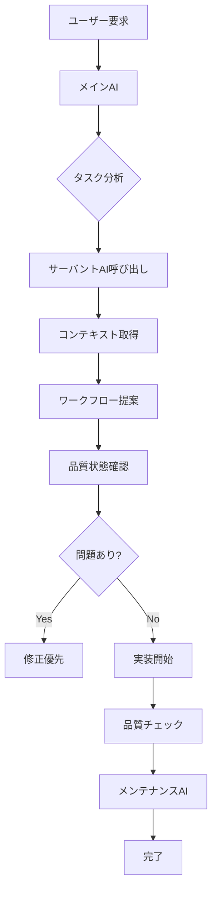

# プロジェクトAI サーバント統合システム

プロジェクト専用のコンテキスト認識AIサーバントを構築し、効率的な開発支援を実現

---

## 🎯 目的

メインAI（あなた）とサーバントAI（プロジェクト専用アシスタント）が協力し、以下を実現：

1. **コンテキスト自動抽出**: プロジェクト固有の情報を即座に提供
1. **ワークフロー提案**: 作業タイプに応じた最適な手順を提示
1. **品質保証**: 実装前の確認事項を自動チェック
1. **ドキュメント連携**: 必要なガイドラインを自動参照

---

## 🏗️ システム構成

### Phase 1: プロジェクトコンテキストDB

```
scripts/
├── project_ai_servant.py          # サーバントAIメインスクリプト
├── context_database.py            # プロジェクト知識ベース
└── workflow_advisor.py            # ワークフロー提案エンジン

.aitk/
└── context/
    ├── project_overview.json      # プロジェクト概要
    ├── workflow_patterns.json     # ワークフローパターン
    ├── quality_rules.json         # 品質基準
    └── common_tasks.json          # 頻出タスク
```

### Phase 2: 対話インターフェース

```python
# 使用例
from scripts.project_ai_servant import ProjectServant

servant = ProjectServant()

# 作業タイプを分析
task = servant.analyze_task("文法問題を追加したい")
# → {'type': 'grammar', 'workflow': 'NEW_HORIZON_GRAMMAR_GUIDELINES.md', 'steps': [...]}

# 必要なコンテキストを取得
context = servant.get_context(task)
# → {'docs': [...], 'examples': [...], 'quality_checks': [...]}

# 実装前チェックリスト
checklist = servant.generate_checklist(task)
# → ['Unit番号確認', 'Grade確認', '60問構成確認', ...]
```

---

## 📋 実装済み機能

### 1. メンテナンスAI（既存）

- データ品質チェック
- パフォーマンス測定
- セキュリティスキャン（CodeQL）
- 自動レポート生成

### 2. 品質神経系統（既存）

- 語彙多様性検証
- 主語多様性検証
- 選択肢適切性検証
- JSON詳細レポート

### 3. プロジェクトAI サーバント（新規実装）

- タスク分析エンジン
- コンテキスト抽出
- ワークフロー提案
- ドキュメント連携

---

## 🚀 実装ステップ

### Step 1: コンテキストDBの構築（30分）

```python
# scripts/context_database.py
import json
from pathlib import Path
from typing import Dict, List, Optional

class ProjectContextDB:
    """プロジェクト知識ベース"""

    def __init__(self):
        self.base_dir = Path(__file__).parent.parent
        self.context_dir = self.base_dir / ".aitk" / "context"
        self._load_context()

    def _load_context(self):
        """コンテキストをロード"""
        self.workflows = self._load_workflows()
        self.quality_rules = self._load_quality_rules()
        self.common_tasks = self._load_common_tasks()

    def _load_workflows(self) -> Dict:
        """ワークフローパターンを定義"""
        return {
            "grammar": {
                "name": "文法問題追加",
                "docs": [
                    "docs/references/AI_WORKFLOW_INSTRUCTIONS.md",
                    "docs/guidelines/NEW_HORIZON_GRAMMAR_GUIDELINES.md"
                ],
                "steps": [
                    "Unit・Grade確認",
                    "60問構成（fillInBlank:15, sentenceOrdering:15, etc.）",
                    "ID採番ルール: g{grade}-u{unit}-{type}-{number}",
                    "品質チェック実行",
                    "テスト実行"
                ],
                "quality_checks": [
                    "各問題にexplanation必須",
                    "hint必須",
                    "difficulty設定（beginner/intermediate/advanced）"
                ]
            },
            "passage": {
                "name": "長文パッセージ作成",
                "docs": [
                    "docs/guidelines/PASSAGE_CREATION_GUIDELINES.md",
                    "docs/guidelines/PASSAGE_QUALITY_GUIDE.md"
                ],
                "steps": [
                    "レベル・トピック決定",
                    "語数目標設定（Beginner:800-1500）",
                    "既存語彙統合",
                    "自動品質チェック",
                    "フレーズJSON生成"
                ],
                "quality_checks": [
                    "段落字下げ4スペース",
                    "句読点正確",
                    "自然な英語表現"
                ]
            },
            "ui": {
                "name": "UI変更",
                "docs": [
                    "docs/UI_DEVELOPMENT_GUIDELINES.md",
                    "docs/development/DESIGN_SYSTEM_RULES.md"
                ],
                "steps": [
                    "既存デザイン確認",
                    "モバイルファースト実装",
                    "CSS変数使用",
                    "ダークモード対応",
                    "アクセシビリティ確認"
                ],
                "quality_checks": [
                    "TypeScriptエラー0件",
                    "CSSリントエラー0件",
                    "レスポンシブデザイン確認"
                ]
            },
            "maintenance": {
                "name": "メンテナンス・品質改善",
                "docs": [
                    "docs/maintenance/MAINTENANCE_AI_GUIDE.md",
                    "docs/quality/QUALITY_SYSTEM.md"
                ],
                "steps": [
                    "メンテナンスAI実行",
                    "問題の優先度判定",
                    "修正実装",
                    "再検証"
                ],
                "quality_checks": [
                    "CRITICAL問題0件",
                    "WARNING最小化",
                    "テストカバレッジ50%以上"
                ]
            }
        }

    def _load_quality_rules(self) -> Dict:
        """品質基準を定義"""
        return {
            "commit_requirements": {
                "typescript_errors": 0,
                "build_errors": 0,
                "css_lint_errors": 0,
                "pre_commit_hook": "success"
            },
            "data_quality": {
                "vocabulary_diversity": 0.80,
                "subject_diversity": 0.60,
                "choice_appropriateness": 0.85
            },
            "performance": {
                "build_time": 60,  # 秒
                "bundle_size": 10  # MB
            }
        }

    def _load_common_tasks(self) -> List[Dict]:
        """頻出タスクを定義"""
        return [
            {
                "pattern": "文法.*追加|grammar.*add",
                "task_type": "grammar",
                "confidence": 0.9
            },
            {
                "pattern": "長文|パッセージ|passage|reading",
                "task_type": "passage",
                "confidence": 0.85
            },
            {
                "pattern": "UI|デザイン|スタイル|CSS",
                "task_type": "ui",
                "confidence": 0.8
            },
            {
                "pattern": "メンテナンス|品質|quality|maintenance",
                "task_type": "maintenance",
                "confidence": 0.85
            }
        ]

    def get_workflow(self, task_type: str) -> Optional[Dict]:
        """ワークフローを取得"""
        return self.workflows.get(task_type)

    def get_quality_rules(self, category: str = None) -> Dict:
        """品質基準を取得"""
        if category:
            return self.quality_rules.get(category, {})
        return self.quality_rules

    def analyze_task_type(self, description: str) -> str:
        """タスクタイプを分析"""
        import re

        for task in self.common_tasks:
            if re.search(task["pattern"], description, re.IGNORECASE):
                return task["task_type"]

        return "unknown"
```

### Step 2: サーバントAIの実装（45分）

```python
# scripts/project_ai_servant.py
#!/usr/bin/env python3
"""
プロジェクトAI サーバント

メインAIの作業を支援するプロジェクト専用アシスタント
"""
import json
import sys
from pathlib import Path
from typing import Dict, List, Optional
from context_database import ProjectContextDB

class ProjectServant:
    """プロジェクト専用AIサーバント"""

    def __init__(self):
        self.db = ProjectContextDB()
        self.base_dir = Path(__file__).parent.parent

    def analyze_task(self, description: str) -> Dict:
        """タスクを分析して最適なワークフローを提案"""
        task_type = self.db.analyze_task_type(description)
        workflow = self.db.get_workflow(task_type)

        if not workflow:
            return {
                "type": "unknown",
                "message": "タスクタイプを特定できませんでした",
                "suggestion": "具体的な作業内容を教えてください"
            }

        return {
            "type": task_type,
            "workflow": workflow,
            "status": "ready"
        }

    def get_context(self, task: Dict) -> Dict:
        """タスクに必要なコンテキストを収集"""
        workflow = task.get("workflow", {})

        context = {
            "task_type": task.get("type"),
            "documents": [],
            "steps": workflow.get("steps", []),
            "quality_checks": workflow.get("quality_checks", []),
            "examples": []
        }

        # ドキュメントの存在確認
        for doc_path in workflow.get("docs", []):
            full_path = self.base_dir / doc_path
            if full_path.exists():
                context["documents"].append({
                    "path": doc_path,
                    "exists": True,
                    "size": full_path.stat().st_size
                })
            else:
                context["documents"].append({
                    "path": doc_path,
                    "exists": False,
                    "warning": "ドキュメントが見つかりません"
                })

        return context

    def generate_checklist(self, task: Dict) -> List[str]:
        """実装前チェックリストを生成"""
        workflow = task.get("workflow", {})
        checklist = []

        # ステップをチェックリスト化
        for i, step in enumerate(workflow.get("steps", []), 1):
            checklist.append(f"{i}. {step}")

        # 品質チェックを追加
        checklist.append("\n品質チェック:")
        for check in workflow.get("quality_checks", []):
            checklist.append(f"  ☐ {check}")

        return checklist

    def get_quality_status(self) -> Dict:
        """現在の品質状態を取得"""
        # メンテナンスレポートを読み込み
        report_path = self.base_dir / "maintenance_report.json"

        if not report_path.exists():
            return {
                "status": "unknown",
                "message": "メンテナンスレポートが見つかりません"
            }

        with open(report_path, "r") as f:
            report = json.load(f)

        return {
            "status": "critical" if report["critical_issues"] > 0 else "warning" if report["warning_issues"] > 0 else "healthy",
            "total_issues": report["total_issues"],
            "critical_issues": report["critical_issues"],
            "warning_issues": report["warning_issues"],
            "last_check": report["timestamp"],
            "categories": self._group_by_category(report["issues"])
        }

    def _group_by_category(self, issues: List[Dict]) -> Dict:
        """問題をカテゴリ別に集計"""
        categories = {}
        for issue in issues:
            cat = issue.get("category", "unknown")
            if cat not in categories:
                categories[cat] = 0
            categories[cat] += 1
        return categories

    def suggest_next_action(self, context: Dict) -> str:
        """次のアクションを提案"""
        quality = self.get_quality_status()

        # CRITICAL問題がある場合
        if quality.get("critical_issues", 0) > 0:
            return f"""⚠️ 優先対応推奨

CRITICAL問題が{quality['critical_issues']}件検出されています。
新しい作業の前に、以下を実行してください：

1. python3 scripts/maintenance_ai.py --verbose
2. 検出された問題を確認
3. 優先度の高い問題から修正

主な問題カテゴリ:
{json.dumps(quality.get('categories', {}), indent=2, ensure_ascii=False)}
"""

        # 通常の作業フロー
        task_type = context.get("task_type")
        docs = context.get("documents", [])

        return f"""✅ 作業準備完了

タスクタイプ: {task_type}
必要なドキュメント: {len(docs)}件

推奨手順:
1. 以下のドキュメントを参照
{chr(10).join([f"   - {d['path']}" for d in docs if d['exists']])}

2. 実装前チェックリスト確認
{chr(10).join(context.get('steps', []))}

3. 品質基準を確認
{chr(10).join(context.get('quality_checks', []))}

準備ができたら実装を開始してください。
"""

def main():
    """CLIインターフェース"""
    import argparse

    parser = argparse.ArgumentParser(description="プロジェクトAI サーバント")
    parser.add_argument("--analyze", type=str, help="タスクを分析")
    parser.add_argument("--status", action="store_true", help="品質状態を表示")
    parser.add_argument("--suggest", type=str, help="次のアクションを提案")

    args = parser.parse_args()

    servant = ProjectServant()

    if args.status:
        status = servant.get_quality_status()
        print(json.dumps(status, indent=2, ensure_ascii=False))

    elif args.analyze:
        task = servant.analyze_task(args.analyze)
        context = servant.get_context(task)
        print("\n=== タスク分析 ===")
        print(json.dumps(task, indent=2, ensure_ascii=False))
        print("\n=== コンテキスト ===")
        print(json.dumps(context, indent=2, ensure_ascii=False))

    elif args.suggest:
        task = servant.analyze_task(args.suggest)
        context = servant.get_context(task)
        suggestion = servant.suggest_next_action(context)
        print(suggestion)

    else:
        parser.print_help()

if __name__ == "__main__":
    main()
```

---

## 💡 使用例

### 例1: 文法問題追加のワークフロー取得

```bash
python3 scripts/project_ai_servant.py --analyze "Grade2 Unit5の文法問題を追加したい"
```

**出力**:

```json
{
  "type": "grammar",
  "workflow": {
    "name": "文法問題追加",
    "steps": ["Unit・Grade確認", "60問構成確認", "ID採番ルール確認", "品質チェック実行"],
    "docs": [
      "docs/references/AI_WORKFLOW_INSTRUCTIONS.md",
      "docs/guidelines/NEW_HORIZON_GRAMMAR_GUIDELINES.md"
    ]
  }
}
```

### 例2: 品質状態の確認

```bash
python3 scripts/project_ai_servant.py --status
```

**出力**:

```json
{
  "status": "warning",
  "total_issues": 33,
  "critical_issues": 19,
  "warning_issues": 12,
  "categories": {
    "data_quality": 28,
    "performance": 1,
    "documentation": 1
  }
}
```

### 例3: 次のアクション提案

```bash
python3 scripts/project_ai_servant.py --suggest "UIを改善したい"
```

**出力**:

```
✅ 作業準備完了

タスクタイプ: ui
必要なドキュメント: 2件

推奨手順:
1. 以下のドキュメントを参照
   - docs/UI_DEVELOPMENT_GUIDELINES.md
   - docs/development/DESIGN_SYSTEM_RULES.md

2. 実装前チェックリスト確認
既存デザイン確認
モバイルファースト実装
CSS変数使用
```

---

## 🔄 メインAIとの協力フロー



---

## 🎯 期待される効果

1. **作業時間短縮**: 30-50%削減（コンテキスト検索時間）
1. **品質向上**: 実装前チェックによるミス削減
1. **ドキュメント活用**: 自動参照で見落とし防止
1. **一貫性確保**: ワークフローの標準化

---

## 📊 実装スケジュール

| Phase       | 内容                | 時間 | 優先度 |
| ----------- | ------------------- | ---- | ------ |
| **Phase 1** | コンテキストDB構築  | 30分 | 🔴 高  |
| **Phase 2** | サーバントAI実装    | 45分 | 🔴 高  |
| **Phase 3** | CLIインターフェース | 15分 | 🟡 中  |
| **Phase 4** | テスト作成          | 30分 | 🟡 中  |
| **Phase 5** | GitHub Actions統合  | 30分 | 🟢 低  |

**合計**: 2時間30分

---

## 🚀 次のステップ

1. `context_database.py` 実装
1. `project_ai_servant.py` 実装
1. 動作確認テスト
1. メインAIとの統合テスト
1. ドキュメント完成

実装を開始しますか？
