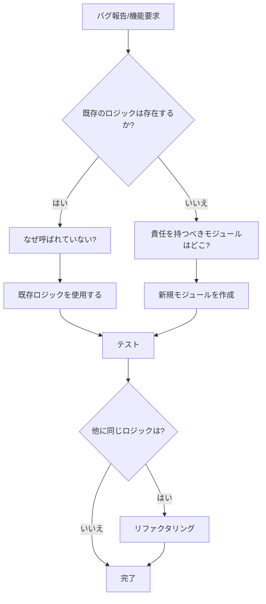

# 対症療法禁止ポリシー - 詳細ガイドライン

> **プロジェクト全体に適用される強制ポリシー**
>
> 最終更新: 2025年12月22日

## ⚠️ 【最重要】修正の修正を絶対に行わない

**CRITICAL ENFORCEMENT**: このルールに違反するコミットは自動リジェクトされます

### 絶対原則: 修正は1回で完結させる

```
❌ 禁止パターン:
1. 機能Aを修正
2. 機能Aの修正が不完全だったので再修正
3. 機能Aの再修正でバグ発生
4. 機能Aの再々修正...

✅ 正しいパターン:
1. 機能Aの問題を完全に分析
2. 根本原因を特定
3. 包括的な修正を1回で実施
4. 完了
```

**詳細**: [no-fix-on-fix-policy.instructions.md](../../.aitk/instructions/no-fix-on-fix-policy.instructions.md)

**強制ツール**:
- Pre-commitフック: `scripts/pre-commit-fix-check.sh`
- CI/CD検証: `.github/workflows/quality-gate.yml` (TODO)

---

## 📋 目次

1. [なぜ対症療法を禁止するのか](#なぜ対症療法を禁止するのか)
2. [対症療法の具体例と対策](#対症療法の具体例と対策)
3. [根本治療のワークフロー](#根本治療のワークフロー)
4. [技術的負債との違い](#技術的負債との違い)
5. [エスカレーションフロー](#エスカレーションフロー)

---

## なぜ対症療法を禁止するのか

### 問題の本質

対症療法は**短期的には楽**ですが、**長期的には破滅**をもたらします。

#### 実際に発生した問題（本プロジェクトの事例）

**状況**: 学習段階（position）の判定ロジック

```typescript
// 🏥 病原体: determineWordPosition() (正しい実装)
export function determineWordPosition(progress: WordProgress): WordPosition {
  // AI担当の正式な判定ロジック
  const { consecutiveIncorrect, consecutiveCorrect, /* ... */ } = progress;
  
  if (consecutiveIncorrect >= 2) return 'incorrect';
  if (consecutiveCorrect >= 3 && accuracy >= 0.8) return 'mastered';
  // ...
}
```

```typescript
// 🦠 感染拡大: 対症療法が3箇所に散在
// ❌ statistics.ts (Line 314-326)
if (wp.incorrectCount >= 2) { // ← 間違った判定基準
  category = 'incorrect';
}

// ❌ progressStorage.ts (Line 1177-1183)
if (accuracy < 0.3 || consecutiveIncorrect >= 2) { // ← 微妙に異なる判定
  category = 'incorrect';
}

// ❌ QuestionScheduler.ts (Line 667-685)
if (accuracy < 0.3 || consecutiveIncorrect >= 2) { // ← さらに別の判定
  category = 'incorrect';
} else if (accuracy >= 0.7 && totalAttempts >= 5) { // ← 微妙に異なる閾値
  category = 'mastered';
}
```

**結果**: 
- 🐛 **バグ**: `incorrectCount`（累計）と`consecutiveIncorrect`（連続）を混同
- 🔥 **振る舞いの不一致**: 3箇所で異なる閾値を使用
- 🧠 **認知負荷**: 修正時に3箇所全てを更新する必要
- ⏰ **デバッグ時間**: 「まだまだ」が「分からない」より増える不具合の原因特定に数時間
- 😡 **ユーザーからの指摘**: "ボケ老人のように同じ間違いを繰り返す"

### 長期的なコスト

| 対症療法のコスト | 根本治療のコスト |
|---|---|
| 初期実装: **5分** | 初期実装: **30分** |
| バグ修正: **3箇所 × 10分 = 30分** | バグ修正: **1箇所 × 10分 = 10分** |
| デバッグ: **数時間〜数日** | デバッグ: **数分〜数時間** |
| 認知負荷: **高い（全箇所把握必要）** | 認知負荷: **低い（1箇所のみ）** |
| 保守性: **悪化し続ける** | 保守性: **改善し続ける** |
| **総コスト: 数時間〜数日** | **総コスト: 1時間以内** |

---

## 対症療法の具体例と対策

### パターン1: ロジックの重複

#### ❌ 対症療法

```typescript
// File: A.ts
function processUser(user: User) {
  const isAdmin = user.role === 'admin' || user.role === 'superadmin';
  const hasPermission = isAdmin && user.status === 'active';
  // ...
}

// File: B.ts
function checkAccess(user: User) {
  const isAdmin = user.role === 'admin' || user.role === 'superadmin'; // 重複！
  const hasPermission = isAdmin && user.status === 'active'; // 重複！
  // ...
}

// File: C.ts
function validateUser(user: User) {
  const isAdmin = user.role === 'admin' || user.role === 'superadmin'; // 重複！
  // ... ただしステータスチェックが抜けている！（バグの温床）
}
```

#### ✅ 根本治療

```typescript
// File: utils/userPermissions.ts (Single Source of Truth)
export function isAdmin(user: User): boolean {
  return user.role === 'admin' || user.role === 'superadmin';
}

export function hasActivePermission(user: User): boolean {
  return isAdmin(user) && user.status === 'active';
}

// File: A.ts
import { hasActivePermission } from './utils/userPermissions';

function processUser(user: User) {
  const hasPermission = hasActivePermission(user);
  // ...
}

// File: B.ts, C.ts - 同様に使用
```

**効果**:
- ✅ 1箇所の修正で全体に反映
- ✅ ロジックの一貫性保証
- ✅ テストが容易

---

### パターン2: 条件分岐の散在

#### ❌ 対症療法

```typescript
// 複数のコンポーネントで同じ判定
if (question.difficulty === 'hard' && attempts > 3) {
  showHint = true;
}

// 別のファイルでは微妙に異なる判定（バグ！）
if (question.difficulty === 'hard' && attempts >= 3) { // >= vs >
  showHint = true;
}
```

#### ✅ 根本治療

```typescript
// strategies/hintStrategy.ts
export class HintStrategy {
  static shouldShowHint(question: Question, attempts: number): boolean {
    return question.difficulty === 'hard' && attempts > 3;
  }
}

// 使用側
if (HintStrategy.shouldShowHint(question, attempts)) {
  showHint = true;
}
```

---

### パターン3: データ変換の重複

#### ❌ 対症療法

```typescript
// 各所でDate変換を繰り返す
const daysSince = (Date.now() - lastStudied) / (1000 * 60 * 60 * 24);

// 別の場所では計算式が微妙に違う（バグ！）
const daysSince = (Date.now() - lastStudied) / 86400000; // マジックナンバー
```

#### ✅ 根本治療

```typescript
// utils/dateUtils.ts
export function daysSince(timestamp: number): number {
  const MS_PER_DAY = 1000 * 60 * 60 * 24;
  return (Date.now() - timestamp) / MS_PER_DAY;
}

// 使用側
const daysSinceLastStudy = daysSince(lastStudied);
```

---

### パターン4: 状態管理の重複

#### ❌ 対症療法

```typescript
// localStorage.setItem を各所で直接呼び出し
localStorage.setItem('user-progress', JSON.stringify(progress));

// 別の場所では異なるキー名（バグ！）
localStorage.setItem('userProgress', JSON.stringify(progress)); // ハイフン vs キャメル
```

#### ✅ 根本治療

```typescript
// storage/progressStorage.ts
const STORAGE_KEYS = {
  USER_PROGRESS: 'user-progress',
  SETTINGS: 'user-settings',
} as const;

export function saveProgress(progress: Progress): void {
  localStorage.setItem(STORAGE_KEYS.USER_PROGRESS, JSON.stringify(progress));
}

export function loadProgress(): Progress | null {
  const data = localStorage.getItem(STORAGE_KEYS.USER_PROGRESS);
  return data ? JSON.parse(data) : null;
}
```

---

## 根本治療のワークフロー

### Step 1: 問題の特定



### Step 2: 責任の所在を決定

#### 質問リスト

1. **このロジックは誰の責任？**
   - データ定義？（types/）
   - ビジネスロジック？（ai/, strategies/）
   - データアクセス？（storage/）
   - UI表示？（components/）

2. **このロジックは再利用される？**
   - はい → ユーティリティ関数化
   - いいえ → コンポーネント内で完結

3. **このロジックは変更される可能性が高い？**
   - はい → 抽象化・インターフェース化
   - いいえ → シンプルに実装

### Step 3: 実装

#### チェックリスト

```typescript
/**
 * ✅ 実装前チェックリスト
 * 
 * [ ] 既存の類似関数を検索した (grep, semantic search)
 * [ ] 責任分離が適切か確認した
 * [ ] Single Source of Truth になっているか確認した
 * [ ] 関数名・変数名が意図を明確に表しているか確認した
 * [ ] JSDocでドキュメント化した
 * [ ] ユニットテストを書いた
 * [ ] 使用箇所を全てリストアップした
 * [ ] 他の対症療法を発見したら一緒に修正した
 */
```

### Step 4: 検証

```bash
# 1. コンパイルチェック
npm run type-check

# 2. Lintチェック
npm run lint

# 3. テスト実行
npm run test

# 4. 対症療法検知スクリプト（要実装）
npm run check:symptomatic-fixes

# 5. 全体影響範囲チェック
git diff --stat
```

---

## 技術的負債との違い

### 技術的負債（許容される場合がある）

```typescript
// ⚠️ 技術的負債: 明示的にマークし、期限を設定
/**
 * @deprecated 2025年1月末まで互換性のため残す
 * @see {@link newFunction} 新しい実装に移行すること
 */
function oldFunction() {
  // 期限後に削除予定
}
```

**特徴**:
- ✅ 明示的に文書化されている
- ✅ 期限が設定されている
- ✅ 移行計画がある
- ✅ チーム全体で認識されている

### 対症療法（絶対に禁止）

```typescript
// ❌ 対症療法: コメントすらない
function quickFix() {
  // とりあえず動くようにした
  if (data && data.value) { // なぜこの条件？
    return true;
  }
  return false;
}
```

**特徴**:
- ❌ なぜこの実装なのか不明
- ❌ 期限・計画なし
- ❌ 他の場所との整合性なし
- ❌ 問題の先送り

---

## エスカレーションフロー

### Level 1: 自己解決（推奨）

1. `.aitk/instructions/` の関連ルールを確認
2. 類似のコードを検索（grep, semantic search）
3. ドキュメント（`docs/`）を参照
4. 根本治療を実装

### Level 2: チーム相談

**対象**: 
- 責任の所在が不明確
- 大規模なリファクタリングが必要
- アーキテクチャ変更を伴う

**方法**:
1. Issue作成（テンプレート使用）
2. 現状分析を添付
3. 提案する解決策を複数提示
4. トレードオフを明記

### Level 3: アーキテクトレビュー

**対象**:
- プロジェクト全体に影響
- 既存のアーキテクチャ原則との矛盾
- 破壊的変更

**方法**:
1. RFC (Request for Comments) 作成
2. 設計ドキュメント作成
3. プロトタイプ実装
4. レビュー会議

---

## 強制メカニズム

### 1. Instructions ファイル（AI強制）

- `.aitk/instructions/no-symptomatic-fixes.instructions.md`
- `.aitk/instructions/ai-modification-guard.instructions.md`

### 2. CIパイプライン（自動検知）

```yaml
# .github/workflows/quality-check.yml に追加
- name: Check for Symptomatic Fixes
  run: npm run check:symptomatic-fixes
```

### 3. Pre-commit Hook（ローカル強制）

```bash
#!/bin/sh
# .git/hooks/pre-commit
npm run check:symptomatic-fixes || exit 1
```

### 4. Code Review（人的チェック）

- [ ] CONTRIBUTING.mdのチェックリスト遵守
- [ ] 根本原因分析の確認
- [ ] SSOT原則の確認

---

## まとめ

### 黄金律

1. **"なぜ"を3回問う**: 表面的な症状ではなく根本原因を探る
2. **既存を探す**: 同じ責任を持つコードが既にないか必ず確認
3. **1箇所に集約**: Single Source of Truth を徹底
4. **文書化**: なぜこの設計なのか必ず記録
5. **テスト**: 動作を保証する自動テスト

### スローガン

```
🚫 対症療法は一時の安楽、永遠の苦痛
✅ 根本治療は一時の苦労、永遠の平和
```

---

**このポリシーは全開発者が遵守する義務があります。**
