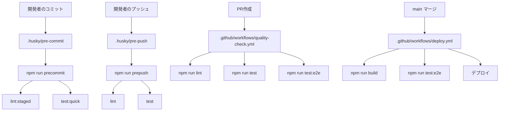

# ドットフォルダ整理計画

**作成日**: 2026-01-14  
**ステータス**: 提案  
**目的**: 業界標準に則した命名規則の適用、責務の明確化、配線維持

## 現状の問題点

### 1. AI関連ファイルの散在
- `.ai-instructions/` - AIルール文書（4ファイル）
- `.aitk/instructions/` - AI指示（50以上のファイル）
- `.copilot/` - Copilot設定（1ファイル）

**問題**: 役割が重複し、どこに何があるか不明確

### 2. 命名規則の不統一
- `.aitk`: 略語で分かりにくい（AI Toolkitの意図が不明）
- `.vscode/ai-*.json`: 実行時データがエディタ設定フォルダに混在

### 3. コミット対象の混在
- 実行時ログ（`ai-action-log.json` 7000行以上）が`.vscode/`に存在
- `.aitk/`内に履歴ファイルとコンテキストファイルが混在

### 4. 深すぎる階層
- `.aitk/instructions/` に50以上のファイル（カテゴリ分けなし）

## 整理計画

### フェーズ1: AI関連の統合（優先度：高）

#### 統合後の構造

```
.ai/                                    # AI関連の単一エントリポイント
├─ README.md                            # 全体索引・セットアップガイド
├─ instructions/                        # AI向け指示（コミット対象）
│  ├─ README.md                         # カテゴリ索引
│  ├─ core/                             # コアルール（10ファイル以内）
│  │  ├─ CRITICAL_RULES.md             # 旧.ai-instructions/から移動
│  │  ├─ SPECIFICATION_ENFORCEMENT.md
│  │  ├─ core-principles.instructions.md
│  │  └─ mandatory-spec-check.instructions.md
│  ├─ quality/                          # 品質ガード
│  │  ├─ code-quality.instructions.md
│  │  ├─ test-quality.instructions.md
│  │  ├─ error-zero-policy.instructions.md
│  │  └─ refactoring-safety.instructions.md
│  ├─ workflow/                         # ワークフローガイド
│  │  ├─ work-management.instructions.md
│  │  ├─ progress-tracking-patterns.instructions.md
│  │  └─ passage-addition-workflow.instructions.md
│  ├─ content/                          # コンテンツ品質
│  │  ├─ grammar-data-quality.instructions.md
│  │  ├─ learning-content-quality-guard.instructions.md
│  │  └─ social-studies-quality-enforcement.instructions.md
│  ├─ security/                         # セキュリティ
│  │  └─ security-best-practices.instructions.md
│  └─ enforcement/                      # エンフォースメント
│     ├─ adaptive-guard-system.instructions.md
│     ├─ efficiency-guard.instructions.md
│     └─ modification-enforcement.instructions.md
├─ copilot/                             # GitHub Copilot固有設定
│  └─ instructions.md
├─ context/                             # コンテキスト情報（共有可）
│  ├─ AI_CONTEXT.md
│  └─ no-fix-on-fix.backup.md
└─ .data/                               # 実行データ（.gitignore対象）
   ├─ history/
   │  ├─ ai-failure-history.json
   │  ├─ servant_history.json
   │  └─ failure-patterns.json
   ├─ cache/
   │  ├─ .commit-count
   │  └─ spec-check.json
   └─ README.md                         # データファイル説明
```

#### マイグレーション手順

```bash
# 1. 新構造を作成
mkdir -p .ai/{instructions/{core,quality,workflow,content,security,enforcement},copilot,context,.data/{history,cache}}

# 2. ファイルを移動（コアルール）
mv .ai-instructions/CRITICAL_RULES.md .ai/instructions/core/
mv .ai-instructions/SPECIFICATION_ENFORCEMENT.md .ai/instructions/core/
mv .ai-instructions/UI_CHANGE_APPROVALS.md .ai/instructions/core/
mv .ai-instructions/css-modification-rules.md .ai/instructions/core/

# 3. .aitk/instructions/ からカテゴリ分けして移動
mv .aitk/instructions/core-principles.instructions.md .ai/instructions/core/
mv .aitk/instructions/mandatory-spec-check.instructions.md .ai/instructions/core/
# (以下、各カテゴリに分類して移動)

# 4. Copilot設定を移動
mv .copilot/instructions.md .ai/copilot/

# 5. コンテキストを移動
mv .aitk/context/* .ai/context/

# 6. 実行データを移動
mv .aitk/ai-failure-history.json .ai/.data/history/
mv .aitk/servant_history.json .ai/.data/history/
mv .aitk/failure-patterns.json .ai/.data/history/
mv .aitk/.commit-count .ai/.data/cache/
mv .aitk/spec-check.json .ai/.data/cache/

# 7. 古いフォルダを削除
rm -rf .ai-instructions .aitk .copilot
```

#### 配線の更新

`.aitk` への参照を探して `.ai` に更新：

```bash
# 全ファイルで参照を検索
grep -r "\.aitk" .
grep -r "ai-instructions" .
grep -r "\.copilot" .

# 想定される更新箇所：
# - .github/workflows/*.yml
# - scripts/*.{js,mjs,ts}
# - extensions/servant/src/**/*.ts
```

### フェーズ2: `.vscode/` の整理（優先度：中）

#### 問題のあるファイル

**実行時データ（.gitignore対象にすべき）**
- `ai-action-log.json` (7087行)
- `ai-feedback.json`
- `ai-performance-history.json`
- `neural-graph.json`
- `neural-signals.json`
- `project-goals.json`
- `project-index.json`
- `workflow-patterns.json`
- `cache/` ディレクトリ

#### 整理後の構造

```
.vscode/
├─ settings.json                # 共有設定（コミット）
├─ launch.json                  # デバッグ設定（コミット）
├─ tasks.json                   # タスク設定（コミット）
├─ extensions.json              # 推奨拡張（コミット）
└─ .ai-data/                    # AI実行データ（.gitignore）
   ├─ ai-action-log.json
   ├─ ai-feedback.json
   ├─ ai-performance-history.json
   ├─ neural-graph.json
   ├─ neural-signals.json
   ├─ project-goals.json
   ├─ project-index.json
   ├─ workflow-patterns.json
   └─ cache/
```

#### マイグレーション手順

```bash
# 1. サブディレクトリ作成
mkdir -p .vscode/.ai-data/cache

# 2. 実行時データを移動
cd .vscode
mv ai-action-log.json .ai-data/
mv ai-feedback.json .ai-data/
mv ai-performance-history.json .ai-data/
mv neural-graph.json .ai-data/
mv neural-signals.json .ai-data/
mv project-goals.json .ai-data/
mv project-index.json .ai-data/
mv workflow-patterns.json .ai-data/
mv cache/* .ai-data/cache/
rmdir cache
```

#### .gitignore への追加

```gitignore
# VS Code AI実行データ
.vscode/.ai-data/
.vscode/cache/

# AI全般の実行データ
.ai/.data/
```

### フェーズ3: 配線の明示化と標準化

#### `.husky/` と `.github/workflows/` の配線

**原則**: 同じチェックをローカル（Husky）とCI（GitHub Actions）で実行

#### 配線マッピング表

| フック/ワークフロー | 実行コマンド | 目的 |
|---|---|---|
| `.husky/pre-commit` | `npm run precommit` | コミット前の軽量チェック |
| `.husky/pre-push` | `npm run prepush` | プッシュ前の完全チェック |
| `.github/workflows/quality-check.yml` | `npm run lint && npm run test` | PR時の品質ゲート |
| `.github/workflows/deploy.yml` | `npm run build && npm run test:e2e` | デプロイ前の最終チェック |

#### `package.json` 標準化

```json
{
  "scripts": {
    "// ---- ローカル開発 ----": "",
    "dev": "vite",
    "build": "vite build",
    "preview": "vite preview",
    
    "// ---- 品質チェック（ローカル/CI共通） ----": "",
    "lint": "eslint . && npm run lint:css",
    "lint:fix": "eslint . --fix",
    "lint:css": "stylelint '**/*.css'",
    "lint:staged": "lint-staged",
    "format": "prettier --write .",
    "format:check": "prettier --check .",
    
    "// ---- テスト（ローカル/CI共通） ----": "",
    "test": "vitest run",
    "test:ui": "vitest --ui",
    "test:coverage": "vitest run --coverage",
    "test:quick": "vitest run --changed",
    "test:e2e": "playwright test",
    
    "// ---- Git フック（.huskyから呼ばれる） ----": "",
    "precommit": "npm run lint:staged && npm run test:quick",
    "prepush": "npm run lint && npm run test",
    
    "// ---- セットアップ ----": "",
    "prepare": "husky install",
    "postinstall": "npm run setup:ai",
    "setup:ai": "node scripts/setup-ai-instructions.js"
  }
}
```

#### 配線の可視化（Mermaid図）



### フェーズ4: ドキュメント整備

各フォルダに `README.md` を配置：

#### `.ai/README.md`

```markdown
# AI指示・設定ディレクトリ

このディレクトリは、AIアシスタント（GitHub Copilot、Servant等）向けの指示、設定、実行データを管理します。

## ディレクトリ構造

- `instructions/` - AI向け指示文書（コミット対象）
  - `core/` - 必須ルール
  - `quality/` - 品質ガード
  - `workflow/` - ワークフローガイド
- `copilot/` - GitHub Copilot固有設定
- `context/` - コンテキスト情報
- `.data/` - 実行データ（.gitignore対象）

## セットアップ

```bash
npm run setup:ai
```

## 新しい指示の追加

1. 適切なカテゴリを選択
2. `*.instructions.md` で作成
3. `instructions/README.md` に索引を追加
```

#### `.vscode/README.md`

```markdown
# VS Code ワークスペース設定

## 共有設定（コミット対象）

- `settings.json` - プロジェクト共通設定
- `launch.json` - デバッグ設定
- `tasks.json` - タスク定義
- `extensions.json` - 推奨拡張

## 個人設定（コミット対象外）

- `.ai-data/` - AI実行データ
- `*.local.json` - 個人用オーバーライド

## 推奨拡張のインストール

VS Codeで `Cmd+Shift+P` → "Extensions: Show Recommended Extensions"
```

## 実装スケジュール

### Phase 1: 準備（1日）
- [ ] `.gitignore` に実行データを追加
- [ ] バックアップ作成 `cp -r .ai-instructions .ai-instructions.backup`
- [ ] 新ディレクトリ構造を作成

### Phase 2: マイグレーション（2日）
- [ ] AI関連ファイルを `.ai/` に移動・整理
- [ ] `.vscode/` の実行データを分離
- [ ] 配線の更新（grep検索して全参照を修正）

### Phase 3: 検証（1日）
- [ ] ローカルでフックが動作することを確認
- [ ] CI/CDが正常に動作することを確認
- [ ] AI指示が正しく読み込まれることを確認

### Phase 4: クリーンアップ（半日）
- [ ] 古いフォルダを削除
- [ ] README.md を各フォルダに追加
- [ ] このドキュメントを `docs/maintenance/` に配置

## ロールバック手順

問題が発生した場合：

```bash
# バックアップから復元
mv .ai-instructions.backup .ai-instructions
mv .aitk.backup .aitk
mv .copilot.backup .copilot

# 配線を元に戻す
git checkout HEAD -- package.json .github .husky
```

## チェックリスト

### マイグレーション前
- [ ] すべての変更をコミット済み
- [ ] バックアップ作成済み
- [ ] チームに通知済み
- [ ] ローカルで全テストがパス

### マイグレーション後
- [ ] `npm run lint` がパス
- [ ] `npm run test` がパス
- [ ] Git commit がフックで止まることを確認
- [ ] CI/CDが緑
- [ ] AI指示が読み込まれることを確認

## 参考資料

- [VS Code Workspace Settings](https://code.visualstudio.com/docs/getstarted/settings)
- [Husky Documentation](https://typicode.github.io/husky/)
- [GitHub Actions Best Practices](https://docs.github.com/en/actions/learn-github-actions/security-hardening-for-github-actions)

## 変更履歴

- 2026-01-14: 初版作成
