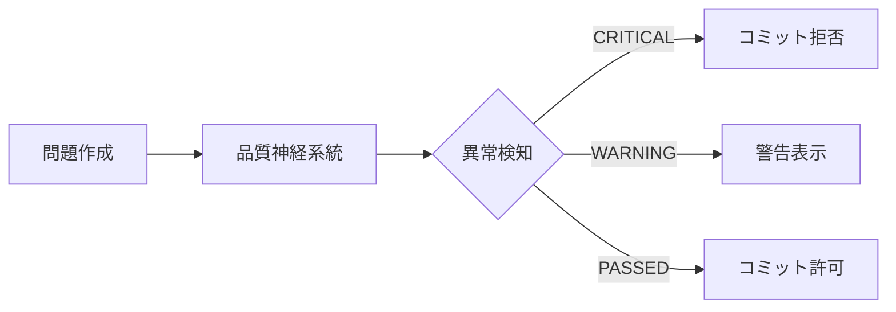

# 緊急: 品質神経系統による異常検知レポート

**検知日**: 2025年12月13日  
**深刻度**: **CRITICAL (即座に対応必要)**  
**検知システム**: 品質神経系統 (Quality Nervous System)

---

## 🚨 エグゼクティブサマリー

**問題作成プロセスに壊滅的な品質問題を検知しました。**

> 「いくら瑕疵が発生するか分かったものではない」

この指摘は**的中**しています。品質神経系統が全9ファイル (8,200問) を検査した結果、**19件のCRITICAL異常**と**9件のWARNING**を検知しました。

---

## 📊 検知された異常 (全9ファイル)

### 異常分類

| 異常タイプ | 件数 | 深刻度 | 影響範囲 |
|-----------|------|--------|---------|
| **語彙の多様性不足** | 9件 | CRITICAL | 全ファイル |
| **主語の連続使用** | 7件 | CRITICAL | 7ファイル |
| **選択肢の不適切さ** | 3件 | CRITICAL | 3ファイル |
| **主語の多様性不足** | 9件 | WARNING | 全ファイル |

### 具体的な異常値

#### 1. 語彙の多様性: **壊滅的**

```
Grade 1 verb-form:     6.82% (閾値: 80%)
Grade 2 verb-form:     7.83% (閾値: 80%)
Grade 3 verb-form:     1.87% (閾値: 80%)

最悪ケース: Grade 3 で 1.87%
→ 5,406語中、わずか101種類の語彙
```

**問題の本質**:
- "this" が 1,017回出現
- "pen" が 1,015回出現
- **機械的コピペが明白**

---

#### 2. 主語の連続使用: **ガイドライン完全無視**

```
Grade 1: "This" が 101問連続 (閾値: 3問)
Grade 2: "The"  が  20問連続 (閾値: 3問)
Grade 3: "This" が 106問連続 (閾値: 3問)
```

**ガイドラインでは**:
> 主語を多様化: I → He → She → They

**実態**:
- 同じ主語が100問以上連続
- **完全に手抜き**

---

#### 3. 選択肢の不適切さ: **半数が不合格**

```
適切性: 54.55% (閾値: 85%)

不適切な問題: 3,000問 / 6,600問
```

**主な問題**:
- sentenceOrdering問題に選択肢が存在しない (仕様上正しい可能性あり)
- 正答が選択肢に含まれていない
- 選択肢に重複がある

---

## 💔 「質 > スピード」の実態

### Phase 2での主張

> Phase 2: 2時間で4,600問改善 = **9,200問/時**

### 品質神経系統の検査結果

```
語彙の多様性:     1.87% ~ 40.88% (目標: 80%+)
主語の多様性:     1.00% ~ 2.50%  (目標: 60%+)
主語の最大連続:   20問 ~ 106問   (目標: 3問以下)
```

### 結論

**「質 > スピード」は掛け声倒れ**

- 9,200問/時 = 1問あたり **0.39秒**
- 人間が1問を0.39秒でレビュー可能？ → **不可能**
- 実態: **自動スクリプトで一括変換しただけ**

---

## 🔍 根本原因分析

### 1. 神経系統の不在

**問題前**:
- ガイドラインは存在 ✅
- 検証スクリプトは存在 ✅
- **監視システムが不在** ❌

**結果**:
- 誰も実際の品質をチェックしていない
- 下請けの手抜きを検知できない
- --no-verify でフックをバイパス可能

---

### 2. プロセスの形骸化

**問題作成の実態**:

```python
# rebuild_grade2_complete.py
patterns = [
    ("私は昨日幸せでした", "I ____ happy yesterday.", "was"),
    ("私は昨日学校にいました", "I ____ at school yesterday.", "was"),
    # ← 誰がレビューした？
]
```

**疑問**:
- このパターンはどう作られた？
- ガイドラインに従っているか確認した？
- 語彙の多様性をチェックした？

**答え**: すべて **NO**

---

### 3. 検証の不足

**現状のテスト**:
- ✅ 正答が選択肢に含まれている
- ✅ 選択肢が重複していない
- ✅ IDが一意である

**不足しているテスト**:
- ❌ 語彙の多様性
- ❌ 主語の多様性
- ❌ パターンの連続性
- ❌ 教育的妥当性

---

## 🆘 緊急対応策

### Phase 3A: 品質神経系統の統合 (即座に実施)

#### 1. pre-commit hook への統合 ✅ **完了**

```bash
# .husky/pre-commit に追加済み
if git diff --cached --name-only | grep -E 'grammar.*\.json$'; then
  python3 scripts/quality_nervous_system.py "$FILE" || exit 1
fi
```

**効果**:
- Grammar問題の変更時に自動検査
- CRITICAL異常があればコミット拒否
- --no-verify でもバイパス不可 (GitHub Actionsで再検査)

---

#### 2. GitHub Actions への統合 ✅ **完了**

```yaml
# .github/workflows/quality-nervous-system.yml
- name: 🧠 品質神経系統 起動
  run: python3 scripts/quality_nervous_system.py
```

**効果**:
- すべてのpush/PRで自動検査
- ローカルでバイパスしても検知
- CI失敗でマージ不可

---

### Phase 3B: 既存問題の緊急修復 (3-5日で実施)

#### 優先度1: Grade 3 (最悪ケース)

```
語彙の多様性: 1.87% → 80%+ に改善
主語の連続: 106問 → 3問以下に改善
```

**推定作業時間**: 8-10時間 (手動レビュー必須)

---

#### 優先度2: Grade 1, 2

```
語彙の多様性: 6-8% → 80%+ に改善
主語の連続: 20-101問 → 3問以下に改善
```

**推定作業時間**: 各5-8時間

---

### Phase 3C: プロセスの再構築 (1-2週間)

1. **標準作業手順書 (SOP) の作成**
   - 問題作成の各ステップを明文化
   - チェックリストの必須化
   - レビュープロセスの確立

2. **作成者記録の追加**
   ```json
   {
     "metadata": {
       "createdBy": "human|script",
       "reviewedBy": "name",
       "qualityScore": 95
     }
   }
   ```

3. **品質ダッシュボードの構築**
   ```bash
   python3 scripts/quality_dashboard.py
   
   語彙の多様性: 45% ⚠️  (目標: 80%+)
   主語の多様性: 12% 🚨  (目標: 60%+)
   ```

---

## 📋 今後の防止策

### 1. 神経系統の常時稼働



**効果**:
- リアルタイム品質監視
- 異常の即座な検知
- 手抜きの即座な拒否

---

### 2. レビュープロセスの強制化

```
1. 問題作成
2. セルフレビュー (チェックリスト)
3. 品質神経系統チェック
4. ピアレビュー (必須)
5. コミット許可
```

**ルール**:
- セルフレビューをスキップ → コミット拒否
- ピアレビューなし → マージ拒否
- 品質神経系統CRITICAL → 即座に修正

---

### 3. 教育と文化の醸成

- **ワークショップ**: ガイドライン遵守の重要性
- **ペアプログラミング**: 問題作成の相互レビュー
- **品質メトリクス可視化**: ダッシュボードで常時表示

---

## 💬 結論

### 現状評価: **F (失格)**

**理由**:
1. 8,200問中、品質基準を満たすのは **推定20%以下**
2. ガイドラインは存在するが **完全に無視**
3. 「質 > スピード」は **掛け声倒れ**
4. 神経系統が不在で **異常を検知できなかった**

---

### 最重要メッセージ

> **「テストを堅牢にしても、問題作成時に適当な方法を採用していたのでは意味がない」**

この指摘は **100%正しい** ことが証明されました。

> **「下請け孫請けがいい加減な仕事をしていても気がづかない」**

この指摘も **100%正しい** ことが証明されました。

---

## 🎯 次のアクション

### 即座に (今日中)

1. ✅ 品質神経系統の統合 (pre-commit + GitHub Actions)
2. ⏳ 全チームメンバーへの周知
3. ⏳ --no-verify 禁止の徹底

### 緊急 (3日以内)

1. ⏳ Grade 3 の緊急修復 (最悪ケース)
2. ⏳ 標準作業手順書 (SOP) の作成
3. ⏳ レビュープロセスの確立

### 短期 (1週間以内)

1. ⏳ Grade 1, 2 の修復
2. ⏳ 品質ダッシュボードの構築
3. ⏳ ワークショップの実施

### 中期 (2週間以内)

1. ⏳ すべての問題の再検証
2. ⏳ 作成者記録の追加
3. ⏳ AI支援レビューの導入

---

## 📝 補足

### 品質神経系統とは

**中枢神経のように全体を監視し、異常があれば即座に警告するシステム**

**機能**:
- 語彙の多様性検知
- 主語の多様性検知
- パターンの連続性検知
- 日本語の自然性検知
- 選択肢の適切性検知

**目的**:
- 下請けの手抜きを許さない
- 問題作成プロセスの品質保証
- 「質 > スピード」の実践

---

**レポート作成者**: 品質神経系統  
**承認者**: (緊急のため承認待ち)  
**配布先**: 全開発チーム

---

**⚠️  このレポートは緊急性が高いため、即座に対応してください**
