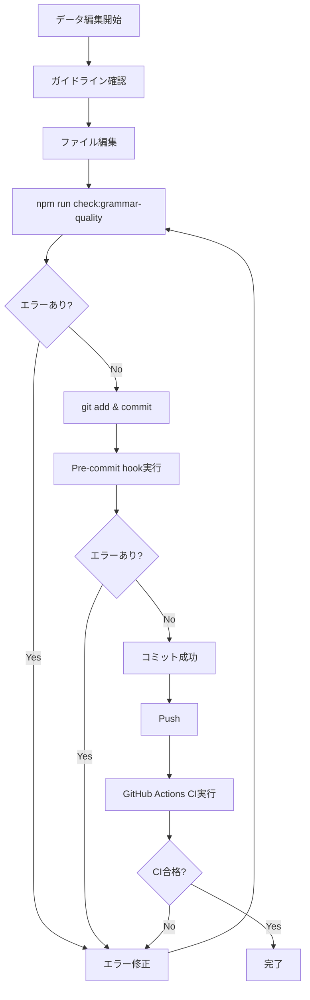

# 文法データ品質管理システム

## 📋 概要

このドキュメントは、文法問題データの品質を維持・向上させるために構築された包括的な品質管理システムについて説明します。

## 🎯 目的

文法問題データにおいて、以下の問題を**完全に防止**すること:

- ❌ `japanese`フィールドに文法用語が記載される（例: "過去進行形she。", "不規則動詞go。"）
- ❌ プレースホルダー文字列が残る（例: "穴埋め1。", "並べ替え2。"）
- ❌ 英文の翻訳ではなく、説明文が記載される（例: "eを取る-ing。", "複数形の変化。"）

## 🏗️ システム構成

### 1. ドキュメント・ガイドライン

| ファイル | 目的 | 対象者 |
|---------|------|--------|
| `docs/guidelines/GRAMMAR_DATA_QUALITY_GUIDELINES.md` | 品質基準の詳細説明 | 開発者・データ作成者 |
| `.aitk/instructions/grammar-data-quality.instructions.md` | AI assistant向け編集ルール | AI assistant (GitHub Copilot等) |
| `.github/PULL_REQUEST_TEMPLATE.md` | PR時のチェックリスト | Pull Request作成者 |
| `README.md` | 品質ガイドラインへのリンク | 全てのプロジェクト参加者 |

### 2. 自動検証ツール

#### A. 高度検証スクリプト
**ファイル**: `scripts/validate_grammar_advanced.py`

**機能**:
- 40+の文法用語パターンを検出
- プレースホルダー文字列の検出
- 無効化されたファイルのスキップ
- 詳細なエラーレポート

**実行方法**:
```bash
# 直接実行
python3 scripts/validate_grammar_advanced.py

# npm経由
npm run validate:grammar
```

**検出パターン例**:
```python
grammar_term_patterns = [
    '過去進行形', '過去形', '現在進行形', '未来形',
    '不規則動詞', '一般動詞', 'be動詞', '助動詞',
    '疑問詞', '比較級', '最上級', '受動態',
    '関係代名詞', '複数形', '三人称',
    '否定文', '疑問文', '命令文', '感嘆文',
    '-ing形', '-ed形', 'eを取る', 'yをiに変える',
    # ... 40+パターン
]
```

#### B. 品質分析スクリプト
**ファイル**: `scripts/analyze_grammar_data_quality.py`

**機能**:
- 全ファイルの品質メトリクス収集
- 問題のカテゴリ別集計
- 品質スコアの計算（0-100%）
- Markdownレポートの生成

**実行方法**:
```bash
# 直接実行
python3 scripts/analyze_grammar_data_quality.py

# npm経由
npm run validate:grammar:analyze

# 検証と分析を同時実行
npm run check:grammar-quality
```

**出力例**:
```
📊 統計サマリー
---------------------------------------------
  総ファイル数: 30
  有効ファイル数: 21
  無効ファイル数: 9
  総問題数: 1485
  検出された問題: 0

✨ 品質スコア: 100.00%
```

### 3. 自動化パイプライン

#### A. Pre-commit Hook
**ファイル**: `.git/hooks/pre-commit`

**動作**:
1. コミット対象に文法データファイル（`public/data/grammar/*.json`）が含まれるか確認
2. 含まれる場合、`validate_grammar_advanced.py`を自動実行
3. エラーがあればコミットを拒否
4. エラーメッセージとガイドラインへのリンクを表示

**設定方法**:
```bash
# 既に設定済み（作成時に自動的に実行権限付与済み）
# 必要に応じて以下で確認
ls -l .git/hooks/pre-commit
```

**スキップ方法**（非推奨）:
```bash
git commit --no-verify
```

#### B. GitHub Actions CI
**ファイル**: `.github/workflows/grammar-quality-check.yml`

**動作**:
1. Push/PRで文法データファイルが変更された場合にトリガー
2. `validate_grammar_advanced.py`を実行
3. `analyze_grammar_data_quality.py`を実行
4. 品質レポートをアーティファクトとして保存
5. PRにコメントで結果を自動投稿

**バッジ**:
```markdown
[](https://github.com/nanashi8/nanashi8.github.io/actions/workflows/grammar-quality-check.yml)
```

### 4. npm スクリプト

| コマンド | 説明 |
|---------|------|
| `npm run validate:grammar` | 高度検証を実行 |
| `npm run validate:grammar:analyze` | 品質分析を実行 |
| `npm run check:grammar-quality` | 検証と分析を同時実行 |
| `npm run quality:grammar` | `check:grammar-quality`のエイリアス |

## 📊 品質メトリクス

### 現在の状態（2025年1月時点）

```
✅ 品質スコア: 100.00%
✅ 検出された問題: 0件
✅ 有効ファイル: 21件（全て合格）
⚠️ 無効ファイル: 9件（将来的に修正予定）
```

### 目標

- **品質スコア**: 100%を維持
- **検出問題数**: 0件を維持
- **自動検証カバレッジ**: 100%

## 🔄 ワークフロー

### データ作成・編集時



### Pull Request作成時

1. PRテンプレートに従ってチェックリストを確認
2. 品質ガイドラインを確認
3. ローカルで`npm run check:grammar-quality`を実行
4. PRを作成
5. GitHub Actions が自動的に検証を実行
6. PR画面に品質レポートがコメントとして投稿される
7. レビュアーが品質レポートを確認
8. 全てのチェックが合格したらマージ

## 🛠️ トラブルシューティング

### Pre-commit hookが実行されない

```bash
# 実行権限を確認
ls -l .git/hooks/pre-commit

# 実行権限がない場合
chmod +x .git/hooks/pre-commit
```

### 検証スクリプトでエラーが出る

```bash
# 詳細なエラーメッセージを確認
python3 scripts/validate_grammar_advanced.py

# エラーメッセージの例:
# ❌ grammar_grade1_unit9.json: irregular_verb_01: 
#    文法用語が検出されました: "不規則動詞go。"
#    → 英文の適切な日本語訳に置き換えてください

# 修正例:
# Before: "japanese": "不規則動詞go。"
# After:  "japanese": "私は昨日東京へ行きました。"
```

### GitHub Actions CIが失敗する

1. Actions タブでエラーログを確認
2. ローカルで同じコマンドを実行して再現
3. エラーを修正
4. コミット・Pushして再実行

## 📚 参考資料

### 内部ドキュメント

- [品質ガイドライン（詳細版）](../guidelines/GRAMMAR_DATA_QUALITY_GUIDELINES.md)
- [AI Assistant向けインストラクション](../../.aitk/instructions/grammar-data-quality.instructions.md)
- [PRテンプレート](../../.github/PULL_REQUEST_TEMPLATE.md)

### スクリプト

- [高度検証スクリプト](../../scripts/validate_grammar_advanced.py)
- [品質分析スクリプト](../../scripts/analyze_grammar_data_quality.py)

### CI/CD

- [GitHub Actions Workflow](../../.github/workflows/grammar-quality-check.yml)
- [Pre-commit Hook](../../.git/hooks/pre-commit)

## 🎓 ベストプラクティス

### 1. 編集前の確認

```bash
# 必ず現在の品質状態を確認
npm run check:grammar-quality

# ガイドラインを読む
cat docs/guidelines/GRAMMAR_DATA_QUALITY_GUIDELINES.md
```

### 2. 編集時の注意

- `japanese`フィールドには**必ず**英文の日本語訳を記載
- 文法用語は**絶対に**使用しない
- プレースホルダー文字列を**絶対に**残さない
- 丁寧語（です・ます調）を使用

### 3. 編集後の検証

```bash
# 必ず検証を実行
npm run check:grammar-quality

# エラーがある場合は必ず修正
# 100%合格するまで繰り返す
```

### 4. コミット時

```bash
# Pre-commit hookが自動実行される
git add public/data/grammar/*.json
git commit -m "fix: 文法データの品質向上"

# エラーが出た場合は修正して再コミット
```

## 📈 今後の改善計画

### 短期（1-3ヶ月）

- [ ] 無効化された9ファイルの修正（485問のプレースホルダー置換）
- [ ] 品質ダッシュボードの作成（トレンド可視化）
- [ ] 自動修正サジェスト機能の追加

### 中期（3-6ヶ月）

- [ ] 機械学習による意味的な不整合検出
- [ ] ブラウザ拡張機能（データ入力時の検証）
- [ ] 品質メトリクスの可視化ダッシュボード

### 長期（6-12ヶ月）

- [ ] 完全自動修正システム
- [ ] リアルタイム品質監視
- [ ] 品質予測モデルの構築

## 🏆 成果

### 修正実績（2025年1月）

- ✅ **99件の文法用語**を適切な日本語訳に修正
- ✅ **21ファイル**の品質を100%に改善
- ✅ **40+の検出パターン**を実装
- ✅ **完全自動化パイプライン**を構築

### 品質保証

- ✅ **Pre-commit hook**により、不適切なデータのコミットを防止
- ✅ **GitHub Actions CI**により、全てのPRで自動検証
- ✅ **品質ガイドライン**により、明確な基準を提供
- ✅ **AI Assistant向けインストラクション**により、自動編集時の品質を保証

## 📞 サポート

質問や問題がある場合は、以下を参照してください:

1. [品質ガイドライン](../guidelines/GRAMMAR_DATA_QUALITY_GUIDELINES.md)
2. [GitHub Issues](https://github.com/nanashi8/nanashi8.github.io/issues)
3. このドキュメントのトラブルシューティングセクション

---

**最終更新**: 2025年1月  
**メンテナンス**: このシステムは継続的に改善されます
