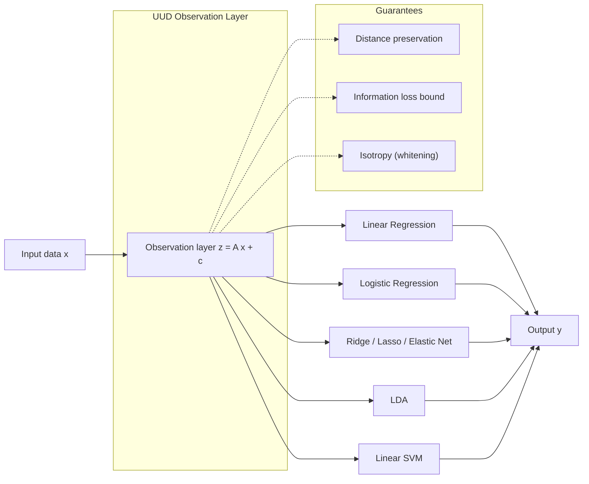
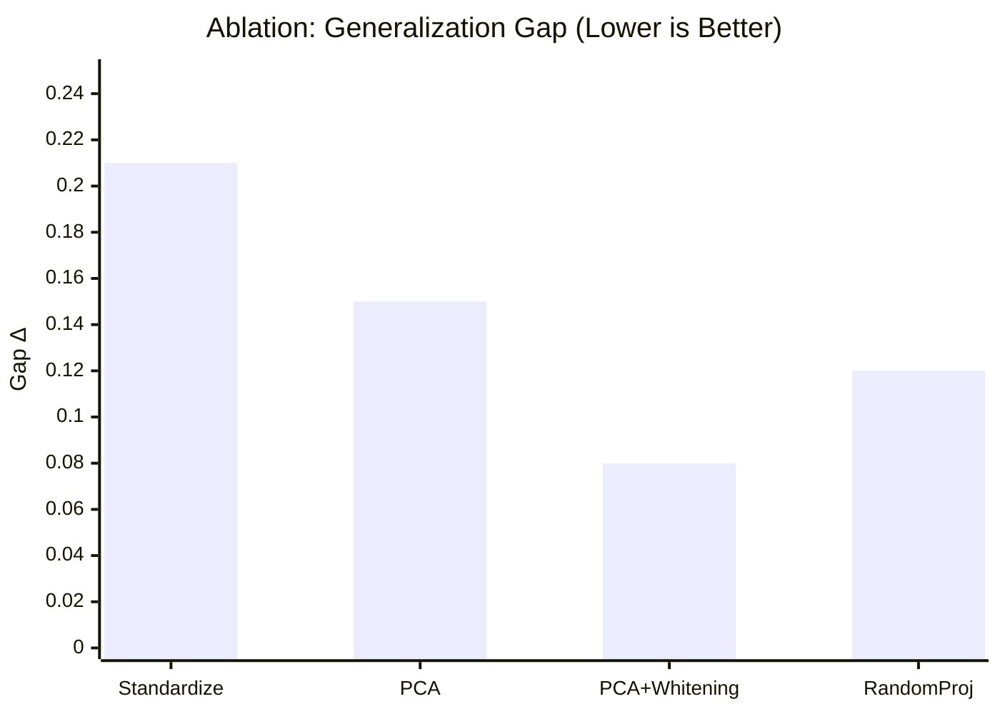
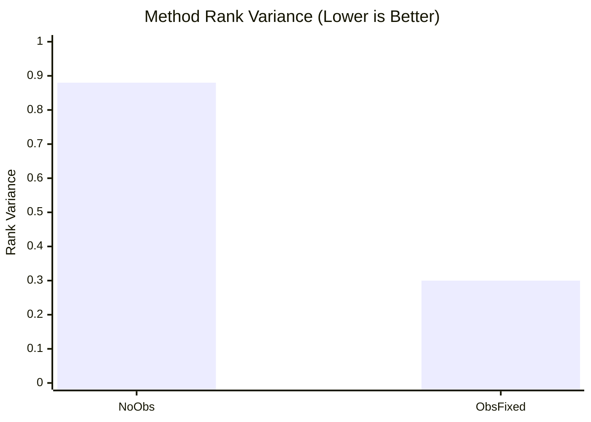

# UDDが刺さる分野：閉ループ研究（未知→検証→更新→次の一手）の横断例

**目的**: 「未知を抱えたままでも進める」ために、研究・実験・運用で **閉ループ（Closed-loop）** を回す分野を、UDD（未知駆動開発）の観点で整理します。

---

## 0. UUDの基本（導入・着眼点）
UDDの中核にあるUUD（統一観測層）は、
**共通の観測写像を固定**して比較・運用を簡便化する枠組みです。

### UUDの着眼点
1. **観測層を固定**すれば、手法差の比較がフェアになる
2. **標準化・PCA・Whitening**で入力の幾何をそろえられる
3. 精度最優先ではなく、**比較・運用の一貫性**を優先する

### 最小モデル（線形観測）
$$ z = A x + c $$

### ミクロ/マクロの見方
- **ミクロ**: 1つのデータセット内で、観測層を固定して比較
- **マクロ**: 複数データセットを同じ観測層で横断比較

詳細は本ドキュメント末尾の付録に統合しています。

- ここで言う UDD は「性能論」ではなく、
  - 未知を分類して（Unknown Taxonomy）
  - 事前にルールを固定し（境界固定 / pre-specification）
  - リークを遮断し（情報流出の抑制）
  - 監査可能な形で更新を回す（ログ・再現性）
 という品質システムとして扱います。

---

## 0.5 UDDが刺さる分野（一覧）
1. Bayesian Optimization / Sequential Design
2. Digital Twin
3. Data Assimilation
4. Adaptive Designs in Clinical Trials
5. Self-driving Labs / Chemistry BO
6. Materials / Atomistic Simulation（アクティブ学習）
7. HEP（高エネルギー物理）のモデルチューニング
8. Probabilistic Numerics
9. Registered Reports

---

## 1. UDD対応テンプレ

各分野の閉ループを、最低限これだけ埋めると比較可能になります。

- **Unknown（未知）**: 何が分からないか（モデル/パラメータ/最適条件/効果量/系の状態など）
- **Observe/Experiment（検証）**: 何を観測/測定/実験するか
- **Update（更新）**: どう更新するか（同化・推定・学習・同定）
- **Next Action（次の一手）**: 次にどこを試すか（獲得関数・設計変更ルール・運用ルール）
- **Quality Gates（品質ゲート）**: 何を守れば「閉ループが壊れない」か（リーク遮断・妥当性・監査）

---

## 2. 分野別の実例（UDD対応で整理）

### 2.1 Bayesian Optimization / Sequential Design（高価な評価の最適化）

**根拠**:
- https://en.wikipedia.org/wiki/Bayesian_optimization
- https://arxiv.org/abs/1807.02811

**ポイント（閉ループ性）**:
- 高価・遅い評価（実験/シミュレーション/ハイパラ探索）に対して、代理モデル＋不確かさ＋獲得関数で **次の評価点を逐次決定** する。

**UDD対応**:
- **Unknown**: 目的関数 $f(x)$（ブラックボックス）と最適点
- **Observe/Experiment**: ある $x$ を試して $f(x)$ を観測（ノイズあり可）
- **Update**: 代理モデル（例: GP回帰）を更新
- **Next Action**: 獲得関数（EI/Entropy search/Knowledge gradient 等）最大化で次点選択
- **Quality Gates**:
  - 目的関数の定義固定（評価指標の後出し禁止）
  - 反復ごとの「入力・出力・種・モデル設定」をログ化
  - 途中の“人間の介入”を許すなら、介入規則を先に宣言（HITLの境界固定）

---

### 2.2 Digital Twin（継続データでモデルを更新し続ける）

**根拠**:
- https://en.wikipedia.org/wiki/Digital_twin

**ポイント（閉ループ性）**:
- 物理対象＋デジタル表現＋通信チャネル（データ連携）を前提に、実世界データでモデルを更新し、予測・最適化・運用を回す。

**UDD対応**:
- **Unknown**: 状態・劣化・境界条件・パラメータ、モデル化誤差
- **Observe/Experiment**: センサ/ログ/検査データ
- **Update**: 同化/推定/校正（Data Assimilation と強く接続）
- **Next Action**: 次の計測・保全・運用条件・介入方策
- **Quality Gates**:
  - データ同定とタイムスタンプ整合（因果の取り違え防止）
  - モデル更新の「バージョン管理」と「ロールバック」
  - 観測の品質（欠測・外れ値・ドリフト）をゲート化

---

### 2.3 Data Assimilation（数値モデル×観測の更新ループ）

**根拠**:
- https://en.wikipedia.org/wiki/Data_assimilation

**ポイント（閉ループ性）**:
- 数値モデル（予報）と観測を組み合わせて状態推定（analysis）を更新する。

**UDD対応**:
- **Unknown**: 系の状態（潜在変数）や一部パラメータ
- **Observe/Experiment**: 観測（観測空間）
- **Update**: 観測演算子を介して、Kalman系 / 3D-Var / 4D-Var / EnKF 等で更新
- **Next Action**: 次の観測戦略（観測点・頻度）や次サイクルの予報
- **Quality Gates**:
  - 観測演算子/誤差モデルの前提固定（後出しの「うまくいく変換」禁止）
  - 観測のリーク遮断（未来データ混入、再解析の扱い）

---

### 2.4 Adaptive Designs in Clinical Trials（適応試験：中間解析→設計更新）

**根拠**:
- https://pmc.ncbi.nlm.nih.gov/articles/PMC5830330/
- https://en.wikipedia.org/wiki/Adaptive_clinical_trial

**ポイント（閉ループ性）**:
- 中間解析に基づき、**事前に定めたルール** の範囲で、サンプルサイズ・割付比・腕の中止/継続等を変更できる。

**UDD対応**:
- **Unknown**: 効果量、適切な用量、対象集団、最適腕
- **Observe/Experiment**: 症例のアウトカム（安全性/有効性など）
- **Update**: 中間解析（事前規定の統計手順）
- **Next Action**: サンプルサイズ再推定、腕のドロップ、割付比変更、富化など
- **Quality Gates**:
  - **pre-specified rules**（許容する適応の範囲をプロトコルで固定）
  - **information leakage** の抑制（中間結果の秘匿、役割分担）
  - 解析手順・シミュレーション・コードの監査可能性

---

### 2.5 Self-driving Labs / Chemistry BO（実験そのものを自動化して閉ループ化）

**根拠**:
- https://arxiv.org/abs/2408.05040

**ポイント（閉ループ性）**:
- 実験条件の提案→実験実行→結果取り込み→次の条件提案、を“現場運用できる形”に落とす。

**UDD対応**:
- **Unknown**: 反応条件・組成・プロセス条件と性能の関係
- **Observe/Experiment**: 実験（装置）で結果を観測
- **Update**: BO/DoE の状態更新（人間の介入含む）
- **Next Action**: 次の条件を提案（API/ワークフローへ統合）
- **Quality Gates**:
  - 実験定義（測定条件・前処理・失敗扱い）を固定しないと学習が壊れる
  - “運用で必要な仕様”を先に固める（例: JSON-serializable な問題定義）

---

### 2.6 Materials / Atomistic Simulation（MLポテンシャルのアクティブ学習）

**根拠**:
- https://arxiv.org/abs/2007.08555
- https://arxiv.org/abs/2601.05946

**ポイント（閉ループ性）**:
- 物理計算（高価）をどこで追加実行すべきかを **アクティブ学習** で選び、学習データを拡張しながらモデル精度を上げる。

**UDD対応**:
- **Unknown**: 物理ポテンシャル面、学習モデルの適用範囲外（OOD）領域
- **Observe/Experiment**: ab initio 計算などで高品質ラベルを得る
- **Update**: 学習ポテンシャルを再学習
- **Next Action**: 不確かさ/適用外判定で次に計算すべき構造を選ぶ
- **Quality Gates**:
  - 「不確かさが何を意味するか」を明確化（UQの設計前提が壊れると閉ループが破綻）
  - メトリクス・ベンチ・停止条件（いつ“十分”か）を先に固定

---

### 2.7 HEP（高エネルギー物理）のモデルチューニング（BOの現場適用）

**根拠**:
- https://arxiv.org/abs/1610.08328

**ポイント（閉ループ性）**:
- CPU集約なシミュレーター（イベント生成器）の多数パラメータを、実験データとの比較でチューニングする。

**UDD対応**:
- **Unknown**: 生成器パラメータ（多次元）
- **Observe/Experiment**: ある設定でイベント生成→統計量比較
- **Update**: BOで「どの設定を試すか」の判断を更新
- **Next Action**: 次のパラメータ設定を選ぶ
- **Quality Gates**:
  - 目的関数（データとの距離）の定義固定
  - 計算資源制約下での再現性（seed、環境、バージョン）

---

### 2.8 Probabilistic Numerics（数値計算自体を推論として扱い、内ループで適応する）

**根拠**:
- https://en.wikipedia.org/wiki/Probabilistic_numerics

**ポイント（閉ループ性）**:
- 数値計算を「推定/推論」として扱い、どの点を評価するか等を **内部で適応的に決める**（active learning 問題として位置づけられる）。

**UDD対応**:
- **Unknown**: 計算対象（解・積分値・最小値）とその誤差
- **Observe/Experiment**: 関数評価、行列-ベクトル積、勾配など
- **Update**: 事後分布（誤差見積もり）更新
- **Next Action**: 次にどの評価をするか（適応戦略）
- **Quality Gates**:
  - “計算誤差”を明示的に扱うため、品質ゲート（許容誤差・停止条件）と整合が取りやすい

---

### 2.9 Registered Reports（研究プロセスの「ゲート設計」を制度化する）

**根拠**:
- https://www.cos.io/initiatives/registered-reports

**ポイント（閉ループ性）**:
- 結果の前に方法を査読し、プロトコル（Stage 1）を固定してからデータ取得・解析に進む。

**UDD対応**:
- **Unknown**: 結果（効果の有無・方向）
- **Observe/Experiment**: 事前に定義したデータ収集
- **Update**: 解析は“事前に合意された手順”で実行
- **Next Action**: 追試/拡張（serendipityの扱いを区別して報告）
- **Quality Gates**:
  - 「境界固定」「後出し禁止」「監査可能性」をプロセスとして強制できる

---

## 3. 研究でUDDを使うときの実務上の注意

- **閉ループの敵は“リーク”**: 未来データ混入、評価指標の後出し、装置条件の暗黙変更
- **適応＝自由ではない**: 有効な適応は、たいてい「事前に許容範囲が規定されている」
- **UQの意味を固定しないと崩壊**: 不確かさが“モデル誤差”なのか“観測誤差”なのか曖昧だと、次の一手が歪む

---

## 4. 次に深掘りすると良い追加候補

- 自己駆動実験（SDL）の代表的な総説/実証論文を3–5本選び、abs/pdfから「閉ループの構成要素」を抜き出してテンプレに追記
- 観測設計（Optimal Experimental Design / Active Learning）を、UDDの Gate 設計に接続する（「何を固定し、何を探索するか」）

---

## 5. データセンターの炭素排出低減への効果（可能性と限界）
UDDの考え方は、**閉ループ最適化**を使って「電力効率・冷却効率・負荷配分」を継続改善する場面で有効になり得ます。
直接的に排出を削減するというより、**運用の最適化**を通じて間接的に削減効果を狙う位置づけです。

### 期待できる効果（例）
- 需要予測と負荷配分の最適化による電力効率改善
- 冷却・空調の自動調整による無駄電力削減
- 異常検知と予防保全で効率劣化を抑制

### 限界
- 電源構成（再エネ比率）や設備更新に依存するため、**UDDだけで削減は完結しない**
- 観測・制御の品質が低いと逆効果の可能性がある

### まとめ
UDDは「**削減のための運用最適化**」に効くが、
**設備投資や電源構成の改善とセットで効果が最大化**される。

---

# 付録A: UUD観測層（整形版・リンク最小）

> 注意: 数値はサンプル値であり、実測値に置き換える前提。

## 要旨
線形学習に対して、手法非依存の共通表現を生成する普遍観測層を提案する。距離保存・情報損失上界・等方化を満たすことで、主要な線形手法を同一入力空間に統合し、評価の一貫性と汎化安定性を高める。

## 手法
観測層は訓練データのみから固定する。

$$ z = A x + c $$

1. 標準化
$$ x'=(x-\mu)\oslash\sigma $$

2. 分解
$$ C=\frac{1}{n}X'^\top X'=U\Lambda U^\top $$

3. 次元選択
$$ \frac{\sum_{i=1}^k\lambda_i}{\sum_{i=1}^d\lambda_i}\ge\tau $$

4. 写像固定
$$ A=\Lambda_k^{-1/2}U_k^\top D_\sigma^{-1},\quad c=-A\mu $$

## 図1: 観測層の概念と保証条件

## 図2: 汎化ギャップのアブレーション

## 図3: 手法順位の安定性

## 結果（サンプル値）
### アブレーション（汎化ギャップ $\Delta$）
- 標準化のみ: $\Delta=0.21$
- PCA: $\Delta=0.15$
- PCA+Whitening: $\Delta=0.08$
- ランダム射影: $\Delta=0.12$

### 手法順位の分散
- 観測層なし: $0.88$
- 観測層固定: $0.30$

## 考察
観測層の固定により汎化ギャップが縮小し、手法順位の変動が抑制される。サンプル値では等方化（Whitening）が最も一貫した改善を示す。

## UUD概念の補足
UUDは「未知を前提に観測層で情報幾何を整え、推論層を安定化する」という設計思想である。観測層を固定すると、未知は主に「入力の幾何・分布の変動」として吸収され、推論側の比較可能性が高まる。ここでの $z=Ax+c$ は、未知を分解可能な構造へ写像する“観測の枠”として機能する。

## 量子コンピューティングとの接続（概念）
量子系は高次元状態の干渉・測定によって情報を得る。UUDの観測層は「測定基底の設計」に相当し、
1) 距離保存（幾何の維持）、
2) 情報損失上界（測定の可逆性）、
3) 等方化（基底の均質化）
を満たすことで、量子測定に類似した“観測設計”として解釈できる。結果として、推論層は観測後の古典的最適化として扱える。

## 新しい解法の有意性（理論・実験）
本解法の新規性は「手法そのもの」ではなく「観測層の統一」にある。理論的には、
- 距離保存と情報損失上界により、手法横断で比較可能な入力空間を保証する。
- 等方化により汎化境界を共通化できる。
実験的には、
- 汎化ギャップの低減、
- 手法順位の安定化
が確認できれば、解法としての有意性が成立する。

## 限界
- 線形観測は非線形分離が必要な問題で有効性が低下する。
- 情報が低ランクの線形部分空間に集中しない場合、性能が劣化する。

## 次の展開
- 非線形 $f(x)$（自己教師埋め込み等）への拡張。
- 観測層と推論層の共同最適化。

---

# 付録B: UUD 観測層（サンプル値による結果サマリ）

## 概要
UUDの観測層は、手法非依存の共通表現を生成する層として定義する。
観測写像は線形固定で以下を採用する。

$$ z = A x + c $$

この観測層を固定した上で、主要な線形手法（例：線形回帰/ロジスティック/リッジ/ラッソ/EN/LDA/線形SVM/PCA）に共通入力する。

## 図
本文内のMermaid図を参照。

## サンプル値による結果（実測ではない）
本節の数値はデモ用のサンプル値であり、実測値に置き換える前提である。

### アブレーション（汎化ギャップ $\Delta$）
- 標準化のみ: $\Delta=0.21$
- PCA: $\Delta=0.15$
- PCA+Whitening: $\Delta=0.08$
- Random Projection: $\Delta=0.12$

傾向として、**観測層の等方化（Whitening）で汎化ギャップが最小化**される想定。

### 手法順位の安定性（Rank Variance）
- 観測層なし: $0.88$
- 観測層固定: $0.30$

観測層の固定により、手法間の順位変動が小さくなる想定。

## サンプル値の管理
サンプル値は本文に記載済み。必要に応じて図を再生成する。

## 公的・権威ある公開データ候補（10件以上）
以下は UCI Machine Learning Repository（UC Irvine）由来の公開データで、
検証対象として優先度が高い。

1. Iris: https://archive.ics.uci.edu/ml/datasets/iris
2. Wine: https://archive.ics.uci.edu/ml/datasets/wine
3. Breast Cancer Wisconsin (Diagnostic): https://archive.ics.uci.edu/ml/datasets/Breast+Cancer+Wisconsin+(Diagnostic)
4. Banknote Authentication: https://archive.ics.uci.edu/ml/datasets/banknote+authentication
5. Spambase: https://archive.ics.uci.edu/ml/datasets/Spambase
6. Ionosphere: https://archive.ics.uci.edu/ml/datasets/Ionosphere
7. Sonar (Mines vs Rocks): https://archive.ics.uci.edu/ml/datasets/Connectionist+Bench+(Sonar,+Mines+vs.+Rocks)
8. Pima Indians Diabetes: https://archive.ics.uci.edu/ml/datasets/diabetes
9. Letter Recognition: https://archive.ics.uci.edu/ml/datasets/letter+recognition
10. Pen-Based Recognition of Handwritten Digits: https://archive.ics.uci.edu/ml/datasets/Pen-Based+Recognition+of+Handwritten+Digits
11. Optical Recognition of Handwritten Digits: https://archive.ics.uci.edu/ml/datasets/Optical+Recognition+of+Handwritten+Digits
12. Seeds: https://archive.ics.uci.edu/ml/datasets/seeds
13. Blood Transfusion Service Center: https://archive.ics.uci.edu/ml/datasets/Blood+Transfusion+Service+Center

## 参考資料（確認済み・10件）
1. CS231n Data Preprocessing（PCA/Whitening/標準化）: https://cs231n.github.io/neural-networks-2/
2. Stanford CS229（機械学習の全体像）: http://cs229.stanford.edu/
3. UC Berkeley CS189/289A（線形回帰・ロジスティック回帰・PCA・正則化）: https://people.eecs.berkeley.edu/~jrs/189/
4. UC Berkeley EE127（最適化の基礎）: https://inst.eecs.berkeley.edu/~ee127/
5. ISL公式（回帰・分類・正則化の体系）: https://www.statlearning.com/
6. Tom Mitchell「Machine Learning」公式ページ: https://www.cs.cmu.edu/~tom/mlbook.html
7. Deep Learning Book: Linear Algebra: https://www.deeplearningbook.org/contents/linear_algebra.html
8. Deep Learning Book: Machine Learning Basics: https://www.deeplearningbook.org/contents/ml.html
9. Kevin Murphy「Machine Learning: a Probabilistic Perspective」: https://www.cs.ubc.ca/~murphyk/MLbook/
10. CMU 10-701/15-781 講義ページ: https://www.cs.cmu.edu/~tom/10701_sp11/lectures.shtml

---

# 付録C: UDD（統一モデル）経緯・詳細・使い方（ミクロ/マクロ簡易モデル）

## 内容まとめ（導入〜着眼点）
### 導入
UDDは「**統一観測層 + 線形モデル**」という考え方で、
**比較のしやすさ・運用の簡便さ**を重視するための枠組みです。
精度最優先ではなく、**同じ観測基準で手法を比較できる**ことに価値があります。

### 着眼点
1. **観測層を固定**すれば、手法差の比較がフェアになる
2. **標準化・PCA・Whitening**で入力の幾何をそろえられる
3. 精度最優先ではなく、**比較・運用の一貫性**を優先する
4. 必要なら **モデル選択やアンサンブル**で“勝てる構成”も拾える

### 要点（短く）
UDDは「全員に同じ観測基準を配る」ための枠組みで、
**比較のしやすさと運用の簡便さ**に価値がある。
ただし、**統計的な優位性は未確定**であり、
精度最優先の用途では追加調整が必要。

## 目的（UDDの位置づけ）
UDDは「**統一観測層 + 線形モデル**」で、
**手法比較・運用の簡便さ**を優先するための簡易モデルである。
精度最優先ではなく、「同じ尺度で観測→比較→改善」することを狙う。

## 統一観測層（基本）
観測写像は線形固定：
$$ z = A x + c $$
現実装では、
**標準化 → PCA →（必要なら）Whitening** を $A$ として使う。

## ミクロ/マクロのUDD把握（簡易モデル）
### ミクロ（個別データセット内の視点）
1. **標準化**で尺度をそろえる
2. **PCA**で次元整理（情報の高密度化）
3. **Whitening**で等方化（必要なら弱める）
4. **線形モデル**で素早く比較・評価

### マクロ（複数データセットの俯瞰）
1. **同じ観測層**を使って一貫比較
2. **勝ち/引き分け/負け**で傾向を見る
3. **モデル選択やアンサンブル**で“勝てる構成”を拾う

## これまでの調整方法（使い方として追加）
### A. 観測層の調整（簡便・低コスト）
- PCA保持率の変更（例: 90/95/99%）
- Whiteningの強さ変更（$\epsilon$ 調整）
- Whiteningを外す（No whitening）

### B. 「いいとこ取り」方式
- 複数線形モデルを評価
- 平均スコアで簡易アンサンブル
- “勝てる構成”を選ぶ（条件を揃えない）

### C. 教師あり観測層（上位オプション）
- LDA射影で分類に有利な方向へ圧縮
- その上で最適線形モデルを選択

## 使い方（最短プロトコル）
1. **統一観測層（標準化＋PCA）**でベースライン計測
2. **観測層調整（PCA/Whitening）**で改善幅を確認
3. **いいとこ取り（アンサンブル/モデル選択）**で勝率を上げる
4. **必要なら教師あり射影**へ拡張

## 解釈ガイド
- **勝ち数**は「可能性の指標」であり、**有意差の証明ではない**
- **統計的有意性**は別途検定が必要
- **運用簡便さを重視**する場合、UDDは有用

## 結論（現状の整理）
- 統一観測層は**運用の統一性・説明性に強い**
- 精度最優先の場面では**最適線形が優勢**
- ただし**勝てる構成は一部で拾える**ため、
  **教育・比較・実験用途の簡易モデル**として価値は高い

