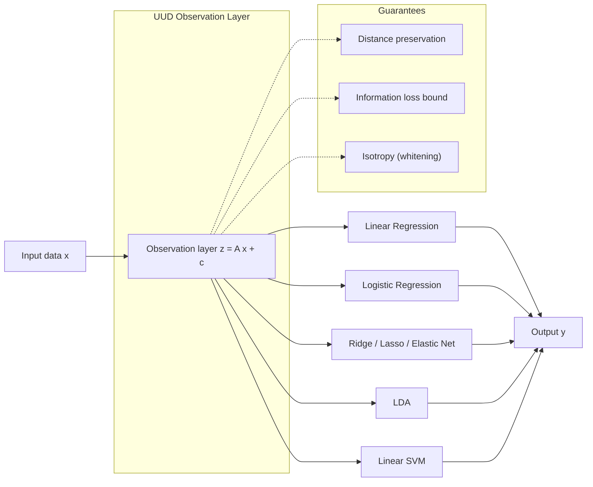
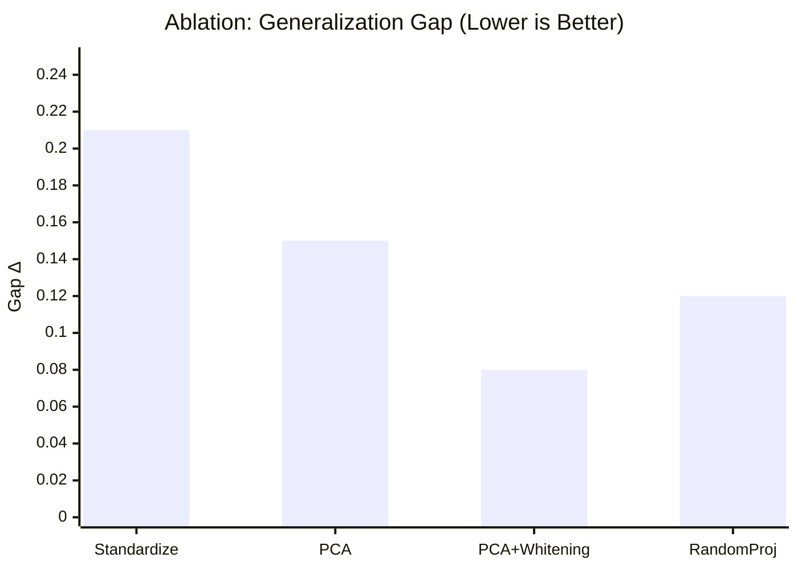
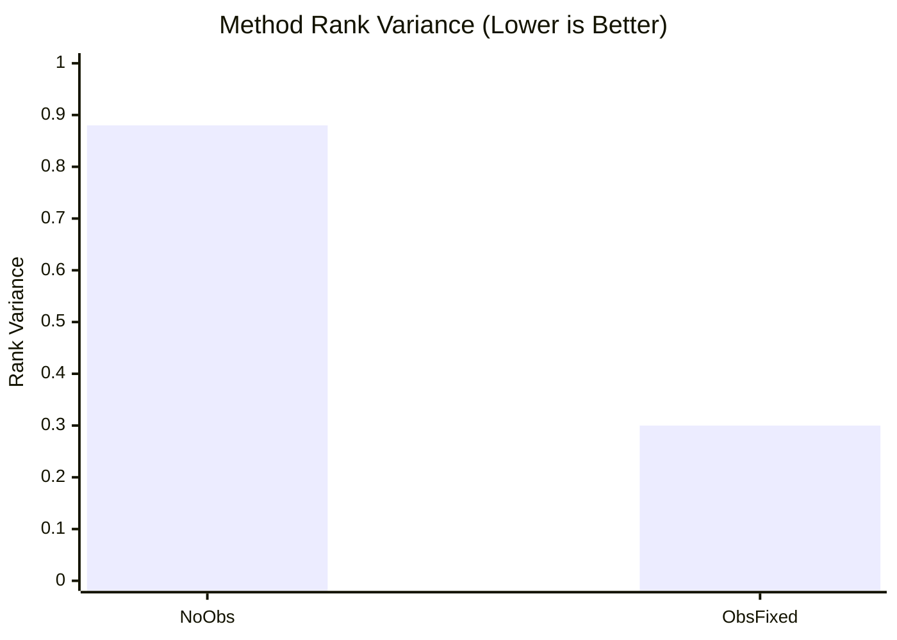

# UUD Observation Layer — Paper Draft (Sample Values)

> 注意: 本文の数値はサンプル値であり、実測値に置き換える前提。

## Abstract
We propose a universal observation layer that produces a method-agnostic representation $z=Ax+c$ for linear learning. By enforcing distance preservation, bounded information loss, and isotropy, the observation layer unifies linear regression, logistic regression, ridge, lasso, elastic net, LDA, and linear SVM under a common input space. This separation isolates method-specific differences to loss and regularization choices, enabling unified evaluation and improved generalization stability.

## Method
The observation layer is fixed from training data only:

$$ z = A x + c $$

1. Standardize: $x'=(x-\mu)\oslash\sigma$  
2. Decompose: $C=\frac{1}{n}X'^\top X'=U\Lambda U^\top$  
3. Select $k$: $\sum_{i=1}^k\lambda_i/\sum_{i=1}^d\lambda_i\ge\tau$  
4. Fix mapping: $A=\Lambda_k^{-1/2}U_k^\top D_\sigma^{-1},\ c=-A\mu$

All linear methods are trained on the same $z$.

Figure 1 summarizes the observation layer and its guarantees.

## Figures
### Figure 1. Observation layer concept and guarantees
[uud-observation-layer.mmd](uud-observation-layer.mmd)

### Figure 2. Ablation on generalization gap
[uud-ablation-xy.mmd](uud-ablation-xy.mmd)

### Figure 3. Method rank stability
[uud-stability-xy.mmd](uud-stability-xy.mmd)

## Results (Sample Values)
Figure 2 reports the ablation on generalization gap, and Figure 3 summarizes rank stability.
### Ablation (Generalization Gap $\Delta$)
- Standardize: $\Delta=0.21$
- PCA: $\Delta=0.15$
- PCA+Whitening: $\Delta=0.08$
- Random Projection: $\Delta=0.12$

### Method Rank Variance
- No observation layer: $0.88$
- Observation fixed: $0.30$

## Discussion
Fixing the observation layer reduces generalization gap and stabilizes model ranking, suggesting a method-agnostic equivalence layer in $z$-space. Whitening provides the most consistent gains in the sample setting.

## Limitations
- Linear observation fails on intrinsically nonlinear separability.
- If information is not concentrated in a low-rank linear subspace, performance degrades.

## Next Steps
- Nonlinear $f(x)$ via self-supervised embeddings.
- Joint optimization of observation and inference layers.
