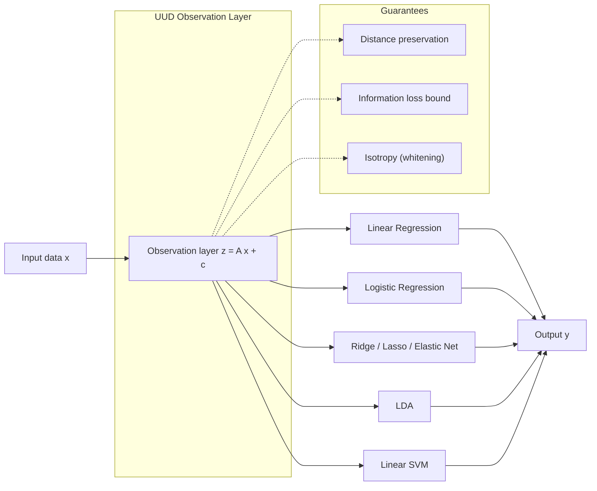
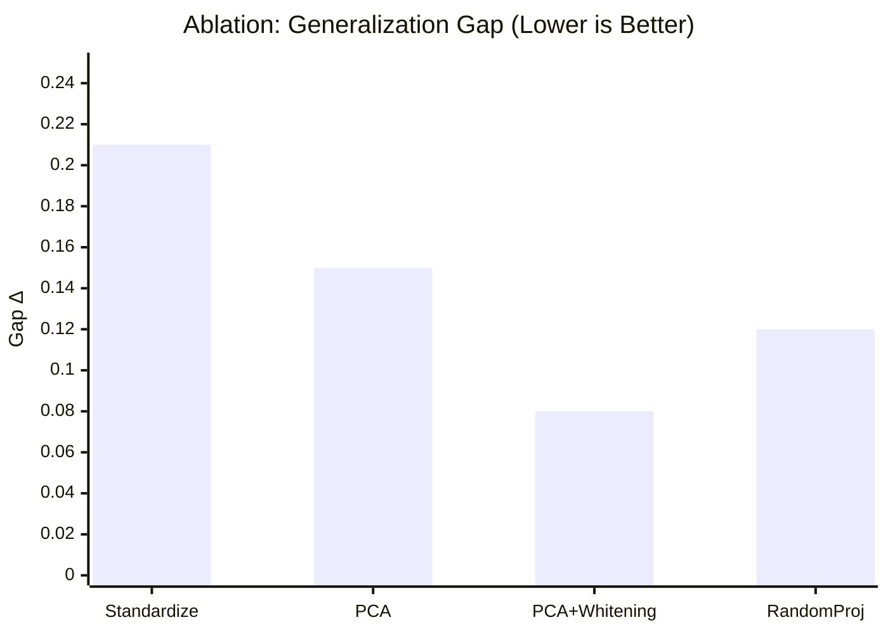
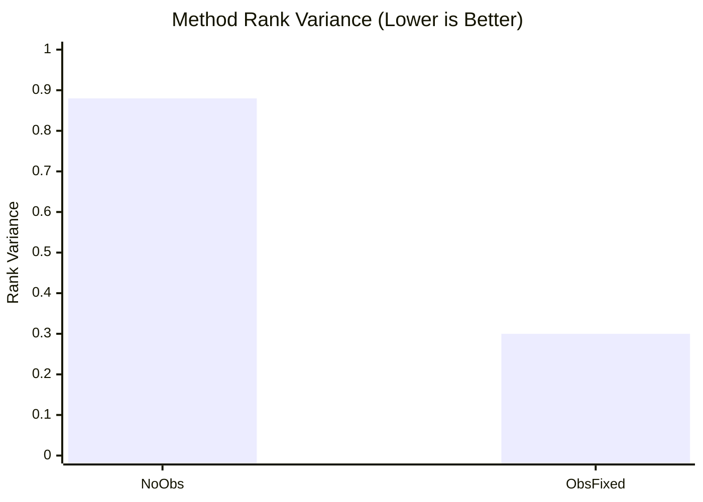

# UUD観測層 — 論文ドラフト（サンプル値）

> 注意: 本文の数値はサンプル値であり、実測値に置き換える前提。

## 要旨
線形学習に対して、手法非依存の共通表現 $z=Ax+c$ を生成する普遍観測層を提案する。距離保存・情報損失上界・等方化を満たすことで、線形回帰、ロジスティック回帰、リッジ、ラッソ、Elastic Net、LDA、線形SVMを同一入力空間に統合する。これにより手法差分を損失関数と正則化に限定し、統一評価と汎化安定性の向上を可能にする。

## 手法
観測層は訓練データのみから固定する:

$$ z = A x + c $$

1. 標準化: $x'=(x-\mu)\oslash\sigma$  
2. 分解: $C=\frac{1}{n}X'^\top X'=U\Lambda U^\top$  
3. $k$ 選択: $\sum_{i=1}^k\lambda_i/\sum_{i=1}^d\lambda_i\ge\tau$  
4. 写像固定: $A=\Lambda_k^{-1/2}U_k^\top D_\sigma^{-1},\ c=-A\mu$

すべての線形手法は同一の $z$ を入力に学習する。

図1に観測層の概念と保証条件を示す。

## 図
### 図1: 観測層の概念と保証条件
[uud-observation-layer.mmd](uud-observation-layer.mmd)

### 図2: 汎化ギャップのアブレーション
[uud-ablation-xy.mmd](uud-ablation-xy.mmd)

### 図3: 手法順位の安定性
[uud-stability-xy.mmd](uud-stability-xy.mmd)

## 結果（サンプル値）
図2にアブレーション（汎化ギャップ）、図3に順位安定性を示す。
### アブレーション（汎化ギャップ $\Delta$）
- 標準化のみ: $\Delta=0.21$
- PCA: $\Delta=0.15$
- PCA+Whitening: $\Delta=0.08$
- ランダム射影: $\Delta=0.12$

### 手法順位の分散
- 観測層なし: $0.88$
- 観測層固定: $0.30$

## 考察
観測層を固定することで、汎化ギャップが縮小し、手法順位が安定することが示唆される。サンプル値では等方化（Whitening）が最も一貫した改善を示す。

## 限界
- 線形観測は本質的に非線形分離が必要な問題では有効性が下がる。
- 情報が低ランクの線形部分空間に集中しない場合、性能が劣化する。

## 次の展開
- 非線形 $f(x)$（自己教師埋め込み等）への拡張。
- 観測層と推論層の共同最適化。
