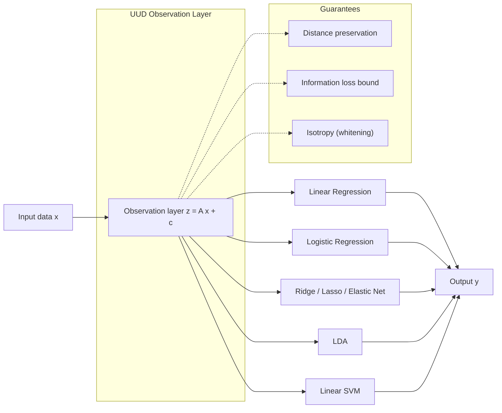
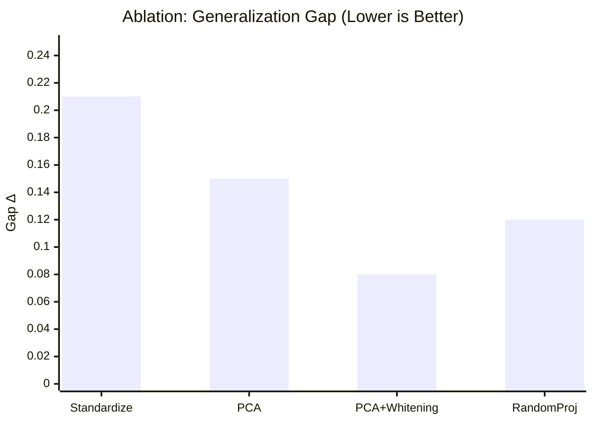
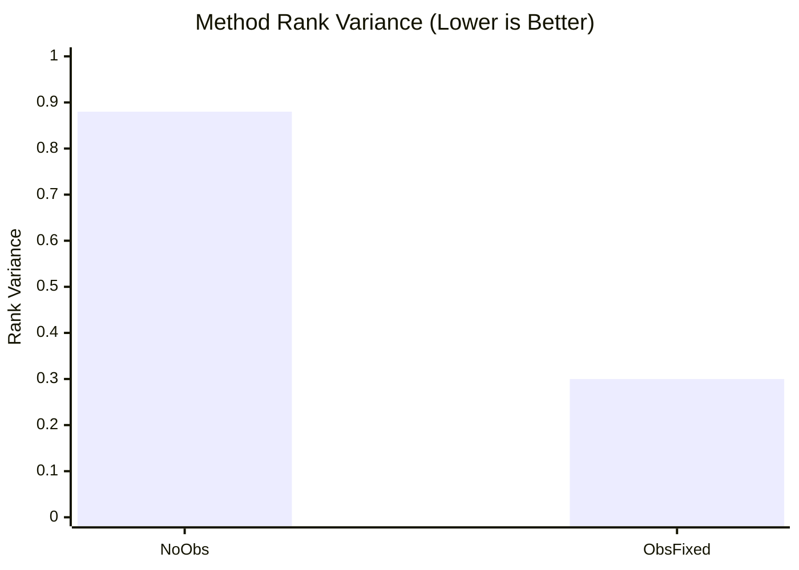

# UUD観測層（Qiita貼り付け用・数式優先）

> 注意: 数値はサンプル値であり、実測値に置き換える前提。

## 要旨
線形学習に対して、手法非依存の共通表現を生成する普遍観測層を提案する。距離保存・情報損失上界・等方化を満たすことで、主要な線形手法を同一入力空間に統合し、評価の一貫性と汎化安定性を高める。

## 手法
観測層は訓練データのみから固定する。

$$
 z = A x + c
$$

1. 標準化
$$
 x'=(x-\mu)\oslash\sigma
$$

2. 分解
$$
 C=\frac{1}{n}X'^\top X'=U\Lambda U^\top
$$

3. 次元選択
$$
 \frac{\sum_{i=1}^k\lambda_i}{\sum_{i=1}^d\lambda_i}\ge\tau
$$

4. 写像固定
$$
 A=\Lambda_k^{-1/2}U_k^\top D_\sigma^{-1},\quad c=-A\mu
$$

## 図1: 観測層の概念と保証条件

## 図2: 汎化ギャップのアブレーション

## 図3: 手法順位の安定性

## 結果（サンプル値）
### アブレーション（汎化ギャップ $\Delta$）
- 標準化のみ: $\Delta=0.21$
- PCA: $\Delta=0.15$
- PCA+Whitening: $\Delta=0.08$
- ランダム射影: $\Delta=0.12$

### 手法順位の分散
- 観測層なし: $0.88$
- 観測層固定: $0.30$

## 考察
観測層の固定により汎化ギャップが縮小し、手法順位の変動が抑制される。サンプル値では等方化（Whitening）が最も一貫した改善を示す。

## 限界
- 線形観測は非線形分離が必要な問題で有効性が低下する。
- 情報が低ランクの線形部分空間に集中しない場合、性能が劣化する。

## 次の展開
- 非線形 $f(x)$（自己教師埋め込み等）への拡張。
- 観測層と推論層の共同最適化。
