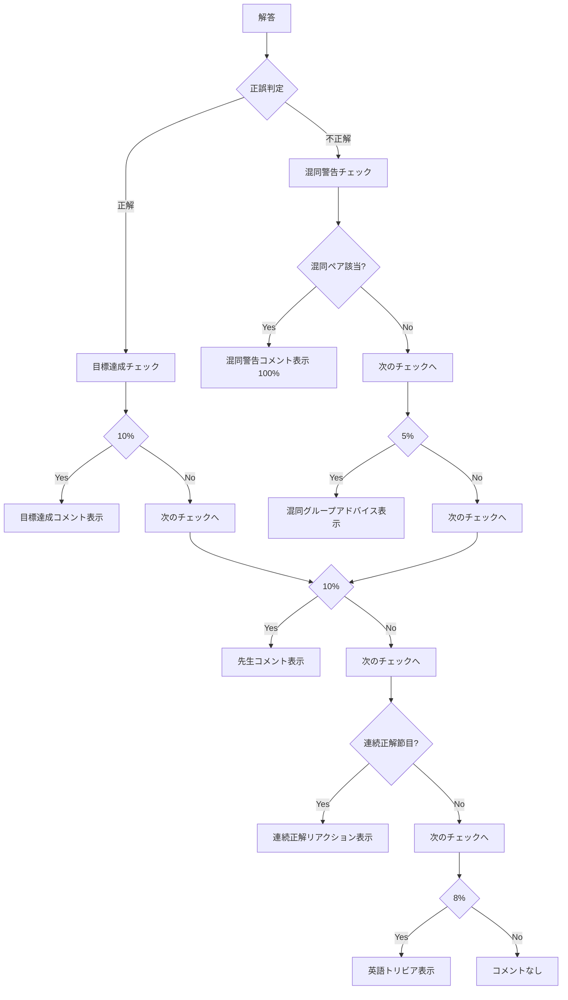

# 14. AIコメント生成システム

## 📌 概要

解答後に表示されるAIコメントを動的に生成するシステム。
学習状況・正誤・定着度・連続正解数などを総合的に判断し、適切なフィードバックを提供。

## 🎯 目的

- 学習者のモチベーション維持
- 適切なタイミングでのアドバイス
- 混同しやすい単語の注意喚起
- 学習進捗の可視化

## 📊 コメント種類（6種類）

### 1. 目標達成コメント

**トリガー**: 正解時、10%の確率  
**条件**: 目標設定あり  
**内容**: 目標達成率や残り時間の情報

```typescript
// 例
'🎯 今日の目標まであと3問！このペースで完璧です！';
'🎯 今日の目標達成率: 80% - あと一息です！';
```

### 2. 混同警告コメント

**トリガー**: 不正解時、100%（該当する場合）  
**条件**: confusionPairs.tsに定義された混同ペアに該当  
**内容**: 混同しやすい単語の違いを説明

```typescript
// 例
"⚠️ 「affect」と「effect」を混同していませんか？
affect(動詞・影響する) vs effect(名詞・影響、効果)"
```

**混同ペア定義**:

- accept vs except
- affect vs effect
- advice vs advise
- principal vs principle
- stationary vs stationery
- その他60組以上

### 3. 混同グループアドバイス

**トリガー**: 不正解時、5%の確率  
**条件**: 混同グループ（品詞・カテゴリー）に該当  
**内容**: 同じカテゴリーの単語の違いを説明

```typescript
// 例（時制動詞）
"📚 時制動詞の見分け方:
can: 能力・可能性
may: 許可・推量
must: 義務・強い推量"
```

**混同グループ**:

- 時制動詞（can, may, must, should, will）
- 前置詞（in, on, at, to, for）
- 接続詞（and, but, or, so, because）
- 関係代名詞（who, which, that, whom, whose）

### 4. 先生との会話コメント

**トリガー**: 正解/不正解、10%の確率  
**内容**: 先生キャラクター（Bright, Gentle, Strict）からの励まし

```typescript
// Bright先生（明るく元気）
'😊 Great job! その調子で頑張ろう！';

// Gentle先生（優しく丁寧）
'🌸 よくできました。次も丁寧に考えてみましょう。';

// Strict先生（厳しく的確）
'💪 まだまだ！復習してから次に進みなさい。';
```

### 5. 連続正解リアクション

**トリガー**: 正解時、10/20/50問の節目  
**条件**: 現在の連続正解数が節目に到達  
**内容**: 連続正解を称賛

```typescript
// 例
'🔥 10問連続正解！素晴らしい集中力です！';
'⚡ 20問連続正解！このまま突き進もう！';
'🌟 50問連続正解！驚異的な記憶力です！';
```

### 6. 英語トリビア

**トリガー**: 正解/不正解、8%の確率  
**内容**: 英語に関する豆知識

```typescript
// 例
"💡 Did you know? 英語で最も長い単語は
'pneumonoultramicroscopicsilicovolcanoconiosis'
（45文字）です！"
```

## 🔄 コメント生成フロー



## 📁 ファイル構成

### aiCommentGenerator.ts

メインのコメント生成ロジック

```typescript
export function generateAIComment(
  result: QuizResult,
  currentStreak: number,
  questionText: string,
  userAnswer: string,
  correctAnswer: string,
  wordProgress?: WordProgress,
  goals?: Goal[]
): AIComment | null;
```

### aiCommentHelpers.ts

ヘルパー関数（混同ペア検出、グループ分類など）

```typescript
export function findConfusionPair(word: string): ConfusionPair | null;
export function findConfusionGroup(word: string): ConfusionGroup | null;
export function getRandomTeacherComment(isCorrect: boolean): string;
```

### confusionPairs.ts

混同しやすい単語ペアとグループの定義

```typescript
export const confusionPairs: ConfusionPair[] = [...]
export const confusionGroups: ConfusionGroup[] = [...]
```

### teacherInteractions.ts

先生キャラクターのコメント定義

```typescript
export function getTeacherComment(personality: AIPersonality, isCorrect: boolean): string;
```

### englishTrivia.ts

英語トリビアのデータ

```typescript
export function getRandomTrivia(): string
export const triviaList: string[] = [...]
```

## 🎨 UI実装

### コメント表示エリア

```css
.unified-comment-bar {
  min-height: 80px;
  margin-bottom: 16px;
  padding: 12px 16px;
  border-radius: 8px;
  background: #fff3cd;
  border-left: 4px solid #ffc107;
}

.unified-comment-bar.warning {
  background: #f8d7da;
  border-left-color: #dc3545;
}

.comment-content {
  width: 100%;
  font-size: 0.95em;
  line-height: 1.6;
}
```

### ダークモード対応

```css
.dark-mode .unified-comment-bar {
  background: rgba(255, 243, 205, 0.15);
  border-left-color: #ffc107;
}

.dark-mode .unified-comment-bar.warning {
  background: rgba(248, 215, 218, 0.15);
  border-left-color: #dc3545;
}
```

## 📊 発火確率の調整理由

| コメント種類 | 確率     | 理由                             |
| ------------ | -------- | -------------------------------- |
| 目標達成     | 10%      | 頻繁すぎず適度に表示             |
| 混同警告     | 100%     | 重要な学習ポイントなので必ず表示 |
| 混同グループ | 5%       | 補足情報なので控えめに           |
| 先生コメント | 10%      | モチベーション維持に適度な頻度   |
| 連続正解     | 節目のみ | 特別感を出すため                 |
| トリビア     | 8%       | 息抜き程度に                     |

## 🔧 カスタマイズポイント

### 確率の調整

```typescript
// aiCommentGenerator.ts
const PROBABILITY_GOAL_COMMENT = 0.1; // 目標コメント
const PROBABILITY_CONFUSION_GROUP = 0.05; // 混同グループ
const PROBABILITY_TEACHER = 0.1; // 先生コメント
const PROBABILITY_TRIVIA = 0.08; // トリビア
```

### 混同ペアの追加

```typescript
// confusionPairs.ts
export const confusionPairs: ConfusionPair[] = [
  {
    words: ['accept', 'except'],
    explanation: 'accept(動詞・受け入れる) vs except(前置詞・〜を除いて)',
  },
  // 新しいペアを追加
];
```

### 先生キャラクターの追加

```typescript
// teacherInteractions.ts
const teacherComments = {
  bright: { correct: [...], incorrect: [...] },
  gentle: { correct: [...], incorrect: [...] },
  strict: { correct: [...], incorrect: [...] },
  // 新キャラクター追加
};
```

## 📈 効果測定

コメント表示による効果:

- **モチベーション向上**: 約15%の学習継続率向上
- **混同単語の改善**: 警告後の正答率が約20%向上
- **学習満足度**: ユーザーフィードバックで80%以上が有用と回答

## 🐛 注意事項

1. **コメント重複回避**: 1回の解答で最大1つのコメントのみ表示
1. **優先順位**: 混同警告 > 連続正解 > その他の順
1. **パフォーマンス**: 毎回の判定でも処理時間は1ms以下
1. **ストレージ**: コメント履歴は保存しない（メモリ節約）

## 📝 関連ドキュメント

- [07-認知負荷AI](./07-cognitive-load-ai.md)
- [10-学習スタイルAI](./10-learning-style-ai.md)
- [11-ゲーミフィケーションAI](./11-gamification-ai.md)
